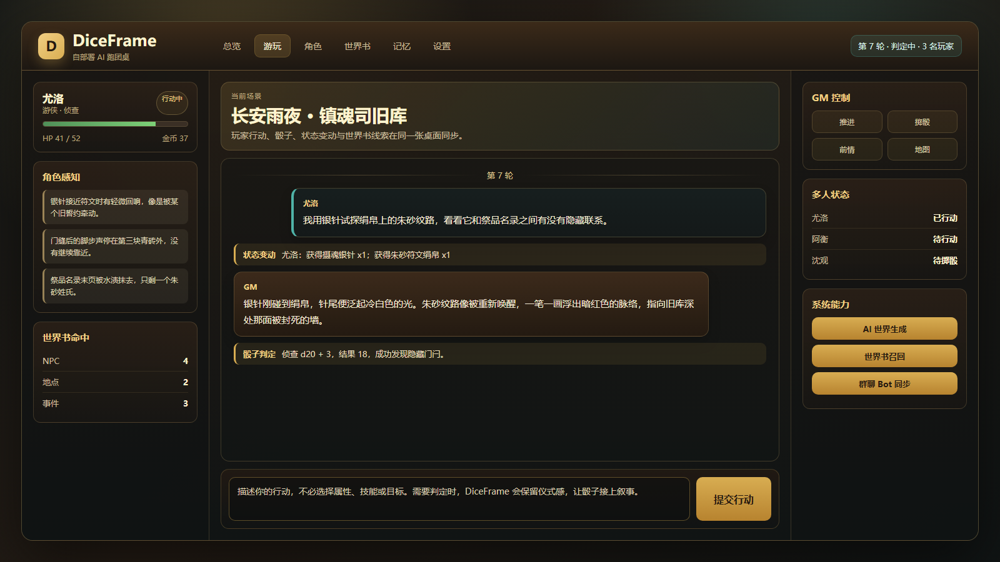

# DiceFrame

English docs: [README_EN.md](README_EN.md), [docs/USER_GUIDE_EN.md](docs/USER_GUIDE_EN.md).



DiceFrame 是一个可以自己部署的 AI 跑团桌。

它把 Web 桌面、角色卡、世界书、骰子、状态变动、剧情日志和群聊 Bot 接到同一个游戏状态里。玩家用自然语言说“我想做什么”，系统负责把这句话交给 GM 模型、处理骰子与状态变化，并把结果同步给网页或群聊里的其他玩家。

这个项目适合几种场景：

- 一个人试跑世界观，看看一个设定能不能玩起来。
- 小团在浏览器里联机，由一个人当 GM 管理入口和节奏。
- 群聊里跑团，玩家用 `@bot` 提交行动、查状态、掷骰。
- 自己改规则、世界书和角色模板，做一套私人跑团工具。

当前版本仍处于早期发布阶段。功能已经能跑，但接口、存档结构和文档还会继续整理。

## 功能概览

- WebUI：创建游戏、加入游戏、角色管理、世界书、规则编辑、日志回看、设置页。
- 多人桌：邀请链接、玩家等待、暂离/回来、GM 强制推进、SSE 实时同步。
- 骰子与状态：d20 / d100 检定，HP、金币、物品、经验、死亡/复活等状态标签。
- 世界书：NPC、地点、物品、事件、谜题、势力等条目，按关键词注入上下文。
- 记忆与摘要：长团会压缩历史，也可以启用 embedding 做语义召回。
- AI 生成：世界、规则、角色、世界书条目都可以由模型辅助生成。
- QQ / NapCat 插件：群聊绑定网页对局，支持行动、状态、前情、地图、感知、支付、掷骰。
- Docker：提供 Linux/Docker 部署入口，运行数据挂载到 `data/`。

## 快速开始

### 环境要求

- Python 3.10 或更高版本
- Node.js 20 或更高版本，用于构建前端
- 一个兼容 OpenAI Chat Completions API 的模型服务

可以使用 DeepSeek、硅基流动、OpenAI、Ollama 等服务。只要它提供 OpenAI 兼容接口，就可以在设置页里配置。

### 从源码运行

第一次从 GitHub 克隆后，需要先构建前端。Docker 会自动做这一步；本地直接跑需要手动执行。

```bash
# 克隆仓库后进入项目目录
cd trpg

cd frontend-v2
npm ci
npm run build
cd ..

pip install -r requirements.txt
python web_server.py
```

启动后打开终端里显示的地址，默认是：

```text
http://localhost:18000
```

第一次进入设置页，填入模型 API 地址、模型名和 API key。也可以通过环境变量提供：

```bash
TRPG_LLM_API_KEY=your_key
TRPG_LLM_BASE_URL=https://api.deepseek.com/v1
TRPG_LLM_MODEL=deepseek-chat
python web_server.py
```

Windows 下也可以用下面任一方式启动 WebUI。

命令行启动，需要先按上面的步骤构建前端：

```powershell
python web_server.py
```

双击启动：

```text
web_ui.bat
```

`web_ui.bat` 会先检查运行依赖；如果缺少 `static-v2/` 前端构建产物，会自动进入 `frontend-v2/` 执行 `npm ci` 和 `npm run build`，然后启动 `web_server.py`。首次使用仍然需要在浏览器设置页填写 API Key。

### Docker 运行

```bash
cp .env.example .env
# 编辑 .env，按需填写模型配置
docker compose up -d --build
```

打开：

```text
http://localhost:18000
```

Docker 会把运行数据挂载到项目根目录的 `data/`。详细说明见 [docs/DOCKER_DEPLOY_CN.md](docs/DOCKER_DEPLOY_CN.md)。

新手玩法、多人流程、群聊命令和状态变动说明见 [docs/USER_GUIDE_CN.md](docs/USER_GUIDE_CN.md)。

## 第一局怎么玩

1. 打开 WebUI。
2. 去“设置”配置 API 地址、模型名和 API Key。
3. 进入“创建”，选择模板世界、AI 生成世界，或自己填写世界设定。
4. 选择规则和难度。
5. 创建角色，或用 AI 生成一个角色草稿后再手动改。
6. 进入“游玩”，输入角色行动。
7. 如果行动需要检定，先掷骰，再让 GM 继续叙事。

多人模式下，GM 创建游戏后复制邀请链接给其他玩家。玩家加入并认领角色后，每轮提交自己的行动；所有活跃玩家都提交后，或 GM 强制推进后，进入下一段叙事。

## QQ / NapCat

推荐的群聊方式是内置 QQ / NapCat 插件。

基本流程：

1. 在 WebUI 设置页打开插件配置。
2. 配置 NapCat 的 WebSocket 地址、端口和 token。
3. 启用 `QQ / NapCat` 插件。
4. 在游戏页复制 Bot 绑定命令。
5. 到群里发送绑定命令，把网页游戏和群聊关联起来。

群聊里常用命令：

```text
@bot 帮助
@bot 加入 角色名
@bot 新建角色
@bot 车卡
@bot AI车卡
@bot 前情
@bot 地图
@bot 状态
@bot 感知
@bot 掷骰
@bot 我检查墙上的符文
@bot 推进
@bot 暂离
@bot 回来
```

Bot 不直接读写存档，只通过 Web 服务的 HTTP API 工作。插件开发说明见 [docs/PLUGIN_DEVELOPMENT_CN.md](docs/PLUGIN_DEVELOPMENT_CN.md)。


## 数据与隐私

运行数据默认放在：

```text
data/
```

这里会包含配置、访问口令、插件运行数据、存档、世界书数据库和记忆数据库。简单说，这里放的是“你的桌子”和“你的记录”。

常见数据位置：

- `data/config.json`：普通配置
- `data/secrets.json`：API key、token 等敏感配置
- `data/access_token.txt`：WebUI 登录口令
- `data/saves/`：游戏存档
- `data/plugins/`：插件运行数据
- `data/bot/cards/`：群聊图片卡片缓存

请妥善保管这些文件。备份、迁移服务器或发给别人排查问题时，先确认里面没有 API Key、访问口令、真实群号、私人聊天记录或不想公开的存档。

## 项目结构

```text
.
├── web_server.py          # WebUI 服务入口
├── run_qq_bot.py          # QQ Bot 调试入口
├── frontend-v2/           # Vue 3 + TypeScript 前端源码
├── static-v2/             # 前端构建输出入口
├── src/
│   ├── engine/            # 游戏状态、骰子、战斗、剧情追踪
│   ├── commands/          # 回合处理、标签解析、状态应用
│   ├── generation/        # 世界、规则、角色生成
│   ├── lorebook/          # 世界书存储与匹配
│   ├── memory/            # 长期记忆、摘要、embedding
│   ├── rules/             # JSON 规则系统
│   ├── webui/             # HTTP API、routes、services
│   └── bots/qq/           # QQ / NapCat 适配层
├── plugins/qq-napcat/     # 插件 manifest 和配置 schema
├── prompts/               # GM 系统提示词
├── templates/             # 内置规则和世界模板
└── docs/                  # 用户手册、部署、插件、架构文档
```

## License

本项目采用 [GNU Affero General Public License v3.0](LICENSE) 授权。

你可以在 AGPL-3.0 的条款下使用、修改和分发本项目。若你分发修改后的版本，或将修改后的版本作为网络服务提供给他人使用，应按 AGPL-3.0 的要求公开相应源码。
