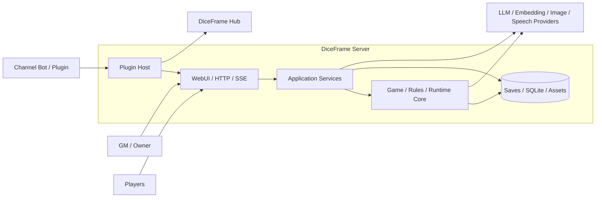
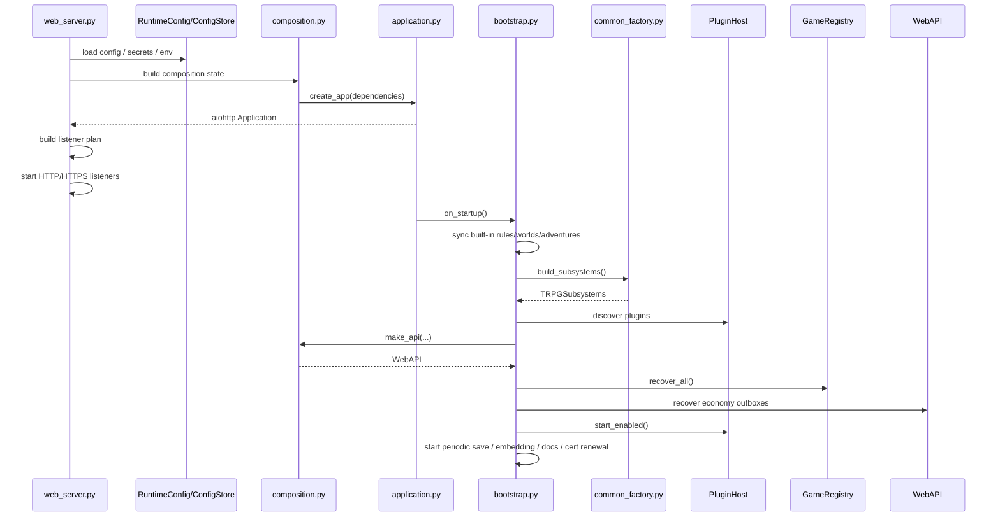
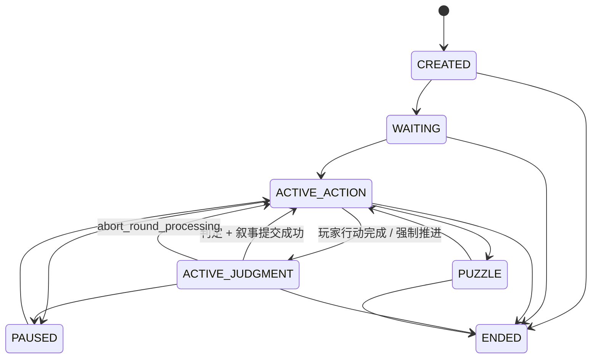
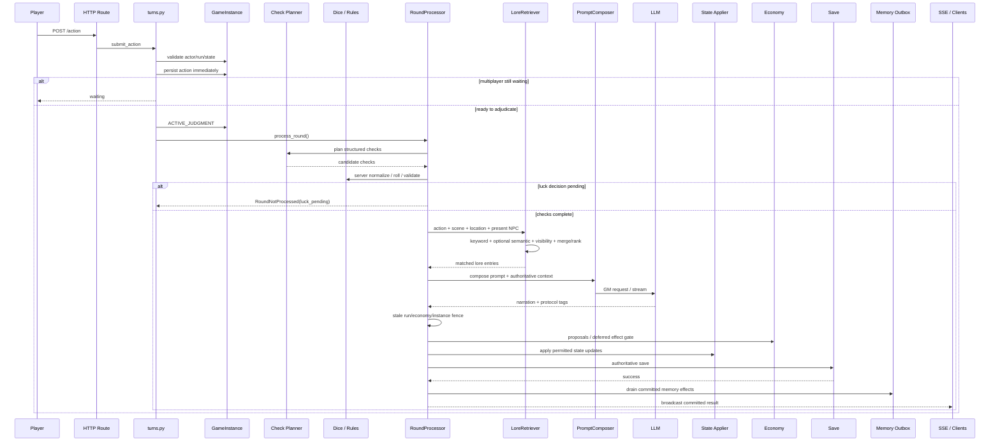
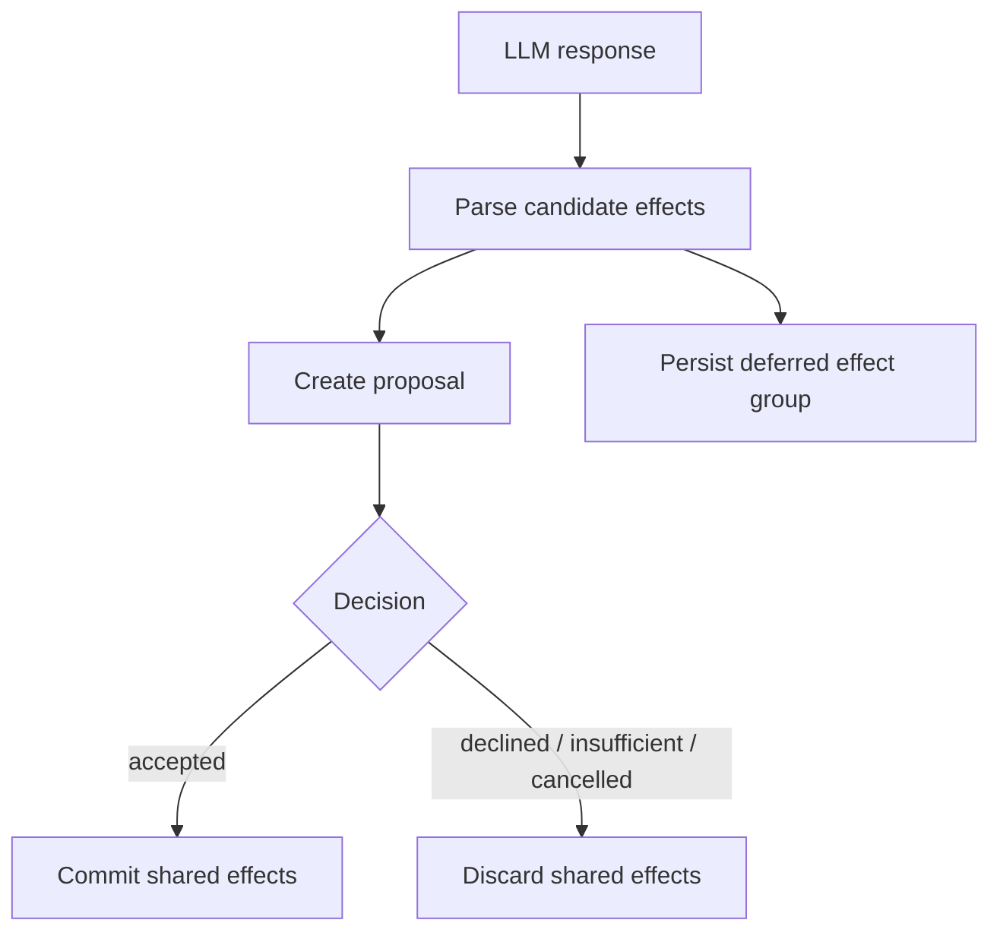
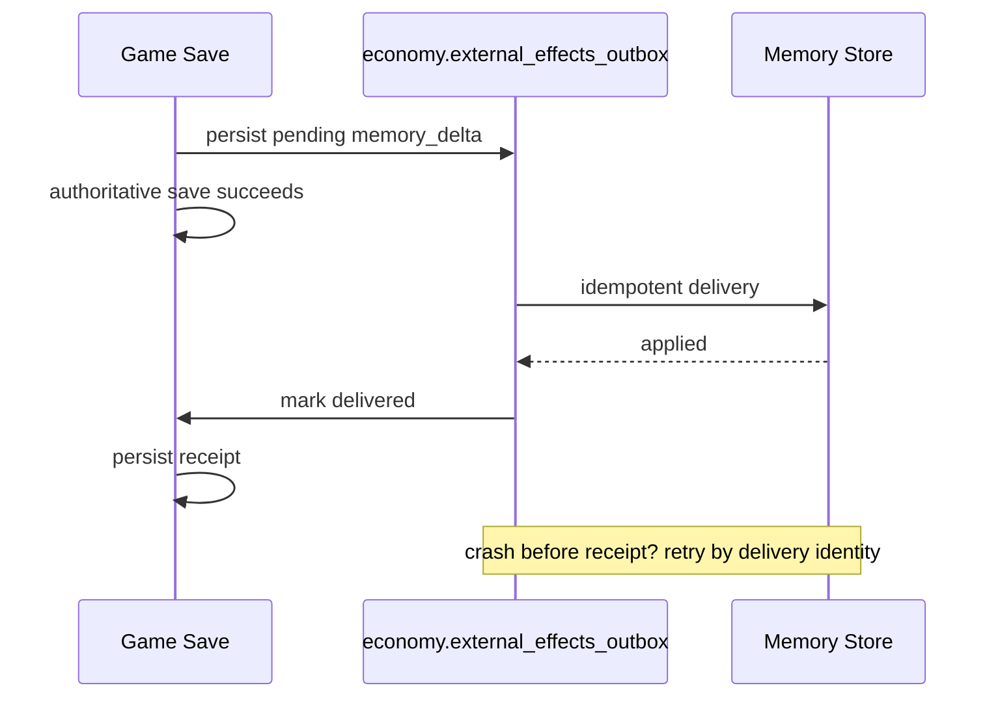
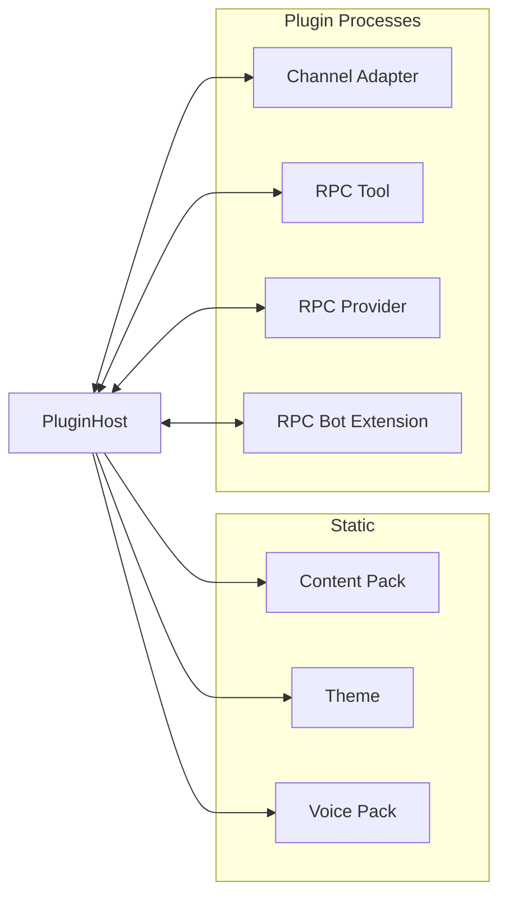
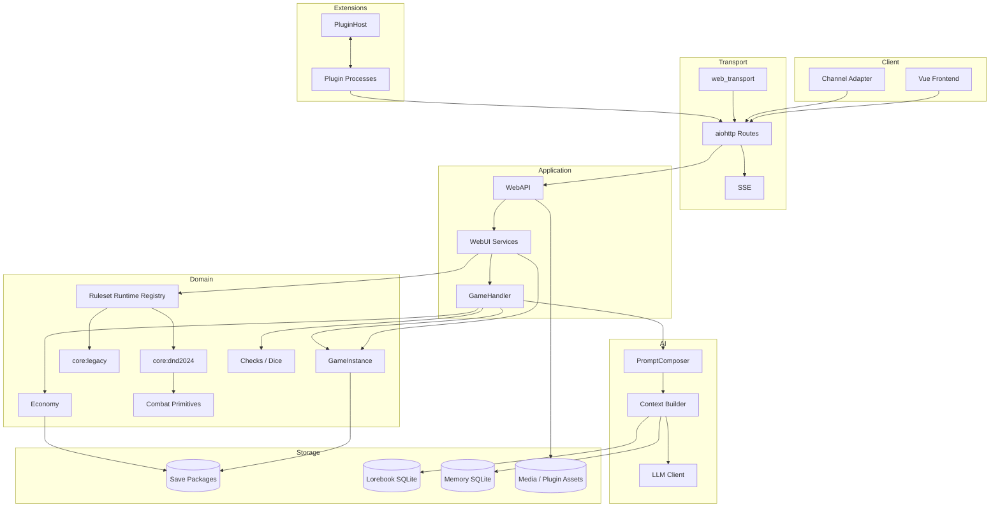
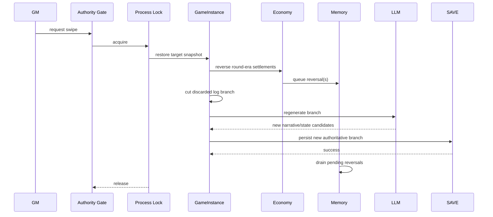

# DiceFrame 系统架构文档（开发者版）

> **文档性质：Current Architecture / System Architecture**
>
> 本文描述 DiceFrame 当前 `main` 分支已经合并并可从源码验证的系统架构。它不是路线图、需求清单、PR 汇总，也不是“以后应该怎样”的设计稿。
>
> **核验基线**
>
> - 仓库：`diceframe/diceframe`
> - 分支：`main`
> - Commit：`962fda45a68caa24bac38fd2313d92d66fa59a7a`
> - Release：`2.6.1`
> - 当前 GameInstance persisted schema：`24`
> - 当前 Lorebook SQLite schema（`PRAGMA user_version`）：`9`
> - 文档核验日期：2026-09-18
>
> **明确不计入当前架构的内容**
>
> - 未合并 PR / 未合并 feature branch；
> - 本地工作区草稿；
> - 只有设计说明、但当前 `main` 没有实现的能力。
>
> 上述内容可以作为未来架构输入，但不得在本文件中写成“现状”。


---

# 0. 开发者快速入口

这一章是给“第一次进仓库、准备改代码”的开发者看的。

原文后面的完整架构章节全部保留；这里不替代它们，只提供**功能入口、主要文件和权威边界**。

## 0.1 先记住三个问题

接任何 issue / PR 前，先问：

```text
1. 这个功能的最终 authority 在哪里？
2. 用户请求从哪里进入，经过哪些 service / runtime？
3. 我现在要改的是表现层、应用编排，还是权威状态？
```

DiceFrame 最容易出问题的改法不是“代码写错”，而是：

```text
在错误的层写了一份正确逻辑
```

例如：

```text
前端自己计算 D&D 规则
LLM 文本直接修改 HP
AI 托管复制一份角色
WorldState 和 memory 各记一份“当前世界”
service 之间互相 import 形成环
```

这些都可能短期能跑，但会产生第二套 authority。

---

## 0.2 功能 → 第一入口 → 核心 Owner

| 我要改什么 | 第一入口 | 继续追到哪里 | 最终 Authority / Owner |
|---|---|---|---|
| 玩家提交行动 | `src/webui/services/turns.py` | `GameInstance` → `RoundProcessor` | `GameInstance` / Ruleset |
| 多人行动 barrier | `turns.py` | `GameInstance.human_actions_ready()` / `try_advance()` | `GameInstance` |
| AI GM 回合 | `src/commands/round_processor.py` | Check Planner / Prompt / State Applier | Server + Ruleset |
| 检定规划 | `src/commands/check_planner.py` | normalize / dice / rules | Server RNG / Rules |
| AI 托管 PC（探索） | `src/commands/ai_player.py` | `turns.py` | Player Control + canonical action queue |
| 玩家控制权 | `src/webui/services/game_controls.py` | `src/engine/player_control.py` | `players[uid].control` |
| 暂离 / AI 临时接管 | `game_controls.py` | away policy / control revision | Player Control |
| AI 托管 PC（D&D 战斗） | `src/rulesets/automation.py` | `src/rulesets/dnd2024/combat/` | D&D Runtime |
| 当前世界事实 | `src/engine/world_state.py` | world ops | `GameInstance.world_state` |
| 地点 / 路线是否合法 | `src/engine/world_legality.py` | planner requirement / RoundProcessor | WorldState |
| 世界时间 / 定时事件 | `src/engine/world_events.py` | `world_state.scheduled_events` | WorldState |
| 长期记忆 | `src/memory/delta.py` | `src/engine/memory_outbox.py` | MemoryStore |
| D&D 2024 Runtime | `src/rulesets/dnd2024/runtime.py` | 各 domain | D&D Runtime |
| D&D 战斗 | `src/rulesets/dnd2024/combat/` | validate / resolve / reducer | D&D Combat State |
| D&D Campaign / Session 0 | `src/rulesets/dnd2024/campaign/` | EventBatch / reducer | D&D Ruleset State |
| D&D 角色 | `src/rulesets/dnd2024/character/` | ruleset character lifecycle | `ruleset_character` |
| D&D 休息 | `src/webui/services/ruleset_rest.py` | D&D resting domain | D&D Runtime |
| D&D 升级 | `src/webui/services/ruleset_advancement.py` | progression / character reconciliation | D&D Runtime |
| Ruleset capability | `src/rulesets/contracts.py` | `registry.py` | Runtime capability contract |
| 通用战斗扩展 | `src/webui/services/combat_extension.py` | `src/engine/combat_*` | Generic combat primitives |
| 经济 / 支付 | `src/engine/economy.py` | proposal / settlement / outbox | Economy |
| 货币模型 | `src/engine/currency/` | frontend currency utility | CurrencySpec |
| 存档 encode/decode | `src/engine/game_state_codec.py` | migrations | GamePersistedState |
| 存档迁移 | `src/migrations/instance.py` | schema sequence | Migration layer |
| reset / restart | lifecycle service | aggregate replacement / run_id | GameInstance |
| rollback / swipe | lifecycle / GameHandler | authority lock / snapshots | GameInstance |
| 世界书内容 | `src/lorebook/store.py` | locale view / CRUD / canonical entries | LorebookStore |
| 世界书检索 | `src/lorebook/retrieval.py` | KeywordMatcher / optional EmbeddingClient / context projection | LoreRetriever（检索编排；不拥有 mechanics authority） |
| 世界模板 | `src/content/` / worlds service | Content V2 | World Content |
| Adventure Bundle | `src/adventures/` | ruleset adventure binding | Adventure package |
| 插件 | `src/plugin_host/host.py` | descriptors / capabilities | PluginHost |
| Bot | `src/bots/bridge_core/` | DiceFrame HTTP API | Server API |
| Web 登录 / Access | `src/webui/access_control.py` | middleware / session | Web Access |
| 手机扫码登录 | `src/webui/pairing.py` | routes / device token | Access Control |
| WebUI 启动 | `web_server.py` | composition / application / bootstrap | Composition Root |
| 配置热重载 | `src/webui/config_controller.py` | RuntimeConfig / composition | ConfigStore |
| 前端开房 | `frontend-v2/src/features/create/CreateView.vue` | API / server validation | Server |
| 前端游玩主页面 | `frontend-v2/src/features/play/PlayView.vue` | play components / ruleset UI | Projection only |
| D&D 战斗前端 | `frontend-v2/src/features/rulesets/dnd2024/combat/` | gameplay projection | Server projection |
| 图片生成 | `src/imagegen/` | generated image service / assets | Image service |
| TTS / ASR | `src/tts/` / `src/asr/` | webui services | Media service |
| 更新器 | updater service | launcher / docker launcher | Deployment boundary |

---

## 0.3 开发者的查代码顺序

遇到一个功能问题，不建议只全文搜索按钮文字。

推荐：

```text
UI / Bot 入口
↓
HTTP route
↓
WebAPI delegate
↓
WebUI service
↓
GameInstance / Engine / Ruleset Runtime
↓
Persistence / Migration
↓
对应 tests
```

如果中途已经找到“最终 authority”，就不要再向表现层复制一份逻辑。

---

## 0.4 常见请求的真实链路

### 普通玩家行动

```text
ActionComposer / Bot
↓
HTTP action route
↓
turns.submit_action
↓
validate actor / run / state
↓
GameInstance.add_action
↓
save action
↓
多人 barrier
↓
AI-hosted seat 补行动（若需要）
↓
try_advance
↓
RoundProcessor.process_round
↓
Check Planner
↓
server normalize / rules / dice
↓
PromptComposer
↓
LLM GM
↓
stale fence
↓
state/economy/deferred effect gate
↓
authoritative save
↓
memory outbox
↓
SSE / Bot projection
```

### 玩家控制权切换

```text
Web / Bot 控制请求
↓
GameControlService
↓
control_change_block
↓
players[uid].control
↓
revision++
↓
save
↓
human → ai 时 resume_after_control_change
↓
复用原 turns progression
```

### WorldState 合法性

```text
玩家自然语言行动
↓
Check Planner 提出 world_requirements
↓
world_legality 使用权威 WorldState
↓
未知事实：不猜、不阻断
已证明冲突：结构化拒绝 / 可信裁定
↓
合法 move 才写回 canonical location
```

### D&D 权威战斗

```text
Intent
↓
D&D validation
↓
resolution
↓
EventBatch
↓
combat reducer
↓
canonical combat state
↓
projection
↓
LLM 只负责叙述已确认结果
```

---

## 0.5 “文件在哪”和“谁说了算”不是同一个问题

例如：

```text
frontend-v2/src/features/play/PlayView.vue
```

可能是按钮所在位置，但它不是战斗 authority。

同理：

```text
src/commands/ai_player.py
```

负责产生 AI 玩家行动文本，但不拥有角色 HP、装备、世界位置，也不决定骰子结果。

开发者应该区分：

```text
入口文件
编排文件
状态 Owner
规则 Authority
持久化 Owner
```

---

## 0.6 当前 main 最近新增的架构级能力

从原始文档 2026-09-16 的历史基线到当前 2026-09-18 `main`，已经合入以下**架构级**能力：

```text
WorldState v1
├─ 权威 facts
├─ public / gm 可见性
├─ 逻辑世界时钟
├─ scheduled events
├─ 简单地点/路线合法性
└─ world ops 原子写入口

Player Control
├─ human
├─ ai
├─ unclaimed
├─ revision
├─ temporary
├─ resume_mode
└─ away_control_policy

AI-hosted PC
├─ 探索轮自动补行动
├─ human readiness gate
├─ 控制权变化后即时 resume
├─ control revision stale guard
├─ 角色卡 persona 约束
└─ D&D 战斗 deterministic automatic intent

D&D Class Feature Runtime v1
├─ src/rulesets/dnd2024/features/
├─ class_feature_catalog 参数化
├─ class resource 投影与 resize policy
├─ 装备前提 / capability 投影
└─ 继续复用既有 combat / rest / advancement authority

Hybrid Lore Retrieval
├─ 所有标准 Ruleset 共用同一 LoreRetriever
├─ action + scene + canonical location + present NPC 锚点
├─ KeywordMatcher + optional semantic retrieval
├─ 复用 MemoryStore.embedding_client
├─ lorebook_embeddings 派生缓存
├─ 无 embedding / embedding failure 自动 lexical fallback
└─ WorldState / Ruleset authority 高于 Lorebook

Access / UX supporting architecture
├─ owner device token
├─ one-time pairing code
├─ 手机扫码登录
├─ 创建游戏逐角色 control mode
└─ QR 共享入口
```

这些内容在后文增加了开发者专章。

---

## 0.7 当前明确**没有**的能力

不要在开发中误以为以下东西已经存在：

```text
通用 Entity Registry
通用 Relation Graph
完整 Long-running Process Engine
地图拓扑 / Pathfinding
统一 Confirmed Event → World Memory Manager
跨 Ruleset 的通用 Class Feature Runtime（当前只有 D&D 2024 专属 `features/` runtime）
```

WorldState v1 已经有 facts / clock / scheduled events，但这不等于 Entity / Relation / Process 已完成。

---


## 1. 文档目标

DiceFrame 已经不是“一个调用 LLM 的跑团页面”，而是一个包含以下能力的自托管 TRPG 系统：

- 多人/单人游戏运行时；
- 世界、规则、角色、冒险内容系统；
- 权威 WorldState（facts / 可见性 / 逻辑时钟 / 定时事件 / 简单行动合法性）；
- Player Control 与 AI 托管 PC（human / ai / unclaimed）；
- LLM GM、结构化检定、长期记忆；
- 通用 Hybrid Lore Retrieval（场景锚点 + 关键词 + 可选语义检索）；
- 权威 D&D 2024 runtime 与 Class Feature Runtime v1；
- legacy CoC / Freeform 等兼容规则路径；
- 权威战斗与通用战斗 primitives；
- 经济结算、回滚和跨存储 outbox；
- 插件宿主与渠道 Bot；
- Web 前端、SSE、玩家分享入口；
- 图像、TTS、ASR 等附属媒体服务；
- Source / Windows Portable / Docker 三种部署与更新路径。

因此，架构文档的核心任务不是罗列功能，而是回答：

1. **哪个模块拥有哪类状态与权威？**
2. **请求从客户端进入后经过哪些层？**
3. **LLM 能决定什么，不能决定什么？**
4. **多人并发、重开、回滚、结算时如何避免旧写入污染新状态？**
5. **legacy 与新 Ruleset Runtime 如何共存？**
6. **规则、世界、冒险、插件内容如何区分 identity、locale 与 mechanics？**
7. **外部副作用如何在崩溃、重试、rollback 后保持一致性？**
8. **新增能力应该扩展哪个边界，而不是把逻辑继续塞进一个大文件？**

本文以这些问题为主线。

---

# 2. 架构总览

## 2.1 系统上下文



DiceFrame 的关键边界是：

- **浏览器、Bot、插件、LLM 都不是最终游戏状态权威。**
- `GameInstance`、规则 runtime、服务端 reducer / resolver 才是机械与持久状态权威。
- LLM 主要承担：
  - 叙事；
  - 语义理解；
  - 候选结构化计划；
  - 低可信 proposal。
- 任何会修改：
  - HP；
  - 余额；
  - 法术位；
  - 状态；
  - 战斗顺序；
  - campaign facts；
  - persisted identity；
  - 玩家权限；
  - 规则 mechanics  
  的操作，都必须回到服务端合法化、验证和持久化路径。

---

## 2.2 分层与依赖方向

当前应用的核心依赖方向可以概括为：

```text
Frontend / Bot / Plugin Client
          │
          ▼
     HTTP Routes / SSE
          │
          ▼
         WebAPI
          │
          ▼
   WebUI Application Services
          │
          ├─────────────┐
          ▼             ▼
      GameHandler    Ruleset Runtime
          │             │
          ▼             ▼
      Generic Engine / Rules / Content
          │
          ├───────────────┬───────────────┐
          ▼               ▼               ▼
       Saves          Lorebook DB       Memory DB
```

`tests/architecture/test_dependencies.py` 用 AST 级 import 分析保护真实依赖方向。当前明确保护：

- `engine / generation / lorebook / memory / rules`
  - 不得依赖 `webui`；
  - 不得依赖具体 `dnd2024` runtime；
  - 不得随意依赖 legacy compat；
- `rulesets`
  - 不得依赖 `webui / compat`；
- `dnd2024/combat`
  - 不得依赖 `campaign / webui`；
- `adventures`
  - 不得依赖具体 ruleset / webui / compat；
- `web_transport`
  - 不得反向依赖游戏、规则或 WebUI 业务；
- 游戏/规则/AI 层
  - 不得感知 TLS、证书或具体 transport。

这是当前最重要的“硬架构边界”之一。

---

## 2.3 Authority Model：谁有权决定什么

| 参与者 / 层 | 可以做 | 不可以直接做 |
|---|---|---|
| 浏览器前端 | 提交 intent、行动文本、选择、确认、显示 projection | 提交可信伤害、余额、权限结论、战斗结果 |
| Bot / Channel Adapter | 代表合法 actor 调用 HTTP API | 绕过 actor / game / room 权限 |
| LLM GM | 叙事、生成候选 tags / check plans / proposals | 直接成为 persisted mechanics authority |
| Check Planner LLM | 提出“需要什么检定”的候选 | 最终决定合法 actor、数值、骰子结果 |
| Ruleset Runtime | 解释规则、验证 intent、resolve、apply event | 反向控制 WebUI / transport |
| GameInstance | 单局权威状态与生命周期 | 感知 HTTP、TLS、Vue 等表现层 |
| Economy Engine | 余额、proposal、transaction、rollback | 让模型文本直接扣钱 |
| Memory Store | 长期记忆外部存储 | 在权威 settlement 前自行写入 |
| Plugin | 声明 contribution / capability / RPC | 绕过 host 权限直接变成核心 authority |
| Web Transport | HTTP/HTTPS、listener、cert、endpoint | 感知游戏规则 |

---

# 3. 仓库与模块地图

## 3.1 后端主要目录

当前 `src/` 的重要架构域如下：

```text
src/
├─ adventures/          独立 Adventure Bundle loader / graph contracts
├─ asr/                 语音识别能力
├─ bots/                Bot bridge 共用逻辑
├─ commands/            回合编排、检定、LLM、state apply 等应用/领域 orchestration
├─ compat/              旧格式兼容边界
├─ content/             Content V2、GM style 等内容语义
├─ db/                  DB 辅助
├─ docker_launcher/     Managed Docker 安装提交与回滚边界
├─ engine/              GameInstance、骰子、经济、战斗 primitives、持久化 projection
├─ generation/          内容生成
├─ imagegen/            图像生成 backend / asset contracts
├─ knowledge/           助手/知识能力
├─ launcher/            Windows Portable launcher
├─ llm/                 LLM client / context / parser / tools
├─ lorebook/            世界书存储、关键词匹配、Hybrid retrieval、embedding 派生缓存
├─ memory/              长期记忆存储、检索、delta
├─ migrations/          Persisted schema migration
├─ plugin_host/         插件宿主、进程、descriptor、capability
├─ plugin_sdk/          插件 SDK
├─ rules/               Legacy / generic RuleSystem 与 bundle loader
├─ rulesets/            版本化 Ruleset Runtime
├─ tts/                 TTS 能力
├─ web_transport/       HTTP/HTTPS / TLS / listener / endpoint
└─ webui/               aiohttp application、routes、services、WebAPI
```

需要特别注意：

- `src/commands/` 不是 HTTP 层；
- `src/webui/services/` 才是 Web 应用服务层；
- `src/engine/` 不应继续吸入具体 D&D 语义；
- `src/rulesets/dnd2024/` 是 D&D 专属规则权威；
- `src/compat/` 是“旧世界进入新模型”的边界，不是新代码默认依赖层。

---

## 3.2 Web 后端结构

```text
src/webui/
├─ application.py       aiohttp app + middleware + route composition
├─ bootstrap.py         startup / recovery / plugin / background jobs / cleanup
├─ composition.py       runtime composition root
├─ runtime_config.py    配置加载与持久化
├─ access_control.py    owner / player-share / bot / SSE auth
├─ api.py               WebAPI delegation facade
├─ routes/              HTTP 层
└─ services/            应用服务层
```

当前 `services/` 已经按功能域拆分，包括但不限于：

- `turns.py`
- `game_lifecycle.py`
- `game_queries.py`
- `game_master.py`
- `game_controls.py`
- `ruleset_gameplay.py`
- `ruleset_characters.py`
- `ruleset_advancement.py`
- `ruleset_rest.py`
- `combat_extension.py`
- `characters.py`
- `character_cards.py`
- `manual_rolls.py`
- `generated_images.py`
- `memory.py`
- `plugins.py`
- `worlds.py`
- `rules.py`
- `adventures.py`
- `updater.py`
- `security.py`
- `speech.py`
- `asr.py`

架构意图是：**route 负责 HTTP shape，service 负责用例，WebAPI 负责委托/组合，核心负责权威 mechanics。**

---

## 3.3 前端结构

当前前端位于 `frontend-v2/`，采用 Vue/TypeScript 的 feature-oriented 结构：

```text
frontend-v2/src/
├─ api/                 后端 API client
├─ components/          通用 UI
├─ composables/         可复用状态/行为
├─ features/
│  ├─ admin/
│  ├─ auth/
│  ├─ create/
│  ├─ legal/
│  ├─ lorebook/
│  ├─ overview/
│  ├─ peer/
│  ├─ play/
│  ├─ player/
│  ├─ plugins/
│  ├─ rulesets/
│  └─ worlds/
├─ i18n/
├─ navigation/
├─ peer/
├─ router/
├─ App.vue
└─ main.ts
```

前端的规则：

- 不复制后端 Content V2 逻辑；
- 不根据“名字像 D&D”推断规则能力；
- 对专业规则能力使用后端 `ruleset capabilities / available_intents`；
- 不把按钮是否显示当成权限检查；
- UI capability gating 只是体验层，服务端仍需重新校验。

---

# 4. 启动与 Composition Root

## 4.1 为什么拆 `web_server / composition / application / bootstrap`

DiceFrame 当前启动过程已经从“大型入口脚本”拆出四类 owner：

| 模块 | Owner |
|---|---|
| `web_server.py` | 环境入口、listener 实际启动 |
| `runtime_config.py` | 配置来源与写盘 |
| `composition.py` | runtime dependency graph |
| `application.py` | aiohttp app / middleware / routes |
| `bootstrap.py` | startup / recover / plugin / background jobs / cleanup |

这样做的核心价值不是“文件更短”，而是避免以下问题：

- import 一个模块就发生配置迁移写盘；
- listener 与游戏业务互相引用；
- runtime hot reload 只换一半依赖；
- route 构造业务对象；
- 测试启动逻辑必须真的开端口。

---

## 4.2 启动序列



---

## 4.3 `TRPGSubsystems`

`src/common_factory.py` 定义当前核心 subsystem bundle：

```text
TRPGSubsystems
├─ registry            GameRegistry
├─ llm_client          LLMClient
├─ lorebook_store      LorebookStore
├─ lorebook_matcher
├─ memory_store        MemoryStore
├─ ruleset_registry    RulesetRuntimeRegistry
└─ handler             GameHandler
```

这是一条非常重要的 composition seam。

WebUI runtime reload 时，可以：

- 保留现有 registry；
- 保留 lorebook/memory；
- 重建 LLM client / provider 配置；
- 在候选 runtime 完整构造成功后切换。

它避免了“热重载模型配置时游戏实例被清空”。

需要注意，`EmbeddingClient` 当前不是 `TRPGSubsystems` 的顶层字段。`common_factory.py` 在候选 runtime 完整构造后把新客户端切到：

```text
MemoryStore.embedding_client
```

`GameHandler.lore_retriever` 再通过惰性 provider 复用这一**同一个**客户端。因此长期记忆和世界书语义检索共享：

```text
embedding_enabled
embedding_provider_ref
embedding_model
embedding_max_input
```

而不是各自维护第二套配置或第二个客户端。`LoreRetriever` 也不是新的状态 authority，它只是 `GameHandler` 内的检索编排组件。

---

# 5. Web Transport 与 Listener 拓扑

## 5.1 Transport 不是业务层

`src/web_transport/` 专门管理：

- HTTP / HTTPS；
- self-signed / Let's Encrypt 等证书；
- endpoint；
- listener topology；
- graceful lifecycle。

业务模块不得 import 它。

---

## 5.2 ListenerPlan

每个监听器由：

```text
ListenerPlan
- host
- port
- tls
```

描述。

例如一个实例可以同时有：

```text
0.0.0.0:8000  HTTP
0.0.0.0:8443  HTTPS
[::]:8000      HTTP
[::]:8443      HTTPS
```

每个 site 独立启动：

- 某个 host bind 失败，不自动判定其它 listener 失败；
- 失败必须记录；
- 不能因为 IPv6 失败就把 IPv4 正常 listener 一起当成失败。

---

## 5.3 内部插件 API 地址

插件通过 `TRPG_API_BASE` 调用 DiceFrame 自身 HTTP API。

问题在于：

- 外部主 listener 可能是 self-signed HTTPS；
- 插件普通 aiohttp client 未必信任该证书；
- 服务可能只监听 IPv6；
- 某个计划中的 listener 可能实际 bind 失败。

因此内部地址选择分两步：

```text
计划阶段：
internal_api_listener(plan)
    ↓
优先 HTTP
    ↓
同 scheme 下优先 loopback → wildcard → concrete host

启动后：
resolve_internal_listener(plan, started)
    ↓
验证原选择真的启动成功
    ↓
失败则从 started 重新选 fallback + warning
```

如果启动后的实际内部 base URL 与插件启动时的值不同：

```text
web_server
  └─ update PluginHost.base_env["TRPG_API_BASE"]
       └─ restart_api_consumers()
```

只重启：

- 已运行；
- 声明使用 `diceframe.http`

的插件，而不是全量重启所有插件。

---

# 6. aiohttp Application 与 HTTP 边界

## 6.1 Middleware 顺序

`create_app()` 当前组合的主要 middleware/response hook 包括：

```text
CORS
  ↓
Session
  ↓
Abuse Guard
  ↓
Authentication / Access Control
  ↓
Error Code Normalization
  ↓
Response Security Headers
```

同时 application 持有：

- `SessionManager`
- `AbuseGuard`
- `LoginAuditStore`
- `ConnectionPool`
- `SseTicketStore`
- runtime control
- web transport
- security transport service

这些都属于 Web application state，不进入 GameInstance。

---

## 6.2 Route ownership

HTTP routes 按 domain 注册，例如：

- games
- auth
- bot
- plugins
- security
- hub
- system
- updater
- speech / ASR
- generated images
- worlds
- rules
- adventures
- character cards
- avatars
- scene images
- maps
- generation
- SSE
- memory

原则：

```text
request parsing
    ↓
identity / auth extraction
    ↓
call WebAPI
    ↓
service / core
    ↓
serialize response
```

Route 不应自己：

- 结算经济；
- 决定 D&D 伤害；
- 操作 migration；
- 直接拼一套新的 LLM pipeline。

---

# 7. WebAPI 与 Service 架构

## 7.1 WebAPI 的定位

`src/webui/api.py` 仍然是一个很大的 facade，但架构上它的角色是：

- 统一暴露 JSON-safe application API；
- 组装 service dependencies；
- 将复杂用例委托到 `src/webui/services/*`；
- 把共享 registry/lorebook/memory/ruleset registry/handler 注入 service。

它不应该继续吸收具体业务实现。

---

## 7.2 Service 间调用

当前原则是：

> **WebUI service 不直接 import 另一个 service 来完成跨域 orchestration。**

跨域调用使用：

- dependency dataclass；
- callable；
- protocol；
- composition root 注入。

这样可以防止：

```text
characters -> turns -> payments -> characters -> ...
```

形成隐式循环。

---

## 7.3 典型依赖注入

以角色服务为例，WebAPI 构造：

```text
CharacterDependencies
├─ games
│  ├─ get_instance
│  ├─ parse_game_key
│  └─ save_instance
├─ rules
│  ├─ load_rule_by_id
│  ├─ load_rule_for_game
│  └─ ruleset_registry
├─ assets
│  ├─ lorebook
│  ├─ world template loader
│  ├─ avatar resolver
│  └─ generated image resolver
└─ economy hooks
   ├─ commit deferred effects
   ├─ schedule deferred scene image
   ├─ apply memory
   └─ reverse memory
```

Service 只拿它真正需要的 capability，而不是拿整个 `WebAPI` 当 service locator。

---

# 8. GameHandler：游戏编排层

`src/commands/game_handler.py` 是核心游戏编排 facade。

它组合：

```text
GameHandler
├─ CombatResolver            legacy/generic combat path
├─ DiceResolver
├─ PuzzleProcessor
├─ PromptComposer
├─ LoreRetriever             shared by round / swipe / KP Q&A
├─ GameFactory
├─ StateUpdateApplier
├─ ProgressionResolver
├─ RoundProcessor
├─ SwipeGenerator
├─ GameLifecycle
├─ StoryRecapGenerator
└─ KPQuestionResponder
```

## 8.1 为什么它不是 Aggregate Root

`GameHandler` 不拥有单局状态。

单局状态归 `GameInstance`。

GameHandler 的职责更接近：

> **Application / Domain Orchestrator**

它负责把：

- LLM；
- rules；
- lore retrieval / projection；
- memory；
- combat；
- state applier；
- lifecycle

串成完整流程。

---

## 8.2 安全入口与内部入口

一个关键架构事实：

- `process_round()` 是受保护入口；
- `_process_round_impl()` / `process_round_impl()` 只是内部实现 seam。

内部实现不保证：

- 获取正确 process lock；
- failure rollback；
- stale-run guard；
- failure persistence。

因此外部 transport / service 不应绕过安全入口直接调用内部 round implementation。

---

# 9. GameInstance：单局 Aggregate Root

## 9.1 核心职责

`GameInstance` 是当前单局游戏的权威 Aggregate Root。

它拥有：

- 游戏 identity；
- run identity；
- 玩家与 NPC；
- round state；
- action queues；
- legacy combat state；
- ruleset binding / state；
- adventure binding；
- economy；
- checks；
- manual rolls；
- narrative state；
- private/public logs；
- media references；
- rollback snapshots；
- health/degraded state；
- runtime concurrency locks。

---

## 9.2 GameState

当前状态机：



这里需要区分两个概念：

### Judgment Abort

本轮已经进入判定，但处理失败：

```text
ACTIVE_JUDGMENT
    ↓
abort_round_processing
    ↓
恢复本轮进入判定前快照
    ↓
ACTIVE_ACTION
```

它不是“回滚一个已经完成的历史回合”。

### Historical Rollback / Swipe

对已经提交过的回合进行历史改写：

```text
authoritative history
    ↓
restore target snapshot
    ↓
cut discarded branch
    ↓
regenerate / apply new branch
    ↓
persist
```

这两个生命周期不能混在一起。

---

# 10. 单局并发模型

## 10.1 三层锁

GameInstance 当前的锁顺序：

```text
_authority_lock
      ↓
_process_lock
      ↓
_lock
```

含义大致是：

### `_authority_lock`

保护：

- 历史 rewrite；
- aggregate replacement；
- 高级 authority gate。

### `_process_lock`

保护：

- process_round；
- generate_swipe；
- 同局不能同时跑两条完整叙事处理流水线。

### `_lock`

保护：

- 较细粒度 state mutation；
- 行动队列/状态切换等 aggregate 内部操作。

顺序固定的目的，是降低死锁和逆序获取风险。

---

## 10.2 `run_id`

`game_key` 表示：

> “这是哪一局槽位”。

`run_id` 表示：

> “这个槽位现在是哪一次运行”。

例如：

```text
game_key = web:roomA:default

run_1    ---- restart ----> run_2
            same game_key
```

旧请求可能还持有 `run_1`。

因此 mutation path 必须检查：

```text
request.expected_run_id == current_instance.run_id
```

否则拒绝 stale write。

---

## 10.3 Aggregate Replacement

重开/重置不是直接在旧对象上逐字段清空。

正确语义是：

```text
Old GameInstance
     │
     ├─ lock authority
     │
     ├─ construct candidate
     │
     ├─ initialize candidate
     │
     └─ atomic registry replacement
                    ↓
             New GameInstance
```

这样，等待锁的旧 writer 恢复执行后仍然指向旧 object / old run，可以被 stale fence 拦截。

## 10.4 R5-c 推进边界决定

**c2：做。** `GameInstance.finish_judgment` 在同一段 `_lock` 内先校验
progression 可写性与 economy 模块，再依次调用同步的
`round_recovery.finish_judgment_locked` 和 `turn_state.start_round_locked`。
日志提交和下一轮开启之间没有 `await`，也不调用会重新取锁的公开 `start_round`。
已排队的状态锁 writer 因此只能在二者完成后观察到新日志、下一回合号与
`ACTIVE_ACTION`；等待锁时取消完成任务不会提交日志，提交后排队的取消者也不能
把它留在“日志已提交但仍在判定”的中间状态。这是状态锁内原子边界，不是整条
LLM 流水线的回滚事务；既有日志、快照、pending actions、检查/计时器和 SSE
投影语义继续由原 owner 负责。

基线特征测试在第 3 轮先排队 `finish_judgment`，再排队状态锁 writer；后者实际
读到了第 3 轮新日志与 `ACTIVE_JUDGMENT`，随后才开启第 4 轮。修复覆盖真实
WebAPI → GameHandler → RoundProcessor 流水线，以及等待取消、排队写入、未知
progression mode/schema 和 economy/combat module schema 的拒绝前不变性。

公开 `start_round(expected_run_id=...)` 保留锁内 run 检查，过期 token 在模块校验
前直接返回；`finish_judgment` 沿用无 token 的内部提交契约，run / registry identity
围栏仍由既有调用流水线负责。c2 不新增围栏参数，也不声称防住任意绕过 authority
或流水线围栏的直接写入。

其余决定（本次仅记录）：

- **c3：保持。** 权威意图经 `progression.advance_for_public_timeline` 推进公共
  日志时间线，使其编号连续；它不表示经过叙事状态机，不改成普通叙事开轮。
- **c4：不删。** `GameState.PUZZLE` 当前没有运行时进入路径，但它仍是持久化
  枚举值；删除需要迁移而没有本次收益，仅在枚举旁注明保留原因。
- **c5：保持 legacy/imported `game_time` 原值。** “永远为空”不成立：构造、codec
  与导入都可保留非空文本，reset 才清空。当前没有批准的显示格式或 locale 与逻辑
  时钟联动规则，不能据此派生覆盖、删除或迁移已有文本。WorldState 的 day/minute
  时钟继续独立拥有时间推进；两处既有上下文读取保持原样。
- **c6：不改。** lorebook 延迟门继续使用现有回合 tick；第二种推进模式及内容轨道
  的时钟适配另行设计，本次不涉及 R6。

---

# 11. 持久化架构

## 11.1 Save Projection

持久化 projection 的 owner 是：

```text
src/engine/game_state_codec.py
```

而不是把序列化逻辑继续堆在 `GameInstance.to_dict()`。

流程：


---

## 11.2 Persisted 主要状态

当前 codec 覆盖的主要类别：

| 类别 | 示例 |
|---|---|
| identity | game_key, run_id, memory_namespace |
| binding | world_id, rule_id, ruleset_runtime, adventure_binding |
| runtime state | ruleset_state, event_ledger |
| world state | world_state: facts / clock / scheduled_events / revision |
| player control | players[uid].control / away_control_policy |
| game lifecycle | state, round_number |
| participants | players, npcs, ready/away |
| actions | action_queue, pending_actions |
| legacy combat | combat_active, enemies, initiative |
| generic combat extension | combat_extension, round snapshots |
| narrative | scene, game_time, log, summary, key_facts |
| presentation prefs | language, difficulty, narrative_perspective, gm_style_override |
| economy | proposals / transactions / effects / outbox |
| checks | last_check, last_checks, manual_roll_requests |
| rollback safety | round_start_snapshot, round_entity_snapshot, death save outcomes |
| access | GM, player access, bot bind, room credentials |
| media | scene_image, map_background |
| health | health_events, health_status |
| private channels | private_log, table_talk |

不是所有 runtime-only 对象都会序列化，例如：

- asyncio locks；
- active tasks；
- timer task handles；
- transient in-flight context。

---

## 11.3 Persisted Schema Migration

当前：

```text
CURRENT_INSTANCE_SCHEMA_VERSION = 15
```

迁移必须顺序执行：

```text
v1 → v2 → v3 → ... → v15
```

而不是：

```text
if old_version:
    guess latest shape
```

当前重要 migration 历史：

| 版本 | 关键变化 |
|---|---|
| 1→2 | `run_id`、memory namespace、economy 基础形态 |
| 2→3 | durable external-effect outbox |
| 4→5 | 曾引入 purchase request/order |
| 5→6 | 清理已废弃 narration-priced purchase state |
| 6→7 | 收敛为 payer-confirmed proposals |
| 7→8 | 淘汰 transfer / fee / all_contributors surface |
| 8→9 | persisted manual roll requests |
| 9→10 | 明确 `play_mode` |
| 10→11 | manual roll purpose / target / comparison |
| 11→12 | Currency V2；内置 CoC dollar→cent |
| 12→13 | WorldState core；为旧存档创建显式空世界状态容器 |
| 13→14 | Player Control contract；旧席位无猜测地默认 `human` |
| 14→15 | `away_control_policy`；旧存档默认 `pause`，不静默交给 AI |

迁移实现：

- 先 `deepcopy`；
- 不修改 caller 原对象；
- 不支持的未来版本直接拒绝；
- 不确定的金额语义不猜。

---

## 11.4 Import 与 Identity Rebind

导入一个 save 不是“继续使用原 run identity”。

导入路径会：

```text
old game_key
old run_id
old memory namespace
       │
       ▼
rebind_imported_game_state_payload
       │
       ├─ new local game_key
       ├─ new run_id
       ├─ new memory namespace
       └─ rebind economy run_id
```

外部 memory store 本身不在存档包内，所以：

- 未投递 pending payload 可以转到新 namespace；
- 已投递 receipt 不伪装成新局已投递。

---

# 12. 完整玩家行动 / 回合流水线

这是 DiceFrame 最核心的运行链路。



---

## 12.1 为什么行动先持久化

多人局中，一个玩家行动后可能需要等其他玩家。

如果 action 只存在 HTTP handler 的局部变量里：

```text
player A submits
server crash
player B submits later
```

A 的行动会丢失。

因此 Web/Bot action flow 在等待 barrier 前就把行动写入 GameInstance / save。

---

## 12.2 Multiplayer Barrier

多人不是“谁说一句就让 LLM 回一次”。

基本语义：

```text
current alive/present participants
       ↓
collect actions
       ↓
all required actors ready
       ↓
one judgment phase
       ↓
checks + one GM narrative
```

这保证：

- 同一 round 的多人行动可以一起判定；
- 不把先发消息的人变成隐性 initiative authority；
- GM prompt 可以看到完整本轮声明。

---


# 12A. Player Control 与 AI 托管 PC

这一节是 2026-09-17 合入 `main` 的重要架构变化。

## 12A.1 控制器不是角色

权威记录：

```text
players[uid].control
```

当前控制模式：

```text
human
ai
unclaimed
```

并包含：

```text
revision
temporary
resume_mode
```

它回答的是：

> **“谁在玩这个角色？”**

而不是：

> “这个角色是什么？”

角色本体仍然只有一份：

```text
GameInstance.players[uid]
character_sheet
ruleset_character
player:<uid> combat actor
```

切换控制器不会复制：

```text
HP
装备
状态
法术位
世界位置
战斗 actor
```

因此绝对不要为了 AI 托管创建：

```text
companion:<same-character>
```

否则会产生双份状态。

### 开发入口

```text
src/engine/player_control.py
src/webui/services/game_controls.py
src/engine/game_instance.py
src/engine/game_state_codec.py
src/migrations/instance.py
```

---

## 12A.2 `human`

真人负责该席位。

真人身份仍由现有 Web session / share / Bot 映射识别。

Player Control 不建立第二套账号体系。

---

## 12A.3 `ai`

服务器负责为该 PC 产生行动。

角色仍然是：

```text
player:<uid>
```

探索行动与权威 D&D 战斗使用不同生成通道，但最后都回到既有 authority。

---

## 12A.4 `unclaimed`

席位存在，但当前没有真人，也不由服务器 AI 玩。

它不应：

```text
阻塞真人 ready barrier
自动产生探索行动
```

是否进入具体权威战斗由战斗参与者规则决定，而不是 control record 自己偷偷加 actor。

---

## 12A.5 控制变更安全边界

控制权变更不是任意时刻都允许。

服务端通过：

```text
control_change_block
```

检查当前阶段与是否存在在飞处理。

典型安全窗口：

```text
ACTIVE_ACTION
且没有正在执行的完整处理流程
```

否则：

```text
CONTROL_CHANGE_BUSY
```

并让调用方稍后重试。

---

## 12A.6 `control.revision`

每次控制权变化都推进 revision。

AI 行动请求发出前捕获：

```text
run_id
round
uid
control.revision
phase
```

LLM 返回后全部复核。

例如 AI 正在思考时玩家认领角色：

```text
ai → human
revision changed
↓
旧 AI 输出丢弃
```

这避免旧 controller 的结果污染新 controller。

---

# 12B. AI 托管探索行动

入口：

```text
src/commands/ai_player.py
```

探索 AI 玩家只生成：

```text
普通行动文本
```

它不直接生成可信：

```text
DC
攻击命中
伤害
骰子结果
世界事实
余额变化
```

流程：

```text
human_actions_ready()
↓
AI 为仍缺行动的 ai seat 生成行动
↓
GameInstance.add_action
↓
与真人动作进入同一 Check Planner / WorldState / RoundProcessor
```

---

## 12B.1 Human Gate

AI 并不是“看到自己没行动就立刻抢跑”。

AI 补行动发生在真人闸门满足后。

示例：

```text
A 已行动
B 仍是真人且未行动
C 是 AI
```

此时：

```text
human_actions_ready() == false
```

C 不应提前生成并推动回合。

只有需要等待的真人全部就绪后，才补 AI seats。

---

## 12B.2 每席位隔离

AI 玩家 prompt 只允许使用该角色可见的信息：

```text
自己的角色卡
公开剧情
自己的私密感知
明确对该角色可见的信息
本轮已声明行动
```

不应读取：

```text
GM 私密事实
gm_directives
别人的 private_log
未来剧情
```

---

## 12B.3 Persona

AI 托管是：

> **扮演这个角色。**

不是：

> “替真人计算全局战术最优解”。

System prompt 要优先遵循：

```text
身份 / 背景
性格
价值观
目标 / 动机
关系
个人经历
已知线索
当前身体 / 资源状态
```

角色卡仍是唯一 persona 来源。

不要新增第二份：

```text
ai_persona
```

去和 character sheet 漂移。

---

# 12C. 控制权变化后的即时 Resume

`human → ai` 写入成功后，系统不要求真人再额外发一条消息才能“叫醒”回合。

入口：

```text
GameControlService.set_player_control
        ↓
turns.resume_after_control_change
```

它复用已有 progression：

```text
检查 phase
↓
检查 human gate
↓
fill AI actions
↓
try_advance
↓
prepare checks / process round
```

禁止通过前端提交：

```text
空行动
假行动
```

来触发。

---

# 12D. AI 托管的 D&D 权威战斗

探索 AI 和 D&D 战斗 AI 不是同一类输出。

权威战斗中：

```text
AI-hosted PC
↓
AutomaticIntentRuntime
↓
structured intent
↓
validate
↓
resolve
↓
apply EventBatch
```

入口：

```text
src/rulesets/automation.py
src/rulesets/dnd2024/combat/
```

当前自动阶梯是确定性的规则逻辑，不使用 LLM 战术。

典型行为：

```text
治疗濒危
↓
攻击最近敌对
↓
合法移动
↓
Dodge
↓
End Turn
```

当当前 combat actor 正好被交给 AI：

```text
ruleset_gameplay.resume_authoritative_combat
```

复用同一 automatic-intent loop，直到：

```text
轮到真人
战斗结束
没有自动意图
```

不要另写第二套 AI combat loop。

---


# 12E. 行动闸门

真人自由文本、AI 席位提交和结构化意图的服务层准入共用 `src/engine/action_gate.py`。策略是检查函数的有序元组；顺序是契约，返回第一个非空拒绝码。共用检查实现不意味着三条路径的策略已经对齐，R4-a 收口检查，R4-b b1 对齐 AI 结构化意图门、b2 增加可选真人 run guard 后保留以下差异：

| 检查项 | 真人自由文本 `turns.submit_action` | AI 席位 `GameInstance.commit_ai_player_action` | 结构化意图 `ruleset_gameplay.submit_intent` |
|---|---|---|---|
| 席位存在 | `PLAYER_NOT_IN_GAME`，403 | `seat_removed` | 非 GM 为 `PLAYER_NOT_IN_GAME`；GM 绕过成员检查 |
| 控制权 | `submission_block` → `PLAYER_AI_CONTROLLED` / `PLAYER_UNCLAIMED`，409 | 必须仍为 ai 且 revision 一致，否则 `control_changed` | gate 不查；具体规则运行时校验 actor 控制权 |
| 结构化意图门 | 权威意图且不支持叙事回合或战斗 active → `STRUCTURED_INTENT_REQUIRED`，409 | 同一能力条件 → `STRUCTURED_INTENT_REQUIRED`；生成前预检、加锁提交时重算 | 本身就是 intent 路径，由规则运行时校验 |
| 死亡 | `is_dead` → `ACTOR_DECEASED`，403；入队仍有 deceased 兜底 | gate 不查；生成端跳过非存活席位，入队仍有 deceased 兜底 | 服务层不查；具体规则运行时按战斗 actor 状态校验 |
| 经济阻塞 | 先 await outbox 重试，再查经济；`ECONOMY_DECISION_PENDING`，409 | gate 不查；推进处仍有经济 barrier（R4-b b3 决定不加） | 无；权威 intent 的结算归规则运行时，不新增叙事 barrier |
| 阶段 | gate 仅拒绝 `ACTIVE_JUDGMENT`，`ROUND_PROCESSING`，409；原有暂停恢复与入队阶段规则保留 | `ACTIVE_ACTION`，否则 `phase_changed` | R5-c1：仅拒绝 `ACTIVE_JUDGMENT`，`ROUND_PROCESSING`，HTTP 409；在状态锁内检查 |
| run 一致 | 非空 `expected_run_id` 启用共享 `check_run_unchanged` 与 registry identity fence；过期返回 `STALE_RUN`，409 | `run_changed` | 无通用 run 检查；保留现有 runtime / version 验证 |
| 回合一致 | 无客户端 expected round 输入 | `round_changed` | 具体规则运行时的 `expected_version` 乐观并发 |
| 真人闸门 | 不适用，真人正在提交自身行动 | 有活跃真人且未交齐 → `human_gate_changed`；全 AI 桌无需等待真人 | 不适用，按权威战斗 actor 顺序 |
| 同源重复 | gate 外保留原有单人行动上限 / 多人修订上限 | `duplicate` | 具体规则运行时的 intent identity / `INTENT_ID_CONFLICT` |

真人完整策略顺序为：成员 → 控制权 → 结构化意图 → 死亡 → 经济 → 判定中。`HUMAN_FREE_TEXT_PRE_RETRY_POLICY` 与 `HUMAN_FREE_TEXT_POST_RETRY_POLICY` 拼成 `HUMAN_FREE_TEXT_POLICY`；服务层只在前段通过后，在原位置 `await _retry_external_economy_effects`，再执行后段。重试可能投递外部记忆并写入回执，不能放进同步 bool 回调；gate 的 `economy_blocked` 仅作同步、只读、懒求值查询。重试期间不重复前段检查，异常仍按原路径传播。

按 R4-a 的显式优先级例外，真人路径的规则加载 / runtime resolve 在成员和控制权检查之前；若两类拒绝同时成立，先返回 `RULESET_RUNTIME_UNAVAILABLE`。其他拒绝顺序、HTTP 状态、文案及 payload 字段保留；死亡和判定中响应新增 `error_code`。非成员仍返回原有 error-only 403（gate 内部码为 `PLAYER_NOT_IN_GAME`）：既有特征测试明确保护该响应无 `error_code`，因此没有照搬指南增加该字段。游戏不存在和策略之外的行动上限响应不变。

AI 的 stale 策略依次检查 run → round → seat → control → phase，完整策略再接真人闸门、同源去重、结构化意图门。`commit_ai_player_action` 继续在原有 `authoritative_write` 与 `_lock` 内先检查写入资格 / process lock，再同步评估完整策略并入队。为保留既有锁边界特征测试所用的 public facade，aggregate 先调用 `ai_player_action_stale_reason`（经 turn_state 委托 stale 策略），通过后执行 `AI_SEAT_COMMIT_POLICY` 的真人闸门 / 去重 / 结构化意图后段；两段拼成 `AI_SEAT_POLICY`，之间没有 await。gate 不获取锁、不写状态、不替代 aggregate authority。结构化意图的共享 `_context` 保留认证、GM effective identity、成员与规则运行时绑定检查；写入策略见下方 R5-c1。

R4-b b1 **决定：做**。特征测试以真实 D&D `combat.start` / EventBatch 激活战斗，再走 `turns._fill_ai_player_actions` → `GameHandler` → `commands.ai_player` → `commit_ai_player_action`；R4-a 基线上，真人已交齐的混合桌与全 AI 桌都会把自由文本入队，原有 `_ai_fill_gate_open` 只查真人 / 骰子就绪，不能拦住权威战斗。

服务层通过 `TurnDependencies` 当前规则与 runtime capabilities 提供同步、只读的 `requires_structured_intent` 查询，经 handler 和命令层原样传入 aggregate。命令层生成前按 AI 策略预检，初始受阻时不调用模型；最终提交在原有 authority / state 双锁内、旧拒绝检查之后重新读取当前 runtime、能力与 `ruleset_state.combat.status`，检查与入队间没有 await。因此生成中或等待锁期间开始战斗，旧结果也不会入队。engine 不解析 runtime，也不包含 D&D 分支。未知 / 不兼容 runtime，或已有 runtime binding 却无法加载规则时，查询返回拒绝，自由文本 fail closed（AI outcome 为 `STRUCTURED_INTENT_REQUIRED`，不新增 HTTP 响应）。无 binding 且无规则保留旧叙事路径；直接命令 / aggregate 调用省略参数或传 `False` / `None` 仍保持旧契约，需要动态保护的调用方必须传查询，不能缓存生成前的 bool。注入的 fill 实现必须接收并转发该关键字参数。

R4-b b3 **决定：不加经济 gate**。`try_advance` 已在推进边界阻止未结算经济事务，AI 行动只是在排队；提前拒绝可能让全 AI 且付款方也是 AI 的桌子无法继续处理。R4-b b4 的结构化意图阶段限制已由下方 R5-c1 实施。b2 真人 run 检查见下文。

R4-b2 决定实施可选真人 run guard：`turns.submit_action(..., expected_run_id: str = "")`；省略与空字符串完全保留旧路径，WebAPI 原有 `**kwargs` 委托即可转发，route / client 暂不传。非空时的刻意新顺序是：游戏 / runtime → 成员 / 控制权 / 结构化意图 / 死亡 → run → authority 准入与 run 复核 → outbox retry → run 复核 → 经济 / 阶段 → 行动上限 / 恢复 / 入队。因此原先的前置权限与错误优先级保留，stale 优先于 retry、经济、阶段和行动上限；stale 响应为 `{"ok": false, "error_code": "STALE_RUN", "error": "对局已重开，请刷新后重试"}`，HTTP 409，不投影成员、行动或经济数据。

只有带非空 token 的提交持有现有、task-reentrant `authoritative_write`，覆盖 retry、恢复、入队、保存及后续推进；等待 authority 后同时核对 run 和 registry 对象 identity，防止旧对象在 reset/restart replacement 后仍保留相同 run_id。`start_round`、`resume`、`add_action` 的新增可选 `expected_run_id` 在各自状态锁内委托共享检查；`add_action` 保留 bool 契约，stale 返回 False。服务在 await 返回后复核，过期时不继续恢复、入队或保存；推进 helper 在 AI 补行动、`try_advance`、检定准备及处理返回后也复核，禁止过期结果继续下一步或自动结算奖励，奖励循环每次结算前复核。注入 processor 抛错且 run 已变时，不对新 run 执行兜底回滚 / 保存。无 token 时不新增 authority 范围，也不向既有调用方传新关键字。

生产 `GameHandler.process_round` → `RoundProcessor.process_round` 直接 await，沿用提交任务；AI 填充也是逐席位直接 await，aggregate commit 在同任务重入 authority。processor 获取 process → state 锁，不创建并等待一个需要重新获取 authority 的子任务；摘要、场景图与幸运计时任务只后台调度，不在持有 authority 时等待其完成。自定义适配器不得持有父任务 authority 又等待一个需要 authority 的子任务；task-reentrant 不代表子任务继承锁。

保证范围是现有遵守 authority gate 的生产 reset/restart/rewrite：它们不能在带 token 的提交中途换 run。持锁时间包含 outbox、AI 和叙事等待，可能延后同局其他 authority writer。低层 `rotate_run_identity()` / `reset()` 本身并非统一 authority transaction；状态锁内的 guard 与 await 后复核能拒绝提交继续写入，但不能回滚任意注入 callback 内已经发生的外部投递或写入，也不承诺对绕过 authority 的任意并发 mutator 提供全局事务隔离。统一这些低层生命周期及所有 callback 的事务契约不在 b2 范围内；不把本次 run guard 宣称为全引擎原子事务。AI b1 策略未变；结构化意图阶段策略见 R5-c1。

R5-c1 **决定：做**。在 R5b `d1d64927` 上，真实 `RoundProcessor.process_round_impl` 停在 fake LLM await，同时经真实服务提交 D&D `combat.start`，无 token 和非空 run token 两种叙事提交都接受了该意图：回合从 3 变成 5，意图与叙事日志都编号 4。run / 经济围栏不能隔离这类同 run 写入。

`STRUCTURED_INTENT_POLICY` 现在按成员 → `check_not_judging` 检查。GM 只绕过成员检查，不绕过判定阶段；不新增死亡、控制权、经济或其他阶段限制。`submit_intent` 在实际 `_lock` 内、绑定迁移及任何事务写入之前重新评估策略；持锁覆盖绑定保存 await、事件应用、公开时间线与自动意图阶梯，所以排队期间转入判定也会拒绝。冒险 `adventure.node.complete` 同样受保护，但其 GM-only 授权仍先于阶段拒绝。拒绝使用服务 `code=ROUND_PROCESSING`，由 HTTP route 映射为 409，且不写状态、日志、资源、保存或记忆。共享 `_context` 只查成员，available-actions 与临时遭遇提案保持原契约（包括既有绑定兼容处理）。

控制权保存后的 `resume_authoritative_combat` 也在状态锁内、绑定处理与自动阶梯之前复核 `check_not_judging`，返回原 resume 契约的 `error_code=ROUND_PROCESSING`、`handled=True`、`resumed=False`；已经成功保存的控制权切换仍成功，拒绝只阻止后续战斗推进。普通 intent 附带的自动阶梯与其主事务共用状态锁。这里不改变 runtime 内部意图机制或叙事处理器自身的 director automation；不合并 `finish_judgment` / `start_round` 的两段锁（c2），不改 `game_time`。R4 membership-only 测试显式更新为 c1 契约，保留非成员优先和 GM 仅绕过成员的覆盖。

R4-a / R4-b b1 / R4-b2 未改变 persisted 形状；R5-c1 沿用 R5b 的实例 schema **21**，无需新增迁移。AST 守卫禁止 action gate 导入 webui / commands / rulesets，并禁止 engine 新增 commands 依赖；唯一既存例外是 `economy.py` 中导入 `commands.state_items.normalized_reward_entries` 的局部调用，待后续经济效果职责收口。

---

# 12F. 参与者视图

R6-a 的只读身份由 `src/engine/participant_view.py` 的 `Viewer` / `resolve_viewer` 统一解析，HTTP 适配位于 `src/webui/viewer.py`。`Viewer.kind` 为 `gm`、`seat` 或 `outsider`；解析顺序是：

1. `player_preview` 为真时，本局成员返回 `seat(user_id)`，非成员返回 `outsider(user_id)`；预览永远不是 GM。
2. `user_id` 为空且 owner 已登录时返回 `gm(gm_uid)`。
3. `user_id == gm_uid` 时返回 GM。
4. owner 已登录时返回 `gm(user_id)`。
5. `user_id` 在本局玩家中时返回席位；否则返回 outsider。

只有分享白名单内的路由会设置 `player_preview`。P2P 读请求使用 owner 凭据并携带 `user`、`share=1`、`delegate=1`，仍必须投影为玩家视图。Bot 不设置 owner 身份，按本局 GM / 成员判断。写路由沿用原有 `is_game_gm`；本节不扩大分享白名单或写权限。

| 编号 | 原泄露位置 | 内容与受影响者 | 处理 |
|---|---|---|---|
| L1 | `api_private_log` | P2P 玩家、owner 预览收到全部玩家私聊 | R6-a1 使用统一观看者 |
| L2 | `api_log` | 同上，错误启用 `include_internal`，下发 GM 指令 | R6-a1 使用统一观看者 |
| L3 | `api_detail` | 同上，错误下发 `gm_style_override` | R6-a1 使用统一观看者 |
| L4 | P2P `bridge.ts` 的 `game.detail` | 对端玩家收到房主 GM 详情 | R6-a1 使用玩家详情投影 |
| L5（撤回） | `api_combat_action` | 不是泄露：该路由不在分享白名单，仍以 owner 本人执行；P2P 不转发战斗操作 | 战斗功能缺口不在 R6 范围 |
| L6 | `services/logs.get_log` | 所有玩家收到世界、玩家与战斗快照，包含 GM 事实 | R6-a2 非 GM 日志白名单投影 |
| L7 | `services/characters.list_characters`（`GET /characters`） | 任何成员收到本局 NPC 原始记录（HP、阵营等级、AI 附加字段）与世界书全部 NPC 条目（含未登场者的名字、关系与完整描述） | R6-a3 非 GM 返回空 `npcs`；服务函数强制显式传入 `viewer_is_gm` |

`get_log(include_internal=False)` 先保留既有 GM 指令过滤，再仅返回公开字段：`round`、`actions`、`player_actions`、`gm_response`、`state_changes`、`check_results`、`swipes`、`current_swipe`、`timestamp`、`story_recaps`、`scene_image`。快照、`pre_world_state`、`pre_adventure_progress`、`tags_summary` 及未知新字段默认不公开；新增公开字段必须显式加入 `PUBLIC_LOG_FIELDS`。`actions` 及列表形式的 `player_actions` 在过滤 GM 指令后，再按 `PUBLIC_ACTION_FIELDS` 仅投影 `user_id`、`text`；历史日志 UI 从文本解析骰子展示，并从玩家列表取得角色名，不需要 live-action 的修订或待掷骰字段。ActionRecord 的内部字段与未知新字段默认不公开；`player_actions` 的用户到文本映射保持原样。`swipes` 由叙事字符串构成，`check_results` 由独立的检定结果构造，不透传 ActionRecord。GM 日志保留原有完整响应与叙事清洗，投影不修改存档或原始日志。R6-a 不新增持久化字段，沿用实例 schema **21**；世界书内容投影另属 R6-b。

---

# 13. Check Planner 与服务端判定

## 13.1 Planner 的定位

`src/commands/check_planner.py` 使用模型理解：

- 哪个行动需要检定；
- 谁是 actor；
- target / opponent；
- intent 类型；
- 可能关联的技能/物品/NPC；
- economy purchase intent 等。

但它输出的是 **candidate plan**。

最终必须经过：

```text
normalize_check_specs
    ↓
server actor resolution
    ↓
rule/dice validation
    ↓
server RNG
    ↓
CheckResult
```

---

## 13.2 Actor Resolution

当前 planner 支持明确 actor：

```text
player:<uid>
companion:<id>
```

以及精确玩家/队友名称匹配。

规则：

- 唯一匹配：可用；
- 多个同名：拒绝；
- 不存在：拒绝；
- 普通 narrative NPC 不能因为名字“像队友”就变机械 actor。

---

## 13.3 Context 不是 Authority

Planner 可以看到压缩后的：

- inventory；
- equipment；
- NPC；
- relationships；
- recent purchases；
- companions；
- recent narration。

这些只是帮助语义理解。

例如：

> Planner 看到“背包里有撬棍”，不代表它有权直接把撬棍数量改成 0。

真正 mutation 仍走 state applier / ruleset runtime。

---

## 13.4 Skill `effect`

角色技能支持：

```json
{
  "name": "调查",
  "value": 60,
  "effect": "擅长从凌乱现场识别不自然的缺口"
}
```

`effect` 当前是：

> **描述性 metadata，不是 mechanics。**

Planner 只有在：

- 玩家行动文本明确命中技能；
- 或客户端明确 selected_skill

时才附带 effect。

它不能改变：

- 技能数值；
- DC；
- advantage/disadvantage；
- 骰子；
- damage；
- HP；
- status；
- resource；
- inventory。

未来若某个技能需要真正的机械效果，应进入 ruleset runtime / rule catalog，不应扩大 `effect` 自由文本的 authority。

---

# 14. Manual Roll 子系统

手动骰不是简单前端随机数。

当前 owner：

```text
src/webui/services/manual_rolls.py
```

请求持久化到：

```text
GameInstance.manual_roll_requests
```

每个请求包含：

- request id；
- `operation_id` 幂等 identity；
- `run_id`；
- round；
- created_by；
- targets；
- formula；
- purpose；
- target/comparison；
- visibility；
- results。

---

## 14.1 Purpose

当前：

```text
free
check
contest
```

### free

普通独立骰。

默认不注入之后的 AI GM 上下文。

只有 API 明确传 JSON boolean：

```json
true
```

才会进入 AI context。

字符串 `"true"` 或数字 `1` 不算。

### check

有 target/comparison，服务端产生 success/failure。

### contest

完成所有目标后服务端比较 totals，形成 winner/loss。

`check / contest` 结果强制进入后续 AI context，因为它们已经成为权威桌面事件。

---

# 15. LLM 子系统

## 15.1 模块边界

```text
src/llm/
├─ client.py
├─ context_builder.py
├─ parser.py
├─ protocol.py
└─ tools.py
```

LLMClient 负责 provider-facing 能力。

Prompt / turn orchestration 则主要在：

```text
src/commands/
├─ prompt_composer.py
├─ round_llm.py
├─ round_processor.py
└─ ...
```

---

## 15.2 PromptComposer

`PromptComposer` 是 GM prompt 的集中 owner。

最终 prompt 由以下层次组成：

```text
base GM system prompt
    +
current rule appendix
    +
difficulty instructions
    +
resource protocol appendix
    +
effective GM narration style
    +
plot tracker
    +
multiplayer authority scope
    +
narrative perspective
    +
ruleset advancement instructions
    +
language instruction
```

一个非常关键的规则：

> `instance.rule_id` 是已经开局后的权威规则选择。

World template 的 `default_rule` 只负责创建页默认值，运行时不能把玩家选定的规则悄悄换回世界默认规则。

---

## 15.3 Runtime LLM Projection

专业 ruleset 可以通过：

```text
runtime.build_llm_view(instance)
```

向 generic LLM context 增加 authoritative projection。

因此正确关系是：

```text
Generic game context
      +
Ruleset authoritative read-only view
      +
WorldState / Hybrid Lore projection
      +
Memory
      +
Current actions/checks
      ↓
LLM
```

而不是让 context_builder 自己 import D&D 并计算 D&D 状态。

---

## 15.4 Player-safe Q&A

面向玩家的 GM/KP 问答与完整 GM context 是分开的。

`build_player_safe_context()` 用受限上下文，避免：

- GM 私密 directives；
- hidden facts；
- 不应对该玩家公开的内容

从完整 GM prompt 中泄漏。

桌外问答并没有第二套世界书检索。`KPQuestionResponder` 复用 `GameHandler.lore_retriever`，但以玩家视角运行：

```text
viewer_is_gm = false
mutate_timers = false
```

候选 Lore 在语义排序前就先做 `visible_to` 过滤，避免隐藏条目仅因为向量相似而进入 player-safe candidate set；计时状态使用副本，因此桌外提问不会推进 sticky / cooldown / delay。玩家安全投影继续保留：

```text
type
tier
unreliable
name
content
```

但不输出内部 canonical lore entry ID，避免 `npc_traitor_mary`、`clue_real_murderer_john` 这类 ID 本身泄漏幕后信息。GM 完整上下文仍可保留 canonical ID 用于诊断和一致性。

---

## 15.5 Reasoning 防泄漏

模型 provider 有时把 reasoning 混进 content：

```text
<think>...</think>
```

DiceFrame 当前做双边界过滤：

### 非流式

`src/llm/client.py`

- 完整 think block；
- 孤立 closing tag；
- 未闭合 reasoning

都会被清理。

### 流式

`src/commands/round_llm.py`

需要处理：

```text
chunk1 = "<thi"
chunk2 = "nk>..."
```

因此 filtering 是 stateful 的，未闭合 think 不能在最终 flush 时被吐给玩家。

---

# 16. LLM 返回后的 Stale Fence

调用 LLM 是长耗时操作。

在这几秒/几十秒中可能发生：

- 玩家结算；
- GM rollback；
- restart；
- reset；
- 新 proposal；
- instance replacement。

因此响应回来时不能直接 apply。

RoundProcessor 会重新比较：

```text
registry current instance identity
run_id
economy fingerprint
```

如果旧 request 已经过期：

```text
LLM response
    ↓
stale fence
    ↓
discard
```

而不是覆盖新状态。

---

# 17. Economy 架构

## 17.1 基本原则

模型文本不能：

```text
“你花了 20 金币”
```

然后系统就：

```python
gold -= 20
```

权威路径是：

```text
Narrative / Planner
      ↓
proposal
      ↓
server validation
      ↓
payer / GM decision
      ↓
transaction
      ↓
balance mutation
```

---

## 17.2 Currency V2

规则定义货币：

```text
CurrencySpec
├─ base_unit
├─ display_unit
└─ positive integer rates
```

例如 CoC：

```text
base_unit = cent
display_unit = dollar
```

engine 内只处理 canonical integer：

```text
$12.34
  ↓ parse
1234
  ↓ engine
1234 cents
  ↓ format
$12.34
```

业务层禁止散落：

```python
amount * 100
amount / 100
float(amount)
```

---

## 17.3 Unknown Price != Free

如果已经识别：

> “我要买这瓶药”。

但价格单位不能 canonicalize：

系统不会：

- 收错钱；
- 也不会免费发货。

而是记录本轮：

```text
round_unpriced_purchase_intents
```

并阻断相关物品 grant。

---

## 17.4 FREE_GRANT

只有叙事明确表示它真的免费/赠与/奖励时，可以产生瞬时：

```text
FREE_GRANT
```

它：

- 不扣钱；
- 不加钱；
- 不自己发物品；
- 不产生 proposal；
- 不持久化；
- 只作为 item grant gate 的授权凭据。

而且：

> 有真实 pending paid proposal 时，FREE_GRANT 不能绕过付款。

---

# 18. Narrative Commit Barrier

Economy 在 DiceFrame 中不仅是“记账”。

它还承担：

> **同一模型回复的权威提交屏障。**

假设模型一条回复同时生成：

```text
NPC 给玩家一把剑
玩家支付 100
任务进入下一阶段
记忆写入“已成交”
场景切换
```

如果先应用：

```text
剑到账
任务推进
记忆写入
```

然后付款被拒绝，就产生不一致。

所以当前模型是：



只要当前 run 还有：

- pending proposal；
- pending effect group；
- memory delivery；
- memory reversal；

下一段权威 narration 就被 barrier 阻断。

---

# 19. Memory Outbox 与跨存储一致性

Game state save 和 memory SQLite 是两个存储域。

不能做到一个真正跨两个系统的数据库 transaction。

DiceFrame 采用 durable outbox。



---

## 19.1 Outbox Owner

Outbox 数据存放在：

```text
economy.external_effects_outbox
```

原因：

- 它必须跟 economy rollback window 一起持久化；
- effect group 与 settlement 有明确 identity。

但：

> delivery state machine 属于 memory domain，而不是 economy ledger。

---

## 19.2 Rollback Reversal

已写进 memory 的状态在历史 rollback 时不能放着不管。

流程：

```text
delivered
   ↓ historical rollback
reversal_pending
   ↓
reverse memory delta
   ↓
reversed
```

若 reverse 成功但 receipt 未保存：

- 下次恢复继续；
- 利用 identity 保持幂等。

---

# 20. Item / Equipment 状态协议

旧版单值字段无法表达：

> 同一回合获得 3 件物品、穿一件、用一件。

当前结构化状态使用：

```text
item_gains[]
equipment_ops[]
item_uses[]
```

例如：

```json
{
  "item_gains": [
    {"name": "皮甲", "category": "equipment", "qty": 1},
    {"name": "治疗药", "category": "consumable", "qty": 2}
  ],
  "equipment_ops": [
    {"op": "equip", "name": "皮甲", "slot": "body"}
  ],
  "item_uses": [
    {"name": "治疗药"}
  ]
}
```

旧：

```text
equip_gain
weapon_gain
...
```

只作为 compatibility fallback。

---

# 21. Ruleset Runtime 总架构

## 21.1 为什么存在 Ruleset Runtime

Legacy `RuleSystem` 能处理大量自定义：

- d20 / d100；
- 技能；
- 资源；
- 通用 combat model；
- prompt appendix。

但完整 D&D 需要：

- canonical class/spell identity；
- slot；
- concentration；
- conditions；
- advancement；
- Session 0；
- adventure encounter binding；
- authoritative event ledger；
- deterministic combat。

这些不能继续塞进 generic `RuleSystem`。

所以引入：

```text
src/rulesets/
```

---

## 21.2 Registry

当前 default registry：

```text
RulesetRuntimeRegistry
├─ LegacyRulesetAdapter
└─ Dnd2024Runtime
```

规则 template 的 binding：

```json
{
  "runtime": {
    "id": "core:dnd2024",
    "minimum_version": 1
  }
}
```

缺 `runtime`：

```text
core:legacy
```

不是通过：

- rule name；
- display language；
- “dice_system == d20”；
- `rule_id` 前缀

猜测 runtime。

---

## 21.3 Runtime 主协议

`RulesetRuntime` 当前主协议仍较宽，包含：

```text
describe_experience
builder_choices
validate_character
derive_character
finalize_character
normalize_character_submission

available_intents
validate_intent
resolve_intent
apply_event_batch

gameplay_view
build_llm_view
project_legacy_character

migrate_state
```

这表示当前架构已经把规则 runtime 抽出，但协议还不是“最终最小接口”。

---

## 21.4 Optional Capability Protocols

为了避免所有 runtime 都实现越来越多方法，额外能力通过可选 Protocol 暴露，例如：

- `AuthoritativeIntentHooks`
- `NarrativeStatePolicyRuntime`
- `NarrativeCombatSignalRuntime`
- `NarrativeCheckPolicyRuntime`
- `NarrativeAdvancementRuntime`
- `NarrativeDirectorRuntime`
- `NarrativeDirectorAutomationRuntime`
- `NarrativeDirectorPlanningRuntime`
- `TemporaryEncounterPlannerRuntime`
- `AutomaticIntentRuntime`
- `GameDetailProjectionRuntime`
- `PlayerJoinRuntime`
- `CharacterRevivalRuntime`
- `LiveAdvancementPolicyRuntime`
- `LiveAdvancementTransactionRuntime`
- `AdventureBindingMigrationRuntime`
- `RunLifecycleRuntime`
- `PublicTimelineProjectionRuntime`

正确扩展方式通常是：

```text
新增一个明确 optional capability
```

而不是把 D&D 特例写进：

```text
engine
WebAPI generic method
frontend generic component
```

---

# 22. Generic Combat Extension

通用战斗扩展的目标不是实现“一个万能 TRPG 规则”。

它只提供足够稳定的 primitives：

```text
Combat Contracts
       ↓
Formula DSL
Resource Pools
Effect Engine
Schedulers
       ↓
Ruleset Adapter
       ↓
Concrete Ruleset
```

---

## 22.1 Formula DSL

不是 `eval()`。

公式是受限 JSON AST。

约束：

- node whitelist；
- depth limit；
- node count limit；
- dice-node limit；
- bounded result；
- unknown reference fail closed；
- deterministic roller injectable。

因此具体 D&D damage：

```text
1d8 + STR
```

可以被 D&D adapter 翻成 generic AST，但：

- spell slot；
- concentration；
- save semantics；
- class feature；

仍由 D&D runtime 拥有。

---

## 22.2 Resource Pools

Generic pool 负责：

- current / max；
- atomic multi-pool spend；
- clamp restore/set。

如果一次 action 需要：

```text
2 Mana
1 Action Point
```

任意一个不足：

```text
whole cost fails
```

不能扣掉 Mana 后才发现 Action Point 不足。

---

## 22.3 Scheduler

当前通用 scheduler primitives 支持：

- round robin；
- initiative；
- threshold / ATB。

但只有 ruleset capability 显式声明后才启用。

generic engine 不通过“看到 speed 字段”自动猜启用 ATB。

---

# 23. Ruleset Bundle v1

Ruleset Bundle 用于第一方高级规则内容快照。

它与 Plugin Content V2 是不同概念。

```text
templates/rulesets/<directory_id>/
```

Bundle 绑定：

- `bundle_id`
- `runtime_id`
- rules version
- content version
- locale
- owned files

Canonical entity 具有：

```text
kind:id
source_ref
automation_level
```

---

## 23.1 Locale 与 Mechanics 分离

Bundle locale 只能改展示。

不允许 locale：

```text
把 Fireball 伤害从 8d6 改成 20d6
```

以下内容会让 bundle 整体拒绝：

- 任意代码执行 key；
- unknown effect primitive；
- duplicate IDs；
- broken internal refs；
- ownership path escape；
- locale mechanics override。

---

# 24. Adventure Bundle v1

## 24.1 四种输入

高级玩法不是“一个世界包全包”。

当前逻辑是：

```text
Ruleset Runtime  → mechanics
Worldbook        → setting + lore
Adventure Bundle → story graph + scene + NPC + encounters
Coach            → local presentation/help
```

四者是独立输入。

没有 Adventure Bundle：

```text
standard free play
```

不能偷偷启用固定教程。

---

## 24.2 Immutable Binding

开局时保存：

```text
adventure_id
version
format
content_digest
world_id
```

重启时必须重新验证。

如果：

- 文件丢了；
- content 改了；
- fixed-world 不匹配；

则 fail closed。

不能静默载入“同名但已经不同”的冒险。

---

## 24.3 Adventure 与 Worldbook

Adventure step 可以决定：

> “现在剧情走到哪一个节点”。

但不能替代玩家选择的 Worldbook。

所以 LLM context 仍然同时有：

```text
actual selected world
+
matched lore
+
current adventure step
```

冒险结束：

```text
same world → free play
```

不是进入“教程完成，游戏结束”。

---

# 25. D&D 2024 Runtime

## 25.1 顶层组成

当前 `src/rulesets/dnd2024/` 已明显按 domain 拆分：

```text
dnd2024/
├─ character/
├─ campaign/
├─ combat/
├─ director/
├─ exploration/
├─ features/
├─ play/
├─ progression/
├─ resting/
├─ spells/
├─ advancement_access.py
├─ adventure_migrations.py
└─ runtime.py
```

`Dnd2024Runtime` 是 composition boundary，而不是把全部实现放进一个文件。

当前：

```text
runtime_id = core:dnd2024
runtime_version = 1
```

capabilities 包括：

- professional character builder；
- rules-aware lifecycle；
- authoritative intents；
- deterministic combat；
- class feature runtime v1；
- versioned state；
- Session 0；
- coach；
- narrative turns；
- Adventure graph format。

---

## 25.2 角色权威

高级 D&D 角色的机械权威：

```text
ruleset_character
```

Legacy 顶层字段：

```text
hp
class
race
level
attributes
skills
...
```

主要用于：

- 通用 UI；
- legacy compatibility；
- generic projections。

不能反过来随便覆盖 canonical ruleset character。

---

## 25.3 Character Lifecycle

专业角色流程：


共享角色卡、加入游戏、编辑、升级、休息都要经过 rules-aware lifecycle。

资料编辑不能直接覆盖：

- abilities；
- HP；
- AC；
- progression history；
- runtime/content/state version。

机械变化需要基于 canonical choices/history 重新验证。

---

## 25.4 Class Feature Runtime v1

当前职业特性边界：

```text
src/rulesets/dnd2024/features/
├─ models.py
├─ resolver.py
├─ combat.py
├─ equipment.py
└─ resources.py
```

这个边界只回答：

> **“这个角色当前拥有什么职业特性、资源和可用 combat capability？”**

它不是第二套角色系统，也不是第二套战斗引擎。

获得职业特性的 authority 仍然是 progression / character lifecycle。关系是：

```text
canonical class + class level + progression history
        ↓
progression_catalog
        ↓
获得哪些 feature
        ↓
class_feature_catalog
        ↓
parameterize / label / capability projection
```

`class_feature_catalog` 不负责重新决定角色等级，也不能绕过 progression history 自行“授予”特性。

当前 class feature runtime 负责投影的主要内容包括：

```text
已获得 feature ID
feature 标量参数
class resource current / max
当前 combat capability
装备前提是否满足
```

职业资源继续写在既有：

```text
ruleset_character.resources.class
```

创建、升级、休息恢复继续走原有 character / advancement / resting authority。不会为职业特性新增：

```text
第二套 resource table
第二套 action economy
第二套 attack resolver
```

Combat 侧只消费已经投影出来的 capability ID、动作/资源成本、目标要求以及底层 canonical action；generic engine 和前端都不根据“职业名字”自行推断 mechanics。

装备前提由：

```text
src/rulesets/dnd2024/features/equipment.py
```

读取 canonical `equipment.item_refs` 与 combat catalog 的武器档案，例如：

```text
weapon category
ranged / melee
Light 等 canonical property
```

装备发生变化时，经既有 reconciliation 重新投影 capability。也就是说，职业特性是否可用由 D&D runtime 回答，而不是前端按钮或自由文本回答。

升级造成 class resource 最大值变化时，行为由 rest catalog 的显式：

```text
resize_policy
```

控制。当前默认：

```text
preserve_spent
```

表示保留已经消耗的资源语义；需要时也可声明：

```text
preserve_current
```

保留合法 current 并夹取溢出。禁止在代码里按具体 class / resource ID 写隐式分支。

这套 feature runtime 当前是 **D&D 2024 专属 domain boundary**。它并不意味着已经存在跨 Ruleset 的通用 Class Feature Runtime；如果其它专业规则未来有自己的职业/天赋系统，应先证明存在真正共享的 primitive，再决定是否上提。

---

# 26. D&D Campaign / Session 0

D&D campaign state 与 combat state 都进入：

```text
GameInstance.ruleset_state
```

并通过 versioned event batches 演进。

---

## 26.1 Session 0 Consent

每次 Session 0 修订：

```text
invalidate old consent
```

只有所有当前成员再次接受：

```text
GM can lock
```

这避免：

> GM 改了设定，但系统还拿旧的“已同意”状态当新版本 consent。

---

## 26.2 Campaign Facts

以下事实不会由 LLM 一句话直接成为 campaign authority：

- tasks；
- clues；
- facts；
- important items；
- relationships。

流程是：

```text
AI / player narrative
      ↓
pending proposal
      ↓
GM authoritative intent
      ↓
confirmed / rejected
```

---

# 27. D&D Combat

## 27.1 事件与 Reducer

战斗不是靠 LLM 自由文本更新 HP。

流程：

```text
Intent
  ↓
validate
  ↓
resolve
  ↓
EventBatch
  ↓
combat reducer
  ↓
ruleset_state
```

敌方自动行动也走同一套：

```text
validate → resolve → events → reducer
```

而不是“AI 说怪物打了 8 点，所以扣 8”。

---

## 27.2 Encounter Access

剧情 encounter 和 sandbox encounter 需要明确区分。

优先级：

```text
bound story encounter
       >
explicit sandbox
       >
unprepared
```

如果 Adventure 当前节点声明了战斗但没有有效 canonical preset：

```text
unprepared
```

不会偷偷用 generic training encounter 顶上。

---

## 27.3 Campaign / Combat 解耦

Campaign engine 不 import combat engine。

Combat engine 也不 import campaign。

Runtime composition root 先从剧情状态投影：

```text
EncounterAccess
```

然后注入 combat。

这样避免：

```text
campaign <-> combat
```

双向依赖。

---

# 28. D&D AI Companions

AI 队友不是只存在 prompt 文本里的 NPC。

Canonical companion state 位于：

```text
ruleset_state.party.companions[*].ruleset_character
```

它们不塞入：

```text
instance.players
```

因为 `players` 仍代表真正玩家身份/权限。

---

## 28.1 Actor Identity

统一 actor ref：

```text
player:<uid>
companion:<id>
enemy:<id>
```

这解决：

- 谁能控制谁；
- 检定是谁做；
- initiative 上是谁；
- spell slot 属于谁；
- conditions 应用给谁。

---

## 28.2 自动行动

Companion 自动回合是：

```text
server-owned automatic intent
    ↓
normal validation
    ↓
normal resolution
    ↓
normal reducer
```

玩家不能提交“伪造的 companion intent”绕过 ownership。

---

# 29. D&D Delegated Checks

玩家可以声明：

> “让队友去推门”。

Planner 会尝试解析：

```text
actor_ref = companion:...
```

后续检定使用 companion canonical sheet。

这和“用玩家自身力量检定，然后叙事里说是队友推的”不同。

如果队友 identity 歧义：

```text
fail closed
```

而不是随便找一个。

---

# 30. D&D Exploration Spellcasting

战斗外施法不是第二套 spell system。

入口：

```text
exploration.cast_spell
```

前端只有在：

```text
available_intents
```

返回该 intent 时才显示。

它与 combat 共用：

- canonical spell known/prepared；
- spell slots；
- conditions；
- concentration；
- actor identity。

---

## 30.1 Exploration 可做什么

确定性：

- heal；
- buff；
- resource spend；

由服务端 resolve。

如果是：

> 必须针对 hostile combat target 的 damage spell

则在 exploration context 拒绝。

如果法术是合法已知法术、资源可合法扣除，但效果是 narrative / 非确定数值：

```text
consume legal resource
    ↓
narrative resolution
```

LLM 可以讲故事，但不能自己重写 numerical mechanics。

---

# 31. D&D Director 与临时遭遇

## 31.1 Director

Director 是规则 runtime 的可选层：

```text
current campaign state
      ↓
read-only proposal
      ↓
assist / manual / auto policy
```

它不等于让 LLM直接写 campaign state。

---

## 31.2 Temporary Encounter Proposal

自由剧情中，如果没有正式 Adventure encounter，AI 可以帮助生成临时遭遇候选。

关键点：

```text
plan_temporary_encounter
```

是：

> **只读 proposal。**

它：

- 不直接写 combat state；
- 不自动开战；
- 可以给 GM 预览/编辑；
- 最终仍经过 `combat.start` 的 authoritative validation。

正式绑定的 Adventure encounter access 优先，temporary proposal 不能伪造剧情 encounter identity。

---

# 32. 单一叙事时间线原则

即使 D&D 有：

- campaign 工具；
- combat 工具；
- adventure；
- companions；
- spells；

DiceFrame 仍保持：

```text
ONE public timeline
ONE action composer
ONE round loop
```

DND5E 工具是同一 Play 页的结构化工具 surface。

不是：

```text
剧情聊天室 A
+
战斗聊天室 B
+
AI 队友聊天室 C
```

这样可避免：

- 历史分叉；
- context 不一致；
- 多个“谁才是最新 scene”的 authority。

---


# 32A. WorldState：当前世界真相

这是 2026-09-17 合入 `main` 的另一条核心 authority。

入口：

```text
src/engine/world_state.py
src/engine/world_legality.py
src/engine/world_events.py
src/llm/world_prompt.py
```

`GameInstance.world_state` 是：

> **当前世界真相的唯一权威容器。**

它仍然属于 GameInstance Aggregate，不是第二个独立 aggregate，也没有独立数据库。

---

## 32A.1 当前结构

第一版：

```text
world_state
├─ schema_version
├─ revision
├─ clock
├─ facts
└─ scheduled_events
```

### `facts`

使用 canonical key。

示例：

```text
actor:p1.location
location:old_bridge.passable
ritual:clearing.status
npc:mayor.alive
```

不要把本地化 display name 当 identity。

每个 fact 还携带：

```text
visibility
source_round
updated_revision
```

visibility：

```text
public
gm
```

---

## 32A.2 唯一写入口

```text
apply_world_ops(instance, ops)
```

原则：

```text
整批 op 先校验
↓
全部合法
↓
原子提交
```

以下情况 fail closed：

```text
未知 op
未知字段
非法 canonical key
非法 scalar
坏 schema
未来 schema
损坏 scheduled event op
```

LLM 不应直接：

```text
instance.world_state["facts"][...]=...
```

---

## 32A.3 WorldState 和其它容器的边界

当前世界真相不要写进：

```text
ruleset_state
key_facts
lorebook_timed_state
memory
```

这些容器可以提供信息，但不能成为 WorldState 的替代 authority。

---

# 32B. WorldState 可见性

读取入口：

```text
project_visible_state(...)
```

原则：

```text
World truth
≠
Player-visible truth
```

GM-only facts 只能进入 GM 可见上下文。

普通玩家 projection 只得到：

```text
public
```

内容。

不要为了“让 AI 更聪明”把完整 world_state 无筛选塞给玩家问答或 AI 玩家。

---

# 32C. 世界行动合法性

入口：

```text
src/engine/world_legality.py
```

LLM / Planner 只提出：

```text
world_requirements
```

例如：

```text
act at location
move to destination
via location ids
```

最终 legality 由 server 使用权威 facts 判定。

---

## 32C.1 保守 fail-open on unknown，fail-closed on proven contradiction

如果世界明确记录：

```text
location:old_bridge.passable = false
```

玩家声明路线经过它，可以阻断。

如果：

```text
WorldState 空
地点不存在
角色位置未知
```

不能凭常识瞎补并阻断。

也就是说：

```text
未知 ≠ false
```

这一点对 AI 跑团非常重要。

---

## 32C.2 合法移动写回

当移动经过权威合法性确认后，server 才能写：

```text
actor:<uid>.location = ...
```

不是让 GM 文本里一句“你来到了教堂”直接改 canonical location。

---

# 32D. 逻辑世界时间与定时事件

入口：

```text
src/engine/world_events.py
```

世界时间只经：

```text
advance_world_time(+N)
```

推进。

流程：

```text
当前 logical clock
↓
推进到新时间
↓
按 (day, minute, event_id) 稳定排序
↓
结算所有到期 scheduled_events
↓
applied / failed
```

没有：

```text
后台实时 tick
独立世界 scheduler 进程
```

所以：

```text
页面刷新
重复保存
进程重启
```

不会自动把同一事件结算两次。

---

## 32D.1 Process 目前做到哪

当前能很好表达：

```text
20 分钟后毒发
14:00 仪式完成
明早城门关闭
两小时后援军到达
```

但还没有 first-class：

```text
Process {
  id
  participants
  progress
  state
  transitions
  end_condition
}
```

因此：

```text
NPC 正在从 A 前往 B
搜捕进度 63%
火势持续扩散
长期阵营战争逐步升级
```

还不是通用 Process Engine。

开发者不要因为已有 `scheduled_events` 就把 Entity / Relation / Process 写成“已完成”。

---

# 32E. Entity / Relation / Process 的未来扩展边界

未来如果要做：

```text
Entity
Relation
Long-running Process
```

应该继续以：

```text
GameInstance.world_state
```

作为当前世界 authority 的基础演进。

不要新增：

```text
WorldState2
EntityStateDB
LLMWorldTruth
```

这种并列 authority。

---


# 33. Lorebook / World / Memory

## 33.1 World 与 Lorebook

Lorebook 是 prompt knowledge/retrieval，不是当前事实 authority。当前事实由
`WorldState` 持有，历史由 `Memory` 持有，规则解释与裁定由 Ruleset Runtime 持有。
持久化 ownership 为：

```text
worlds                 世界 identity / compatibility
lorebooks              canonical book settings
lorebook_bindings      scope / role bindings
lorebook_entries       book entries
lorebook_embeddings    derived semantic cache
```

外部资料统一走：

```text
External Lore → Adapter → Draft/Preview → Canonical Store
→ Binding Resolver → Activation/Keyword/Semantic → Visibility → Budget → Prompt Projection
```

当前导入产品链为：

```text
LorebookView
→ POST /api/lorebooks/import/preview
→ 用户确认
→ POST /api/lorebooks/import
→ GET/POST /api/lorebooks/{book_id}/entries
→ GET /api/lorebooks/{book_id}/export
→ LorebookStore
```

Book 与 Binding 的生命周期也由同一产品链负责：`/api/lorebooks` 的 POST/PUT/DELETE
和 `/api/lorebooks/{book_id}/bindings`、`/api/lorebook-bindings/{binding_id}` 提供
显式 CRUD；导出统一使用 `lorebook_v3` serializer，
并在 DiceFrame 备份场景附带 native backup。前端 Golden 覆盖导入预览/确认、Book
切换、Activation Inspector、GM 与玩家安全视角以及导出请求契约。

`lorebook_bindings.scope_kind` 的 canonical 范围只有 `global`、`world`、`game`、
`character`；旧的 `viewer` / `actor` 名称不属于新 contract。Resolver 按 binding
order 合并当前运行时上下文中的多本书。外部导入条目使用按 book 作用域生成的
内部 canonical ID，外部 `uid` / `id` 只保存于 provenance，不会跨书覆盖条目。
重复创建 book ID 不使用 SQLite `REPLACE` 级联删除既有 binding 或 entries。

v4 → v5 → v6 migration 保留 worlds 与 entry ids，并为每个 world 创建 deterministic
`world:<id>` primary book；`list_entries(world_id)` 是该 primary book 的兼容 façade。

World core 负责：

- world identity；
- default/recommended rules；
- setting；
- starter scene；
- starter lore entry identities；
- deterministic lore metadata。

World core 中会固定 entry 的 canonical 语义，例如：

```text
id
type
tier
unreliable
sync_on_enter
triggers_recursive
visible_to
is_constant
match_mode
sticky
cooldown
delay
order
probability
group
group_weight
connected_to
```

Locale 只负责：

```text
name
keywords
content
```

等 display / language text。共享 `lorebook.db` 保存 canonical/core 条目，每局根据：

```text
instance.language
```

物化只读 locale view。语言切换不得新增、删除或重命名 canonical lore identity。

---

## 33.2 Hybrid Lore Retrieval

当前所有走标准叙事管线的 Ruleset 共用：

```text
src/lorebook/retrieval.py
LoreRetriever
```

它不是某个 D&D / CoC / Freeform 的专用实现。正常回合、历史 swipe 和桌外 GM/KP 问答都走同一个 retriever，只在：

```text
viewer scope
timer mutation policy
```

上有所不同。

第一版检索输入不是只看本轮玩家原句，而是：

```text
当前 actions_text
+
instance.scene
+
WorldState 中的 canonical location
+
当前 scene 实际出现的 NPC
```

默认**不扫描多轮历史**，避免旧关键词反复激活 sticky / cooldown / delay。

为了避免结构标签污染关键词检索，retriever 构造两份 query：

```text
lexical_query
  = 只有 action / scene / location / NPC 的实际值
  → KeywordMatcher

semantic_query
  = 带 [action] / [scene] / [location] / [present_npcs] 标签
  → EmbeddingClient
```

因此英文 Lore 的关键词如果恰好是 `scene`、`location`、`action`，不会仅因为 query 标签本身而每轮误命中。

既有 `KeywordMatcher` 仍然是基础检索，继续拥有：

```text
keyword / regex
any / all / not_any / not_all
constant
recursive trigger
sticky
cooldown
delay
probability
group / group_weight
tier / order
```

语义检索只是可选增强，不替代这些语义。

Lorebook v2 还实现 secondary keys 与 ST-style selective logic、大小写/整词控制、
entry 级正则、带深度与 non-recursable guard 的内容递归扫描，以及多组名的 group
competition。这些 mechanics 仍由 `KeywordMatcher` 持有，通用 retriever 只负责
加载、编排和投影。

这里有三个互不派生的概念，必须分别保存：legacy DiceFrame `match_mode` 管 primary
匹配；canonical `selective`（CCv3/ST 的布尔）决定 `secondary_keys` 是否参与 gate；
`selective_logic` 决定 secondary keys 如何组合。`selective=false` 保留 keys 作为
数据但不做过滤。primary 不命中时 secondary 永不参与判定。ST/CCv3 的正则是
JavaScript，而 DiceFrame 执行 Python `re`：只有安全子集执行，不兼容的 pattern
原样保留并给出 preview warning，绝不经第二个 runtime 求值。

运行时 resolver 会按 global/world/game/character binding 合并多本书，并把 book
settings（scan depth、recursive scanning、token budget、vector default）附加到
本轮候选。Book 自身的 `enabled` 是 runtime 决定而非展示标签：停用的 Book 直接
不进入候选，其 retrieval setting 变更也会 bump `revision`，因此同一秒内的连续修改
不会被缓存吃掉。条目归属遵循 canonical invariant：主世界书 `world:<id>` 的条目带
`world_id`，独立 Book 的条目为 NULL，跨 Book 移动时同步重建该投影。`off` 不产生语义候选，`hybrid` 与关键词并行，`vector_only` 仅由语义
候选进入；所有候选仍须通过 visibility、timer、group 与 budget。每轮 dry-run
ActivationTrace 保存在运行时实例并可由 `POST /api/lorebooks/activation-preview`
查询；玩家视角对隐藏条目 fail-closed，不暴露其 id、名称或原因。

Legacy world projection 默认保留旧 fuzzy 行为；`lorebook_v3`、SillyTavern 与 native
Book 默认关闭 fuzzy，只有 Book settings 明确启用时才打开。fuzzy fallback 仍受
entry 的 secondary、大小写、整词和正则边界约束，不得绕过新 matcher contract。

---

## 33.3 Embedding 与派生缓存

世界书语义检索复用长期记忆已经使用的：

```text
MemoryStore.embedding_client
```

`GameHandler` 通过惰性 provider 把同一个客户端提供给 `LoreRetriever`，因此不存在第二套：

```text
LoreEmbeddingClient
LoreEmbeddingProvider
LoreEmbeddingSettings
```

配置仍然是统一的：

```text
embedding_enabled
embedding_provider_ref
embedding_model
embedding_max_input
```

未配置 embedding，或 provider / query / batch 调用失败时：

```text
semantic skipped
        ↓
scene/location/NPC anchors + KeywordMatcher continue
        ↓
round continues
```

Embedding failure **不得**让正常回合失败。非数字、空向量、`NaN`、`Inf`、维度不一致等坏数据同样 fail-soft。

世界书 entry 向量缓存在 `lorebook.db`：

```text
lorebook_embeddings
```

当前 Lorebook SQLite `user_version = 9`。`vector_activation` 是 `off`、`hybrid`、`vector_only` 三态文本字段；v6 会把旧 v5 布尔值安全转换为 `off`/`hybrid`，并保留 `book_id` 与条目数据。v7 增加 `lorebooks.revision`（条目与 retrieval setting 变更计数，用于失效 matcher 缓存），v8 增加 `lorebook_entries.selective`（`secondary_keys` 是否参与 gate，默认 `1` 保持既有行为），v9 增加 `lorebook_entries.regex_executable`（该条目的正则是否允许执行，默认 `1`；JS 正则无法安全映射到 Python 时由 adapter 置 `false`，Matcher 便永不执行）。缓存键：

```text
(entry_id, language, embedding_profile)
```

并保存：

```text
content_hash
embedding
updated_at
```

`embedding_profile` 绑定模型 / endpoint identity / max input，不包含 API key；`content_hash` 对真正送去 embedding 的：

```text
name
type
keywords
content
```

计算。内容变化、语言变化、模型/端点变化都会自然 cache miss 并 lazy batch 重建。

这张表是：

> **纯派生缓存，不是世界知识 authority。**

整表删除后系统仍能重新构建；条目、世界或插件内容删除时同步清理相关 cache row。

当前没有引入：

```text
FAISS
Chroma
Qdrant
Milvus
pgvector
```

世界书规模下仍使用 SQLite + Python cosine similarity。

---

## 33.4 Hybrid Merge / Visibility / Timer 边界

当 embedding 可用时，Keyword 与 semantic 可以在同一轮都提供候选。

最终结果按 canonical entry ID 去重，并稳定排序：

```text
tier
↓
order
↓
source priority
↓
semantic score
↓
id
```

`core / background / archived` 与 entry `order` 始终高于“它是 keyword 还是 semantic 命中”；source priority 只在同 tier + 同 order 时作 tie-break，避免低优先级条目先吃掉 Lore budget。

Pure semantic hit 只是：

> **“可能相关的已有条目”**

不是：

> “当前世界刚刚发生了这件事”。

因此 semantic hit：

```text
不写 WorldState
不写 Memory
不改 Ruleset state
不触发 scheduled event
不决定战斗 / 检定 / 经济结果
```

玩家视角检索在 semantic rank **之前**就先做 `visible_to` 过滤，防止 GM-only 条目因为向量相似而进入 player-safe candidate set。

现有 `lorebook_timed_state` 的 sticky / cooldown / delay 仍由 KeywordMatcher 语义控制。Pure semantic candidate 不偷偷推进 timer；桌外问答使用计时状态副本，不改变真实 timer。

`GameStateCodec` 在 save/load boundary 将旧的 `status/remaining` 计时器规范化为
独立的 `sticky_remaining`、`cooldown_remaining`、`delay_remaining` 计数器；读取旧
存档不要求数据库降级。`GameInstance.update_lorebook_timed_state()` 同时兼容两种
形状，后续保存会收敛到 canonical representation。

---

## 33.5 Lore Prompt Projection 与 Authority

GM 上下文中的 Lore 不再只是弱语义的：

```text
【世界观知识】
[type] name: content
```

当前投影使用：

```text
【当前相关世界设定】

[id=...][type=...][tier=...][unreliable?]
name:
content
```

并明确告诉模型：

```text
WorldState / 系统裁定 / Ruleset Runtime
        >
Lorebook explicit canon
        >
history / memory
        >
LLM improvisation
```

这里的 `>` 是 authority / current-truth precedence，不是“Lorebook 必须照剧本演”。

具体约束是：

```text
Lorebook 只约束它明确声明的事实
未声明部分属于开放空间，可以合理即兴
Lorebook 不是剧情脚本，不要求玩家按预定路线行动
玩家/系统造成的后续变化以当前 WorldState 为准
unreliable 是传闻 / NPC 认知 / 主观陈述，不自动升级为客观事实
```

例如 Lorebook 说旧桥初始可通行，但游戏过程中 WorldState 已经记录：

```text
location:old_bridge.passable = false
```

则当前事实以 WorldState 为准。

这保证增强世界书的目标是：

```text
减少遗忘 / 设定冲突
```

而不是：

```text
降低玩家自由度
```

GM 完整上下文可以保留 canonical Lore entry ID 作为一致性和诊断线索；player-safe Q&A 不输出内部 ID，只保留：

```text
type
tier
unreliable
name
content
```

避免内部命名本身剧透。

Lore 仍受既有 token/char budget。`context_builder` 会记录最终注入和因预算裁掉的 entry ID；结合 retriever 的 keyword / semantic / final debug 信息，可以区分：

```text
没有召回
召回但被 budget 裁掉
召回并注入但模型没有遵循
```

---

## 33.6 Long-term Memory

Memory 与 Lorebook 不是同一东西。

### Lorebook

偏“世界固有设定 / 规则化世界知识”。

### Memory

偏“这局实际发生了什么”。

Memory 可能带：

- embedding；
- delta；
- namespace；
- economy outbox delivery。

Hybrid Lore Retrieval 复用同一个 `EmbeddingClient`，并不意味着两个存储合并：Lorebook 仍在 `lorebook.db`，长期记忆仍在 `memory.db`，authority 与生命周期不变。

---

### 当前 Confirmed Event → World Memory 的真实程度

当前 `main` 已有：

```text
普通 memory_delta → MemoryStore
durable memory outbox
rollback reversal
D&D 部分权威 EventBatch → memory projection
```

但尚未有一个通用的：

```text
所有 Confirmed Event
↓
统一长期价值筛选
↓
World Memory
```

管理器。

因此不要把：

```text
confirmed_items
```

和：

```text
MemoryStore 长期记忆
```

当成同一个概念。

前者更接近“已经确认、需要在当前/后续上下文避免反复讨论的事项”；后者是独立长期存储与召回系统。

## 33.7 Namespace

长期记忆按：

```text
memory_namespace
```

隔离。

重开/重置会旋转 namespace。


# 34. Content V2

## 34.1 Canonical Identity

例如：

```text
fighter
longsword
athletics
npc_innkeeper
```

是 identity。

```text
战士
Fighter
ファイター
```

是 display。

不能把翻译名拿去做：

- save key；
- rules reference；
- internal joins。

---

## 34.2 Compatibility Pipeline

```text
Legacy / V1
      ↓
Compatibility Adapter
      ↓
Canonical Current Model
      ↓
Runtime Mechanics
      ↓
Typed Locale
      ↓
UI
```

旧 shape 的支持应集中在入口 adapter。

不应在所有业务代码里充斥：

```python
if old_field:
elif new_field:
elif another_old_field:
```

---

# 35. Rule Locale 与 World Locale

## 35.1 Rule Locale

Rule locale 可以翻译：

- ability name；
- skill name；
- item display；
- descriptions。

不能替换：

- damage formula；
- skill pools；
- permissions；
- capabilities；
- combat model；
- mechanics categories。

---

## 35.2 World Locale

World locale 只能修改：

- world name；
- description；
- setting；
- starter scene；
- lore `name/keywords/content`。

不能：

- 增删 lore entry；
- 重命名 canonical entry identity；
- 修改 deterministic trigger/config。

---

# 36. Plugin Architecture

## 36.1 Plugin Host

主要边界：

```text
src/plugin_host/
├─ host.py
├─ support.py
├─ descriptors.py
├─ capabilities.py
├─ content.py
├─ contracts.py
├─ marketplace.py
├─ mirrors.py
└─ ...
```

---

## 36.2 插件类型

当前 descriptor 单一来源 `support.py` 包括：

| Type | Mode |
|---|---|
| content-pack | static |
| theme | static |
| voice-pack | static |
| channel-adapter | plain subprocess |
| provider | JSON-RPC provider process |
| tool | JSON-RPC tool process |
| bot-extension | JSON-RPC bridge process |
| import-export | reserved |

---

## 36.3 Process Boundary



插件进程不等于 in-process 任意 Python import。

RPC plugin 经过：

- descriptor validation；
- capability init；
- permission；
- host lifecycle。

---

## 36.4 Plugin Type Descriptor

插件类型的：

- support level；
- process mode；
- inferred permissions；
- required permission；
- contribution mapping；
- cleanup semantics；

集中在 `support.py`。

新增 plugin type 不应该：

```text
host.py 加一个 if
frontend 再加一个 if
permissions 再加一个 if
registry 再加一个 if
```

而应该扩展 descriptor 及对应 runtime initializer。

---

# 37. Bot / Channel Adapter 边界

Bot 不是一套独立游戏引擎。

Channel Adapter 的职责：

```text
Platform message
      ↓
normalize actor/game
      ↓
DiceFrame HTTP API
      ↓
same service / GameInstance path
```

因此：

- Web 玩家；
- QQ/Telegram/其它 channel；
- plugin transport

应该最终进入相同 authority path。

---

## 37.1 Bot Authentication

Bot 请求可以来自：

- global bot token；
- plugin-specific API token。

如果代表玩家，还需要：

- game identity；
- `X-Bot-Actor`；
- actor allowed；
- player access open。

Bot token 只证明：

> “这个请求来自被授权的 Bot/Plugin”。

不证明：

> “它可以替任意玩家做任意事”。

---

## 37.2 Bot Card Rendering

`src/bots/bridge_core/card_renderer.py` 的 PNG card 是 presentation side effect。

CJK 字体必须通过真实 glyph 检查。

找不到字体：

```text
render fails
    ↓
caller degrades to plain text
```

绝不回退到不含 CJK 的 Pillow default font 生成满屏 `□□□□`。

这说明：

> 卡片渲染失败不能成为游戏命令失败原因。

---

# 38. Web Access / Security

## 38.1 Owner

Owner 使用 access password / bearer 进入后台管理能力。

---

## 38.2 Player Share

Player share 不是把 owner token 发给玩家。

访问会解析：

- game；
- share user；
- player access state；
- room password/token；
- endpoint allowlist。

Owner 预览玩家视角时会保留 viewer identity 与 acting player identity 的区分。

---

## 38.3 Room Password

如果本局设置 room password：

```text
verify password
   ↓
obtain room_token
   ↓
player API
```

而不是每个 endpoint 都直接接受后台 access token。

---

## 38.4 SSE Ticket

SSE 支持一次性 ticket：

```text
obtain ticket
    ↓
GET SSE?ticket=...
    ↓
consume
```

无效/过期票据拒绝。

这避免在 EventSource URL 上长期暴露更高权限 credential。

---

## 38.5 Owner 设备令牌与扫码配对

当前 owner access 有两类平级凭据：

```text
访问密码
设备令牌
```

访问密码：

```text
只保存 PBKDF2 hash
服务端不持有明文
```

设备令牌：

```text
高熵随机 token
落盘只存 SHA-256 digest
可逐台吊销
```

### 配对入口

后端：

```text
src/webui/pairing.py
src/webui/routes/pairing.py
src/webui/device_tokens.py
```

大致流程：

```text
已登录 Owner
↓
POST /api/pairing
↓
生成一次性短 TTL pairing code
↓
手机匿名 POST /api/pairing/claim
↓
兑换 device token
↓
后续作为 Authorization: Bearer
```

`claim` 在设备还没有任何 credential 时发生，因此必须匿名可达；安全性来自：

```text
短 TTL
一次性
摘要存储
abuse guard
login audit
```

不要把 `/pairing/claim` 简单塞进“必须已登录 owner”的 middleware，否则扫码登录流程会自锁。

### 前端入口

相关区域：

```text
frontend-v2/src/components/DevicePairingButton.vue
frontend-v2/src/features/admin/settings/DevicePairingModal.vue
frontend-v2/src/features/admin/settings/DevicePairingPanel.vue
frontend-v2/src/components/common/QrCode.vue
```

QR 只是 transport / UX，最终 authority 仍在 access control 与 pairing service。


# 39. Generated Images / Scene Media

## 39.1 Asset 与 Game State 分离

图像后端保存独立 asset。

GameInstance 只保存：

```text
ImageReference
asset_id
```

而不是把 base64 图片塞进 save。

---

## 39.2 Scene Image 与 Map Background 分离

两个概念：

```text
scene_image      当前叙事/轮次视觉
map_background   地图背景
```

生成一个 scene image 不会自动替换地图。

---

## 39.3 Manual Current-round Generation

GM 手动生成当前回合图时：

```text
read target narration
   ↓
generate image
   ↓
re-fetch current instance
   ↓
verify run_id unchanged
   ↓
verify target round still exists
   ↓
attach reference
   ↓
save
```

如果期间：

- restart；
- reset；
- rollback；

旧图不会写进新 run。

---

## 39.4 Save Failure

如果 image provider 成功，但：

```text
save_instance failed
```

service 会恢复原来的 scene image refs。

避免：

```text
memory says new asset
disk save still old state
```

的半提交。

---

# 40. Narrative Presentation Controls

当前 per-game persisted controls 包括：

- `play_mode`
- `narrative_perspective`
- `gm_style_override`

---

## 40.1 `play_mode`

明确区分：

```text
free
adventure
```

不再只用“有没有 adventure_binding”到处猜当前玩法。

---

## 40.2 GM Style

World 可以提供：

```text
gm_style
```

GameInstance 可以：

```text
None  → 跟随 world
dict  → 显式覆盖
```

最终 prompt 只渲染一份 effective style。

GM style 只能影响：

- tone；
- verbosity；
- pace；
- custom narration instructions。

不能影响 mechanics。

---

# 41. Frontend Capability Gating

前端不应该：

```ts
if (ruleId === "dnd") showSpellButton()
```

正确方式是：

```text
backend ruleset metadata
available_intents
capabilities
        ↓
frontend render
```

例如战斗外施法按钮只有在：

```text
exploration.cast_spell
```

出现在服务端 available intents 时显示。

这意味着：

- custom D&D-like ruleset 不必被 `rule_id` 特判；
- runtime 可以逐步扩展 capability；
- 客户端不成为 mechanics detection owner。

---

# 42. Update / Deployment 架构

DiceFrame 当前支持：

```text
Source
Windows Portable
Managed Docker
```

下载更新状态机可共享，但“谁有权提交安装”不同。

---

## 42.1 Source

更新使用本地 backup transaction。

---

## 42.2 Windows Portable

候选版本由 Windows launcher 控制切换。

应用本身不能在运行中假装完成 launcher 的原子版本切换。

---

## 42.3 Managed Docker

Docker application process：

- 不挂 Docker socket；
- 不直接控制 Docker daemon；
- 不覆盖当前 version dir。

它只能写：

```text
restart signal + relative candidate path
```

稳定 `docker_launcher` 才负责：

- health；
- probation；
- commit；
- rollback。

---

# 43. Runtime Logging 与 Diagnostics

统一 owner：

```text
src/runtime_logging.py
```

默认：

- Portable：`<install>/logs`
- Docker：`data/logs`
- retention：30 days

业务 service 不应各自发明独立 log retention。

---

## 43.1 DF Assistant Log Diagnosis

只有 owner 主动要求时：

```text
runtime_diagnostics.py
```

才读取 DiceFrame 自身最近两个 log。

本地预处理：

- credential redaction；
- successful poll filtering；
- duplicate compaction；
- context bound。

上送模型最多约 24,000 chars。

Log 永远被当作 data，不当作 instructions。

---

# 44. Windows Portable Native Crash Forensics

Windows launcher 当前对 bundled `python.exe` 提供 native crash evidence capture。

运行期间临时设置当前用户：

```text
HKCU\
Software\Microsoft\Windows\Windows Error Reporting\
LocalDumps\python.exe
```

使用：

```text
MiniDump
DumpType = 1
Max dumps = 3
```

输出到：

```text
logs/crash-dumps/
```

异常退出还会生成：

```text
logs/last-crash.json
```

记录最小 crash metadata。

---

## 44.1 这个能力不是什么

它不是：

- root cause classifier；
- 自动上传崩溃 dump；
- 自动读取用户聊天；
- 自动发送角色/世界书；
- “exit code = 一定是某个 bug”的诊断器。

它的职责只是：

> **把原生崩溃从“窗口一闪而过”变成可分析证据。**

---

# 45. Failure Model

系统的 failure handling 不是统一“catch Exception 然后继续”。

不同边界使用不同策略：

| Failure | 策略 |
|---|---|
| 未知 persisted future schema | fail closed |
| Unknown ruleset runtime | fail closed |
| Invalid ruleset minimum version | fail closed |
| Adventure digest changed | fail closed |
| Locale mechanics override | fail closed |
| LLM narration failure | rollback current judgment where possible |
| Stale LLM response | discard |
| Image generation failure | degrade / do not rollback mechanics |
| Bot card font missing | degrade to text |
| Memory receipt missing after external success | retry idempotently |
| One listener bind failure | keep other valid listeners + warn |
| Runtime hot reload candidate build failure | keep old runtime |
| Plugin provider failure | capability-specific failure/degrade |
| Native Python crash | launcher records evidence; process dies |

---

# 46. Rollback 模型

DiceFrame 至少有三种“撤回”，不能混称 rollback。

## 46.1 Current Judgment Abort

```text
本轮还没成功提交
```

恢复进入 judgment 前 snapshot。

---

## 46.2 Historical Swipe

```text
过去回合已经存在
```

恢复 snapshot + cut branch + regenerate。

---

## 46.3 Economy Whole-round Rollback

回到 round N：

> 撤回 **N 及之后** 的相关 settlement era。

这不是只看：

```text
proposal.origin_round == N
```

因为：

- proposal 可以 round 3 创建；
- round 5 才付款；
- rollback round 4 时，round 5 的 settlement 仍必须撤销。

---

# 47. Architecture Guardrails / Tests

当前 repo 不是只靠文档约束架构。

至少有 AST 级 dependency tests。

核心守卫：

```text
core domains !-> webui
core domains !-> dnd2024
rulesets !-> webui
rulesets !-> compat
dnd combat !-> campaign
dnd combat !-> webui
adventures !-> dnd2024
adventures !-> webui
web_transport !-> business
business !-> web_transport
```

测试解析真正的 import AST，包括：

- 普通 import；
- 函数内 delayed import；
- relative import。

因此单纯改注释不会误报，而真实依赖变化会被捕获。

---

# 48. 数据 Ownership Matrix

| 数据 / 状态 | 权威 Owner | 持久化 | 可读 Projection | Mutation Path |
|---|---|---|---|---|
| Game lifecycle | GameInstance | save | game detail | lifecycle / turns |
| WorldState | GameInstance / world_state engine | save | visible world projection / LLM context | `apply_world_ops` / world events |
| Player control | GameInstance player record / player_control | save | roster / game detail | game controls / claim seat |
| Players | GameInstance | save | generic context / UI | character services |
| Canonical D&D character | D&D runtime | save under player/companion | legacy projection | character lifecycle |
| Ruleset state | Ruleset runtime | save | gameplay / LLM view | intents + reducers |
| Combat event result | Ruleset reducer | event ledger / state | combat UI | authoritative intent |
| Legacy combat | GameInstance + CombatResolver | save | generic UI | round/combat resolver |
| Economy balances | Economy + character state | save | UI / trusted context | proposal settlement |
| Economy proposals | Economy | save | proposal card | planner / GM / payer |
| Memory | MemoryStore | SQLite | context retrieval | outbox delivery |
| Lorebook | LorebookStore | SQLite | localized read view | content/world management |
| Adventure graph | Adventure Bundle | files | runtime read | package management |
| World template | Content V2 | files/DB | localized read | content management |
| Ruleset bundle | Ruleset Bundle | files | runtime catalog | package release |
| Scene image asset | Image backend | asset files | reference | image service |
| scene_image ref | GameInstance | save | timeline/UI | generated image service |
| Plugin state/process | PluginHost | plugin data/config | admin UI | host lifecycle |
| Runtime config | ConfigStore | config/secrets | settings | config controller |
| HTTP listener | web_transport/web_server | runtime only | system status | restart |
| Native crash dump | Windows/WER | logs | diagnostics | OS/launcher |

---

# 49. Extension Matrix：新增功能应该改哪里

## 49.1 新增规则集

如果是完整专业规则：

```text
src/rulesets/<new_runtime>/
    +
RulesetRuntime implementation
    +
canonical runtime id/version
    +
capabilities
    +
bundle/content
```

不应：

```text
在 generic d20 里加 if new_rule
```

---

## 49.2 新增通用战斗 primitive

只有多个规则都合理共享时才进入：

```text
src/engine/combat_*
```

具体：

- spell；
- cultivation technique；
- feat；

identity 仍留在 concrete ruleset catalog。

---

## 49.3 新增 persisted GameInstance 字段

检查顺序：

```text
GameInstance field
    ↓
GamePersistedState contract
    ↓
GameStateCodec.encode/decode
    ↓
migration/default
    ↓
projection only if UI/LLM needs it
    ↓
rollback/restart/reset semantics
    ↓
tests
```

不能只加 dataclass field。

---

## 49.4 新增 Web 功能

```text
route
  ↓
WebAPI delegate
  ↓
service
  ↓
core/ruleset
```

如果只是 transport 参数：

```text
web_transport
```

不要进入 engine。

---

## 49.5 新增 plugin capability

优先：

```text
plugin implementation
+
SDK contract
+
capability descriptor
+
tests
```

只有真正新增 plugin type 才扩：

```text
support descriptor / initializer / permissions / cleanup
```

---

## 49.6 新增模型 provider

配置层继续通过：

```text
ai_providers
*_provider_ref
```

不要重新引入：

```text
chat_base_url
chat_key
image_base_url
...
```

散落的 capability-specific credential truth。

---

# 50. 当前仍存在的架构债务 / 非终局边界

这一节只记录当前源码明确可见的“尚未终局”，不是批评。

## 50.1 `RulesetRuntime` 主协议仍然偏宽

它同时承担：

- character；
- intent；
- event；
- projection；
- migration。

已经有 optional protocols 在逐步拆分，但主协议还没有完全 capability 化。

---

## 50.2 Generic character projection 仍保留传统字段

为兼容：

- 旧世界；
- 旧 save；
- prompt；
- generic UI；

通用 state 仍有：

```text
hp
max_hp
class
race
level
attributes
equipment
skills
inventory
```

所以当前不能宣称 generic state 已经“完全 ruleset-agnostic”。

---

## 50.3 Legacy 与 professional runtime 双路径仍并存

当前默认 registry 同时有：

```text
core:legacy
core:dnd2024
```

这是一种有意的 compatibility architecture。

不能因为 D&D runtime 已经存在，就把 legacy fallback 全部删掉。

---

## 50.4 WebAPI 仍然是较大的 facade

许多业务已经拆到 services，但 `WebAPI.__init__` 仍承担大量 dependency wiring。

当前设计方向是：

- 保持 facade compatibility；
- 继续让实际 domain logic 下沉到 services/core；
- 不因“文件大”就盲目拆出新的 cross-service coupling。

---

## 50.5 GameInstance 仍是大 Aggregate

这是有意设计。

玩家、round、economy、combat 等有大量：

- atomicity；
- rollback；
- run identity；
- concurrent write；

约束。

因此不能只因为 dataclass 大，就把它拆成多个独立 Aggregate，然后失去单局 transaction boundary。

可继续拆的是：

- codec；
- projector；
- helper；
- resolver；
- domain service。

而不是随意拆 authority。

---


## 50.6 WorldState v1 不是完整世界模拟器

当前已经有：

```text
facts
visibility
logical clock
scheduled events
simple action legality
```

但没有：

```text
generic Entity Registry
Relation Graph
Long-running Process Engine
map topology / pathfinding
```

因此后续扩展应在现有 WorldState authority 上渐进增强，而不是另起一套“更高级世界状态”。

---

## 50.7 AI-hosted PC 已有 authority，但 AI 玩家能力仍应保持受限

当前 AI 托管已经进入：

```text
control contract
exploration action fill
authoritative D&D combat automation
Web / Bot control UX
```

但这不意味着应该让 AI controller 获得：

```text
GM private context
跨角色私密信息
直接 mechanics mutation
新的角色副本
```

后续增强 AI 行为时要继续沿用：

```text
same PC
same action authority
same combat authority
different controller
```

这一原则。


# 51. 关键端到端架构图



---

# 52. 一条 D&D 玩家攻击的实际权威链路

为了把上述抽象架构落地，可以用“玩家在 D&D 对局中攻击敌人”举例。

```text
1. 玩家 Web/Channel 提交自然语言行动
       ↓
2. turns service 识别 game / actor / run
       ↓
3. action 写入 GameInstance
       ↓
4. multiplayer barrier 满足
       ↓
5. round 进入 ACTIVE_JUDGMENT
       ↓
6. Check Planner 理解该声明是否属于结构化攻击/检定
       ↓
7. D&D runtime / combat intent boundary 识别 authoritative mechanics
       ↓
8. 服务端校验 actor ownership、目标、当前战斗、turn 等
       ↓
9. 服务端 RNG / formula AST 计算
       ↓
10. EventBatch
       ↓
11. D&D combat reducer 修改 canonical combat state
       ↓
12. 该权威结果进入 LLM read-only context
       ↓
13. LLM 根据“已经发生的结果”写叙事
       ↓
14. reasoning/tag parse / stale fence
       ↓
15. apply 允许的 narrative side effects
       ↓
16. save
       ↓
17. SSE/Bot 输出
```

最重要的顺序是：

```text
mechanics result
    BEFORE
narrative description of that mechanics result
```

而不是让 LLM 叙事反过来定义机械结果。

---

# 53. 一条购买物品的实际权威链路

```text
1. 玩家：“我买这把剑”
2. Planner识别 purchase intent
3. 能解析价格：
       → purchase proposal
   不能解析价格：
       → unpriced intent
4. 模型同时输出“你拿到了剑”
5. filter_unconfirmed_purchase_grants()
       pending paid proposal? block
       unpriced intent? block
       explicit legal FREE_GRANT? allow only matching genuinely free grant
6. payer decision
7. balance validation
8. transaction
9. deferred item effect commit
10. authoritative save
11. memory outbox delivery
12. next narration may proceed
```

这说明 economy 和 inventory 的架构已经是联动 transaction boundary，而不是两个彼此独立的 tag parser。

---

# 54. 一条历史 Swipe 的实际边界



普通 live action 在 rewrite 期间必须在写入前拒绝。

否则可能发生：

```text
swipe restores old state
player writes new action into old branch
swipe commits new branch
```

导致 branch contamination。

---

# 55. 维护规则：判断“这段代码应该放哪”

遇到新需求时，可用以下决策：

### 它是否是 HTTP/TLS/证书问题？

是 → `web_transport / webui`

### 它是否是 Web 用例编排，但不是核心规则？

是 → `webui/services`

### 它是否是单局 state invariant / generic mechanics？

是 → `engine`

### 它是否只属于 D&D？

是 → `rulesets/dnd2024`

### 它是否属于所有专业 ruleset 都能共享的 primitive？

是 → generic `engine` 或 `rulesets/contracts`

### 它是否只是旧格式适配？

是 → `compat / migrations`

### 它是否只是展示或 locale？

是 → Content locale / frontend

### 它是否是外部插件能力？

是 → `plugin_host` descriptor/capability 或 plugin package

### 它是否只是叙事生成辅助？

是 → commands / llm，但不能因此获得 persisted mechanics authority

---

# 56. 结论：当前 DiceFrame 的架构中心

当前 DiceFrame 的架构中心不是 LLM。

真正的中心是：

```text
GameInstance Aggregate
        +
Versioned Ruleset Runtime
        +
Server-side Authority
        +
Explicit Persistence / Migration
        +
Transactional Side-effect Boundaries
```

LLM 是围绕这套 authority model 工作的“语义与叙事引擎”。

可以把当前系统浓缩成一句话：

> **DiceFrame 是一个以 GameInstance 为单局事务边界、以 Ruleset Runtime 为规则权威、以 LLM 为受约束叙事/规划器、并通过版本化内容、持久化迁移、outbox 与 capability boundary 支撑多人 TRPG 的自托管运行时。**

---

# 57. 源码核验索引

本文重点对应当前源码：

```text
启动 / Web
web_server.py
src/webui/runtime_config.py
src/webui/composition.py
src/webui/application.py
src/webui/bootstrap.py
src/webui/access_control.py
src/webui/api.py
src/webui/routes/*
src/webui/services/*

核心编排
src/common_factory.py
src/commands/game_handler.py
src/commands/round_processor.py
src/commands/check_planner.py
src/commands/prompt_composer.py
src/commands/round_llm.py
src/commands/state_update_applier.py

Aggregate / Persistence
src/engine/game_instance.py
src/engine/game_state_codec.py
src/engine/game_state_contracts.py
src/migrations/instance.py

WorldState
src/engine/world_state.py
src/engine/world_legality.py
src/engine/world_events.py
src/llm/world_prompt.py

Player Control / AI-hosted PC
src/engine/player_control.py
src/commands/ai_player.py
src/webui/services/game_controls.py
src/webui/services/turns.py
src/rulesets/automation.py

Economy / Memory
src/engine/economy.py
src/engine/memory_outbox.py
src/memory/*

LLM
src/llm/client.py
src/llm/context_builder.py
src/llm/parser.py
src/llm/protocol.py
src/llm/tools.py

规则 Runtime
src/rulesets/contracts.py
src/rulesets/registry.py
src/rulesets/builtin.py
src/rulesets/legacy_adapter.py
src/rulesets/dnd2024/*
src/rulesets/dnd2024/features/*

内容
src/rules/*
src/content/*
src/lorebook/store.py
src/lorebook/matcher.py
src/lorebook/retrieval.py
src/migrations/lorebook.py
src/adventures/*

插件
src/plugin_host/*
src/plugin_sdk/*

Transport / Deployment
src/web_transport/*
src/docker_launcher/*
src/launcher/*
src/runtime_logging.py
src/runtime_diagnostics.py

前端
frontend-v2/src/api/*
frontend-v2/src/features/*
frontend-v2/src/composables/*
frontend-v2/src/i18n/*
frontend-v2/src/router/*

架构守卫
tests/architecture/test_dependencies.py
```

---


# 57A. 给开发者维护这份文档的规则

这份开发者版不要求“每个 PR 都重写全文”，但以下变化必须同步：

```text
Authority owner 改变
Persisted schema 改变
新增 GameInstance 核心字段
新的 ruleset capability
新的跨存储 outbox
新的 Player Control mode / semantics
WorldState contract 改变
Lore retrieval / prompt authority / embedding cache contract 改变
主要端到端请求链变化
```

而这些通常只需要更新“开发入口”，不需要改 architecture core：

```text
按钮换位置
Modal 改样式
文案调整
普通 CSS
不会改变 authority 的组件拆分
```

开发者入口表里的路径如果发生真实 owner 迁移，也必须同步，否则它会比没有文档更危险。

---

# 58. 文档维护策略

以后更新这份文档时，不建议按“每个 PR 都加一句”维护。

只在以下情况更新：

1. authority owner 改变；
2. 模块 dependency direction 改变；
3. persisted schema / identity 语义改变；
4. 新增或删除 runtime / capability boundary；
5. 新增新的跨存储 transaction/outbox；
6. transport / plugin process / deployment topology 改变；
7. Lore retrieval / context authority / semantic cache 边界发生结构变化；
8. end-to-end request sequence 发生结构变化；
9. 一个“兼容路径”正式变成“正常主路径”，或反之。

纯 UI 文案、普通 bugfix、小型组件移动，不应污染核心架构文档。

对于重大设计变更：

```text
ARCHITECTURE_CN.md = 当前事实
ADR               = 为什么作出该长期决策
PR / Issue         = 实施过程与讨论
```

三者职责不要混在一起。


---

# 附录：这份“开发者版”和原架构文档的关系

这份文件保留了原架构文档的完整主体，没有把 73 KB 的系统事实压缩成一份短导览。

新增内容主要是：

```text
开发者快速入口
当前 main 新增的 WorldState
Player Control / AI-hosted PC
D&D Class Feature Runtime v1
Hybrid Lore Retrieval / Semantic Retrieval / Lore Prompt authority
扫码配对
Confirmed Event / World Memory 当前边界
GameInstance schema 13 / 14 / 15 + Lorebook SQLite schema 9
开发者维护与定位规则
```

也就是说：

```text
原架构正文
+
开发入口索引
+
最新 main 架构事实
=
本开发者版
```

如果未来要拆文件，建议拆成：

```text
ARCHITECTURE_CN.md          当前架构事实（长文）
DEVELOPER_GUIDE_CN.md       功能入口与代码导航
ENGINEERING_RULES.md        工程约束
ADR/*                       长期设计决策原因
```

但在拆分之前，这一份可以直接作为“新人开发者完整入口”使用。
