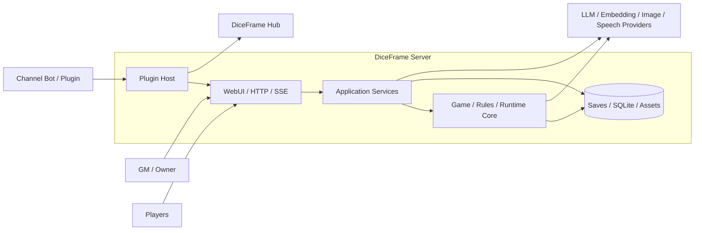
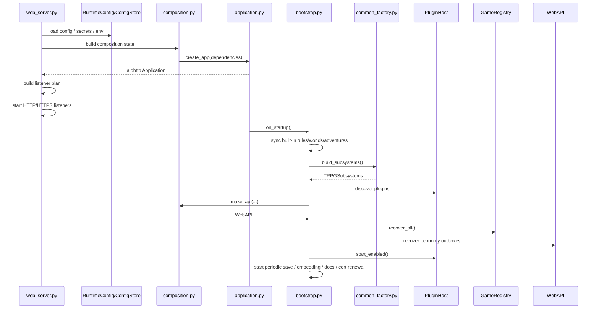
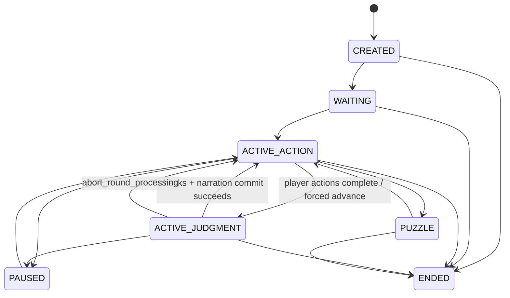
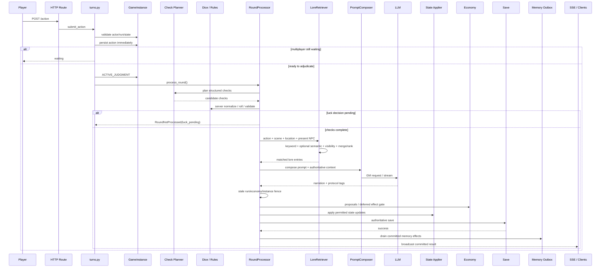
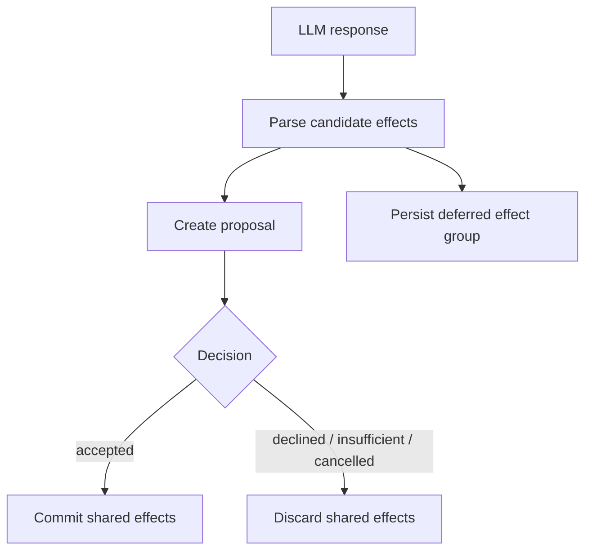
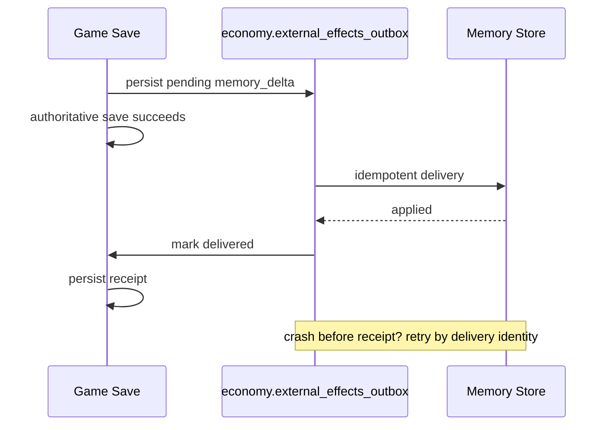
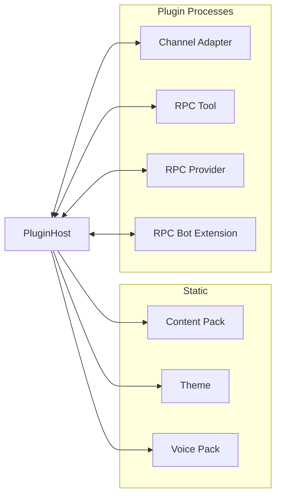
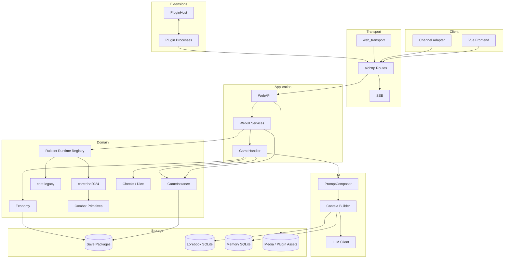
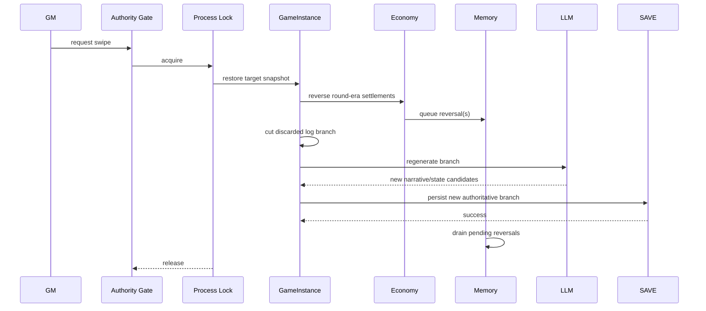

# DiceFrame System Architecture (Developer Edition)

> **Document type: Current Architecture / System Architecture**
>
> This document describes the DiceFrame system architecture that is already merged into the current `main` branch and can be verified from source code. It is not a roadmap, requirements list, PR digest, or a design proposal for “how things should work in the future.”
>
> **Verification baseline**
>
> - Repository: `diceframe/diceframe`
> - Branch: `main`
> - Commit: `962fda45a68caa24bac38fd2313d92d66fa59a7a`
> - Release: `2.6.1`
> - Current GameInstance persisted schema: `21`
> - Current Lorebook SQLite schema (`PRAGMA user_version`): `9`
> - Document verification date: 2026-09-18
>
> **Explicitly excluded from the current architecture**
>
> - Unmerged PRs / unmerged feature branches;
> - Local working-tree drafts;
> - Capabilities that exist only in design notes but are not implemented on the current `main` branch.
>
> These items may inform future architecture, but they must not be described in this document as current behavior.

---

# 0. Developer Quick Start

This chapter is for developers who are entering the repository for the first time and are about to change code.

All of the full architecture chapters that follow are retained. This chapter does not replace them; it only provides **feature entry points, key files, and authority boundaries**.

## 0.1 Remember These Three Questions First

Before taking any issue or PR, ask:

```text
1. Where is the final authority for this feature?
2. Where does the user request enter, and which services / runtimes does it pass through?
3. Am I changing the presentation layer, application orchestration, or authoritative state?
```

The most common way to break DiceFrame is not “writing incorrect code,” but:

```text
Writing correct logic in the wrong layer
```

For example:

```text
The frontend calculates D&D rules by itself
LLM text directly modifies HP
AI hosting creates a duplicate copy of a character
WorldState and memory each keep their own copy of the “current world”
Services import each other and form dependency cycles
```

All of these can appear to work in the short term, but they create a second authority.

---

## 0.2 Feature → First Entry Point → Core Owner

| What I want to change | First entry point | Follow it to | Final Authority / Owner |
|---|---|---|---|
| Player action submission | `src/webui/services/turns.py` | `GameInstance` → `RoundProcessor` | `GameInstance` / Ruleset |
| Multiplayer action barrier | `turns.py` | `GameInstance.human_actions_ready()` / `try_advance()` | `GameInstance` |
| AI GM round | `src/commands/round_processor.py` | Check Planner / Prompt / State Applier | Server + Ruleset |
| Check planning | `src/commands/check_planner.py` | normalize / dice / rules | Server RNG / Rules |
| AI-hosted PC (exploration) | `src/commands/ai_player.py` | `turns.py` | Player Control + canonical action queue |
| Player control | `src/webui/services/game_controls.py` | `src/engine/player_control.py` | `players[uid].control` |
| Away / temporary AI takeover | `game_controls.py` | away policy / control revision | Player Control |
| AI-hosted PC (D&D combat) | `src/rulesets/automation.py` | `src/rulesets/dnd2024/combat/` | D&D Runtime |
| Current world facts | `src/engine/world_state.py` | world ops | `GameInstance.world_state` |
| Location / route legality | `src/engine/world_legality.py` | planner requirement / RoundProcessor | WorldState |
| World time / scheduled events | `src/engine/world_events.py` | `world_state.scheduled_events` | WorldState |
| Long-term memory | `src/memory/delta.py` | `src/engine/memory_outbox.py` | MemoryStore |
| D&D 2024 Runtime | `src/rulesets/dnd2024/runtime.py` | individual domains | D&D Runtime |
| D&D combat | `src/rulesets/dnd2024/combat/` | validate / resolve / reducer | D&D Combat State |
| D&D Campaign / Session 0 | `src/rulesets/dnd2024/campaign/` | EventBatch / reducer | D&D Ruleset State |
| D&D characters | `src/rulesets/dnd2024/character/` | ruleset character lifecycle | `ruleset_character` |
| D&D rest | `src/webui/services/ruleset_rest.py` | D&D resting domain | D&D Runtime |
| D&D advancement | `src/webui/services/ruleset_advancement.py` | progression / character reconciliation | D&D Runtime |
| Ruleset capability | `src/rulesets/contracts.py` | `registry.py` | Runtime capability contract |
| Generic combat extension | `src/webui/services/combat_extension.py` | `src/engine/combat_*` | Generic combat primitives |
| Economy / payments | `src/engine/economy.py` | proposal / settlement / outbox | Economy |
| Currency model | `src/engine/currency/` | frontend currency utility | CurrencySpec |
| Save encode/decode | `src/engine/game_state_codec.py` | migrations | GamePersistedState |
| Save migration | `src/migrations/instance.py` | schema sequence | Migration layer |
| reset / restart | lifecycle service | aggregate replacement / run_id | GameInstance |
| rollback / swipe | lifecycle / GameHandler | authority lock / snapshots | GameInstance |
| Lorebook content | `src/lorebook/store.py` | locale view / CRUD / canonical entries | LorebookStore |
| Lorebook retrieval | `src/lorebook/retrieval.py` | KeywordMatcher / optional EmbeddingClient / context projection | LoreRetriever (retrieval orchestration; does not own mechanics authority) |
| World templates | `src/content/` / worlds service | Content V2 | World Content |
| Adventure Bundle | `src/adventures/` | ruleset adventure binding | Adventure package |
| Plugins | `src/plugin_host/host.py` | descriptors / capabilities | PluginHost |
| Bot | `src/bots/bridge_core/` | DiceFrame HTTP API | Server API |
| Web login / Access | `src/webui/access_control.py` | middleware / session | Web Access |
| Mobile QR sign-in | `src/webui/pairing.py` | routes / device token | Access Control |
| WebUI startup | `web_server.py` | composition / application / bootstrap | Composition Root |
| Runtime config reload | `src/webui/config_controller.py` | RuntimeConfig / composition | ConfigStore |
| Frontend room creation | `frontend-v2/src/features/create/CreateView.vue` | API / server validation | Server |
| Frontend main play view | `frontend-v2/src/features/play/PlayView.vue` | play components / ruleset UI | Projection only |
| D&D combat frontend | `frontend-v2/src/features/rulesets/dnd2024/combat/` | gameplay projection | Server projection |
| Image generation | `src/imagegen/` | generated image service / assets | Image service |
| TTS / ASR | `src/tts/` / `src/asr/` | webui services | Media service |
| Updater | updater service | launcher / docker launcher | Deployment boundary |

---

## 0.3 Recommended Code-Tracing Order

When investigating a feature problem, do not start by merely searching for button text across the repository.

Recommended order:

```text
UI / Bot entry point
↓
HTTP route
↓
WebAPI delegate
↓
WebUI service
↓
GameInstance / Engine / Ruleset Runtime
↓
Persistence / Migration
↓
Relevant tests
```

If you have already found the “final authority” halfway through the trace, do not copy that logic back into the presentation layer.

---

## 0.4 Real Request Paths for Common Operations

### Ordinary Player Action

```text
ActionComposer / Bot
↓
HTTP action route
↓
turns.submit_action
↓
validate actor / run / state
↓
GameInstance.add_action
↓
save action
↓
multiplayer barrier
↓
fill AI-hosted seat actions (if needed)
↓
try_advance
↓
RoundProcessor.process_round
↓
Check Planner
↓
server normalize / rules / dice
↓
PromptComposer
↓
LLM GM
↓
stale fence
↓
state/economy/deferred effect gate
↓
authoritative save
↓
memory outbox
↓
SSE / Bot projection
```

### Player Control Handover

```text
Web / Bot control request
↓
GameControlService
↓
control_change_block
↓
players[uid].control
↓
revision++
↓
save
↓
resume_after_control_change on human → ai
↓
reuse the existing turns progression path
```

### WorldState Legality

```text
Player free-text action
↓
Check Planner proposes world_requirements
↓
world_legality reads authoritative WorldState
↓
Unknown fact: do not guess, do not block
Proven contradiction: structured rejection / trusted ruling
↓
Only a legal move writes back the canonical location
```

### D&D Authoritative Combat

```text
Intent
↓
D&D validation
↓
resolution
↓
EventBatch
↓
combat reducer
↓
canonical combat state
↓
projection
↓
LLM only narrates confirmed results
```

---

## 0.5 “Where Is the File?” and “Who Decides?” Are Different Questions

For example:

```text
frontend-v2/src/features/play/PlayView.vue
```

may be where a button lives, but it is not the combat authority.

Likewise:

```text
src/commands/ai_player.py
```

produces AI-player action text, but it does not own character HP, equipment, world position, or dice results.

Developers should distinguish between:

```text
entry-point file
orchestration file
state owner
rules authority
persistence owner
```

---

## 0.6 Recently Added Architecture-Level Capabilities on Current `main`

From the historical 2026-09-16 baseline of the original document to the current 2026-09-18 `main`, the following **architecture-level** capabilities have been merged:

```text
WorldState v1
├─ authoritative facts
├─ public / gm visibility
├─ logical world clock
├─ scheduled events
├─ basic location / route legality
└─ atomic world-ops write entry point

Player Control
├─ human
├─ ai
├─ unclaimed
├─ revision
├─ temporary
├─ resume_mode
└─ away_control_policy

AI-hosted PC
├─ automatic exploration action fill
├─ human readiness gate
├─ immediate resume after control changes
├─ control revision stale guard
├─ character-sheet persona constraint
└─ deterministic automatic intent in D&D combat

D&D Class Feature Runtime v1
├─ src/rulesets/dnd2024/features/
├─ parameterized class_feature_catalog
├─ class-resource projection and resize policy
├─ equipment prerequisites / capability projection
└─ continues to reuse existing combat / rest / advancement authority

Hybrid Lore Retrieval
├─ one LoreRetriever shared by all standard Rulesets
├─ action + scene + canonical location + present-NPC anchors
├─ KeywordMatcher + optional semantic retrieval
├─ reuses MemoryStore.embedding_client
├─ derived lorebook_embeddings cache
├─ automatic lexical fallback when embeddings are unavailable or fail
└─ WorldState / Ruleset authority outranks Lorebook

Access / UX supporting architecture
├─ owner device token
├─ one-time pairing code
├─ mobile QR sign-in
├─ per-character control mode during game creation
└─ QR sharing entry point
```

Dedicated developer chapters later in this document cover these additions.

---

## 0.7 Capabilities That Explicitly Do **Not** Exist Yet

Do not assume the following already exist when developing features:

```text
Generic Entity Registry
Generic Relation Graph
Full long-running Process Engine
Map topology / Pathfinding
Unified Confirmed Event → World Memory Manager
Cross-Ruleset generic Class Feature Runtime
(currently only the D&D 2024-specific `features/` runtime exists)
```

WorldState v1 already has facts / clock / scheduled events, but that does not mean Entity / Relation / Process have been implemented.

---

## 1. Document Goals

DiceFrame is no longer “a TRPG page that calls an LLM.” It is a self-hosted TRPG system that includes:

- Multiplayer and single-player game runtimes;
- World, rules, character, and adventure content systems;
- Authoritative WorldState (facts / visibility / logical clock / scheduled events / basic action legality);
- Player Control and AI-hosted PCs (`human / ai / unclaimed`);
- LLM GM, structured checks, and long-term memory;
- Generic Hybrid Lore Retrieval (scene anchors + keywords + optional semantic retrieval);
- Authoritative D&D 2024 runtime and Class Feature Runtime v1;
- Compatibility paths for legacy CoC / Freeform and similar rules;
- Authoritative combat and generic combat primitives;
- Economy settlement, rollback, and cross-store outbox handling;
- Plugin host and channel Bots;
- Web frontend, SSE, and player sharing entry points;
- Supporting media services such as image generation, TTS, and ASR;
- Three deployment/update paths: Source / Windows Portable / Docker.

The core purpose of this architecture document is therefore not to list features, but to answer:

1. **Which module owns which state and authority?**
2. **Which layers does a request pass through after entering from a client?**
3. **What may the LLM decide, and what may it not decide?**
4. **How do multiplayer concurrency, restart, rollback, and settlement prevent stale writes from contaminating new state?**
5. **How do legacy paths coexist with the new Ruleset Runtime?**
6. **How do rules, worlds, adventures, and plugin content separate identity, locale, and mechanics?**
7. **How are external side effects kept consistent across crashes, retries, and rollback?**
8. **Which boundary should a new capability extend instead of adding more logic to a large file?**

This document is organized around those questions.

---
# 2. Architecture Overview

## 2.1 System Context



DiceFrame's key boundaries are:

- **The browser, Bot, plugins, and the LLM are not the final authority for game state.**
- `GameInstance`, rules runtimes, and server-side reducers / resolvers are the authority for mechanics and persisted state.
- The LLM is primarily responsible for:
  - narration;
  - semantic understanding;
  - candidate structured plans;
  - low-trust proposals.
- Any operation that changes:
  - HP;
  - balances;
  - spell slots;
  - status;
  - combat order;
  - campaign facts;
  - persisted identity;
  - player permissions;
  - rules mechanics  
  must return to server-side legalization, validation, and persistence paths.

---

## 2.2 Layers and Dependency Direction

The application's core dependency direction can be summarized as:

```text
Frontend / Bot / Plugin Client
          │
          ▼
     HTTP Routes / SSE
          │
          ▼
         WebAPI
          │
          ▼
   WebUI Application Services
          │
          ├─────────────┐
          ▼             ▼
      GameHandler    Ruleset Runtime
          │             │
          ▼             ▼
      Generic Engine / Rules / Content
          │
          ├───────────────┬───────────────┐
          ▼               ▼               ▼
       Saves          Lorebook DB       Memory DB
```

`tests/architecture/test_dependencies.py` protects the real dependency direction through AST-level import analysis. The following boundaries are explicitly enforced:

- `engine / generation / lorebook / memory / rules`
  - must not depend on `webui`;
  - must not depend on the concrete `dnd2024` runtime;
  - must not casually depend on legacy compat;
- `rulesets`
  - must not depend on `webui / compat`;
- `dnd2024/combat`
  - must not depend on `campaign / webui`;
- `adventures`
  - must not depend on a concrete ruleset / webui / compat;
- `web_transport`
  - must not reverse-depend on game, rules, or WebUI business logic;
- the game / rules / AI layers
  - must not be aware of TLS, certificates, or a concrete transport.

This is one of the most important current **hard architecture boundaries**.

---

## 2.3 Authority Model: Who May Decide What

| Participant / layer | May do | Must not directly do |
|---|---|---|
| Browser frontend | Submit intents, action text, choices, confirmations, and render projections | Submit trusted damage, balances, permission conclusions, or combat outcomes |
| Bot / Channel Adapter | Call the HTTP API on behalf of a valid actor | Bypass actor / game / room authorization |
| LLM GM | Narrate; generate candidate tags / check plans / proposals | Become persisted-mechanics authority directly |
| Check Planner LLM | Propose which checks may be needed | Make the final decision on legal actor, numerical values, or dice results |
| Ruleset Runtime | Interpret rules, validate intents, resolve, apply events | Control WebUI / transport in reverse |
| GameInstance | Own authoritative state and lifecycle for one game | Know about HTTP, TLS, Vue, or other presentation concerns |
| Economy Engine | Own balances, proposals, transactions, rollback | Let model text directly deduct money |
| Memory Store | Store external long-term memory | Write before authoritative settlement |
| Plugin | Declare contributions / capabilities / RPC | Bypass host permissions and become core authority directly |
| Web Transport | HTTP/HTTPS, listeners, certs, endpoints | Know game rules |

---

# 3. Repository and Module Map

## 3.1 Major Backend Directories

The important architecture domains under `src/` are:

```text
src/
├─ adventures/          standalone Adventure Bundle loader / graph contracts
├─ asr/                 speech-recognition capabilities
├─ bots/                shared Bot bridge logic
├─ commands/            application/domain orchestration for rounds, checks, LLM, state apply, etc.
├─ compat/              legacy-format compatibility boundary
├─ content/             Content V2, GM style, and other content semantics
├─ db/                  database helpers
├─ docker_launcher/     Managed Docker install-commit and rollback boundary
├─ engine/              GameInstance, dice, economy, combat primitives, persistence projection
├─ generation/          content generation
├─ imagegen/            image-generation backend / asset contracts
├─ knowledge/           assistant / knowledge capabilities
├─ launcher/            Windows Portable launcher
├─ llm/                 LLM client / context / parser / tools
├─ lorebook/            lore storage, keyword matching, Hybrid retrieval, derived embedding cache
├─ memory/              long-term memory storage, retrieval, delta
├─ migrations/          persisted-schema migration
├─ plugin_host/         plugin host, processes, descriptors, capabilities
├─ plugin_sdk/          plugin SDK
├─ rules/               Legacy / generic RuleSystem and bundle loader
├─ rulesets/            versioned Ruleset Runtime
├─ tts/                 TTS capabilities
├─ web_transport/       HTTP/HTTPS / TLS / listener / endpoint
└─ webui/               aiohttp application, routes, services, WebAPI
```

Important distinctions:

- `src/commands/` is **not** the HTTP layer;
- `src/webui/services/` is the Web application-service layer;
- `src/engine/` should not continue absorbing concrete D&D semantics;
- `src/rulesets/dnd2024/` is the D&D-specific rules authority;
- `src/compat/` is the boundary through which old worlds enter the new model, not the default dependency layer for new code.

---

## 3.2 Web Backend Structure

```text
src/webui/
├─ application.py       aiohttp app + middleware + route composition
├─ bootstrap.py         startup / recovery / plugin / background jobs / cleanup
├─ composition.py       runtime composition root
├─ runtime_config.py    configuration loading and persistence
├─ access_control.py    owner / player-share / bot / SSE auth
├─ api.py               WebAPI delegation facade
├─ routes/              HTTP layer
└─ services/            application-service layer
```

`services/` is already split by functional domain, including but not limited to:

- `turns.py`
- `game_lifecycle.py`
- `game_queries.py`
- `game_master.py`
- `game_controls.py`
- `ruleset_gameplay.py`
- `ruleset_characters.py`
- `ruleset_advancement.py`
- `ruleset_rest.py`
- `combat_extension.py`
- `characters.py`
- `character_cards.py`
- `manual_rolls.py`
- `generated_images.py`
- `memory.py`
- `plugins.py`
- `worlds.py`
- `rules.py`
- `adventures.py`
- `updater.py`
- `security.py`
- `speech.py`
- `asr.py`

The architecture intent is: **routes own HTTP shape, services own use cases, WebAPI owns delegation/composition, and the core owns authoritative mechanics.**

---

## 3.3 Frontend Structure

The current frontend lives under `frontend-v2/` and follows a feature-oriented Vue/TypeScript structure:

```text
frontend-v2/src/
├─ api/                 backend API client
├─ components/          shared UI
├─ composables/         reusable state / behavior
├─ features/
│  ├─ admin/
│  ├─ auth/
│  ├─ create/
│  ├─ legal/
│  ├─ lorebook/
│  ├─ overview/
│  ├─ peer/
│  ├─ play/
│  ├─ player/
│  ├─ plugins/
│  ├─ rulesets/
│  └─ worlds/
├─ i18n/
├─ navigation/
├─ peer/
├─ router/
├─ App.vue
└─ main.ts
```

Frontend rules:

- Do not duplicate backend Content V2 logic;
- Do not infer rules capabilities because a name “looks like D&D”;
- Use backend `ruleset capabilities / available_intents` for professional-rules capabilities;
- Do not treat whether a button is visible as authorization;
- UI capability gating is an experience layer only; the server must validate again.

---

# 4. Startup and the Composition Root

## 4.1 Why `web_server / composition / application / bootstrap` Are Separate

DiceFrame's startup path has been split out of the former “large entry script” into distinct owners:

| Module | Owner |
|---|---|
| `web_server.py` | Environment entry point and actual listener startup |
| `runtime_config.py` | Configuration sources and persistence |
| `composition.py` | Runtime dependency graph |
| `application.py` | aiohttp app / middleware / routes |
| `bootstrap.py` | startup / recover / plugin / background jobs / cleanup |

The primary value is not simply “shorter files,” but avoiding problems such as:

- importing a module causes configuration migration/persistence;
- listeners and game business logic reference each other;
- runtime hot reload replaces only half of the dependency graph;
- routes construct business objects;
- startup tests must open real ports.

---

## 4.2 Startup Sequence



---

## 4.3 `TRPGSubsystems`

`src/common_factory.py` defines the current core subsystem bundle:

```text
TRPGSubsystems
├─ registry            GameRegistry
├─ llm_client          LLMClient
├─ lorebook_store      LorebookStore
├─ lorebook_matcher
├─ memory_store        MemoryStore
├─ ruleset_registry    RulesetRuntimeRegistry
└─ handler             GameHandler
```

This is a very important composition seam.

During a WebUI runtime reload, DiceFrame can:

- retain the existing registry;
- retain lorebook / memory;
- rebuild the LLM client / provider configuration;
- switch only after the candidate runtime has been fully constructed successfully.

This prevents “hot-reloading model configuration clears active game instances.”

Note that `EmbeddingClient` is currently not a top-level field on `TRPGSubsystems`. After the candidate runtime is fully built, `common_factory.py` switches the new client into:

```text
MemoryStore.embedding_client
```

`GameHandler.lore_retriever` then reuses **that same client** through a lazy provider. Long-term memory and semantic Lorebook retrieval therefore share:

```text
embedding_enabled
embedding_provider_ref
embedding_model
embedding_max_input
```

They do not each maintain a second configuration or a second client. `LoreRetriever` is also not a new state authority; it is only the retrieval-orchestration component inside `GameHandler`.

---
# 5. Web Transport and Listener Topology

## 5.1 Transport Is Not a Business Layer

`src/web_transport/` specifically manages:

- HTTP / HTTPS;
- certificates such as self-signed / Let's Encrypt;
- endpoints;
- listener topology;
- graceful lifecycle.

Business modules must not import it.

---

## 5.2 ListenerPlan

Each listener is described by:

```text
ListenerPlan
- host
- port
- tls
```

For example, one instance may simultaneously expose:

```text
0.0.0.0:8000  HTTP
0.0.0.0:8443  HTTPS
[::]:8000      HTTP
[::]:8443      HTTPS
```

Each site starts independently:

- a bind failure on one host does not automatically mean other listeners failed;
- failures must be logged;
- an IPv6 failure must not cause a healthy IPv4 listener to be treated as failed.

---

## 5.3 Internal Plugin API Address

Plugins call DiceFrame's own HTTP API through `TRPG_API_BASE`.

The difficulty is that:

- the external primary listener may be self-signed HTTPS;
- an ordinary aiohttp client inside a plugin may not trust that certificate;
- the service may listen only on IPv6;
- a planned listener may fail to bind in reality.

Internal address selection therefore happens in two stages:

```text
Planning stage:
internal_api_listener(plan)
    ↓
prefer HTTP
    ↓
within the same scheme prefer loopback → wildcard → concrete host

After startup:
resolve_internal_listener(plan, started)
    ↓
verify the original choice actually started successfully
    ↓
if not, choose a fallback from started + emit warning
```

If the actual internal base URL after startup differs from the value plugins received when they were started:

```text
web_server
  └─ update PluginHost.base_env["TRPG_API_BASE"]
       └─ restart_api_consumers()
```

Only plugins that:

- are already running; and
- declare use of `diceframe.http`

are restarted. DiceFrame does not restart every plugin globally.

---

# 6. aiohttp Application and the HTTP Boundary

## 6.1 Middleware Order

The primary middleware / response hooks currently composed by `create_app()` include:

```text
CORS
  ↓
Session
  ↓
Abuse Guard
  ↓
Authentication / Access Control
  ↓
Error Code Normalization
  ↓
Response Security Headers
```

The application also owns:

- `SessionManager`
- `AbuseGuard`
- `LoginAuditStore`
- `ConnectionPool`
- `SseTicketStore`
- runtime control
- web transport
- security transport service

These are Web application state and do not belong in `GameInstance`.

---

## 6.2 Route Ownership

HTTP routes are registered by domain, for example:

- games
- auth
- bot
- plugins
- security
- hub
- system
- updater
- speech / ASR
- generated images
- worlds
- rules
- adventures
- character cards
- avatars
- scene images
- maps
- generation
- SSE
- memory

The intended shape is:

```text
request parsing
    ↓
identity / auth extraction
    ↓
call WebAPI
    ↓
service / core
    ↓
serialize response
```

A route should not itself:

- settle economy state;
- decide D&D damage;
- operate migrations;
- construct an entirely new LLM pipeline.

---

# 7. WebAPI and Service Architecture

## 7.1 Role of WebAPI

`src/webui/api.py` is still a fairly large facade, but architecturally its role is to:

- expose a unified JSON-safe application API;
- assemble service dependencies;
- delegate complex use cases to `src/webui/services/*`;
- inject shared registry / lorebook / memory / ruleset registry / handler capabilities into services.

It should not continue absorbing concrete business implementations.

---

## 7.2 Calls Between Services

The current principle is:

> **A WebUI service does not directly import another service to perform cross-domain orchestration.**

Cross-domain calls use:

- dependency dataclasses;
- callables;
- protocols;
- composition-root injection.

This prevents implicit cycles such as:

```text
characters -> turns -> payments -> characters -> ...
```

---

## 7.3 Typical Dependency Injection

For example, WebAPI constructs the character service using:

```text
CharacterDependencies
├─ games
│  ├─ get_instance
│  ├─ parse_game_key
│  └─ save_instance
├─ rules
│  ├─ load_rule_by_id
│  ├─ load_rule_for_game
│  └─ ruleset_registry
├─ assets
│  ├─ lorebook
│  ├─ world template loader
│  ├─ avatar resolver
│  └─ generated image resolver
└─ economy hooks
   ├─ commit deferred effects
   ├─ schedule deferred scene image
   ├─ apply memory
   └─ reverse memory
```

A service receives only the capabilities it actually needs instead of treating the entire `WebAPI` as a service locator.

---

# 8. GameHandler: Game Orchestration Layer

`src/commands/game_handler.py` is the core game-orchestration facade.

It composes:

```text
GameHandler
├─ CombatResolver            legacy/generic combat path
├─ DiceResolver
├─ PuzzleProcessor
├─ PromptComposer
├─ LoreRetriever             shared by round / swipe / KP Q&A
├─ GameFactory
├─ StateUpdateApplier
├─ ProgressionResolver
├─ RoundProcessor
├─ SwipeGenerator
├─ GameLifecycle
├─ StoryRecapGenerator
└─ KPQuestionResponder
```

## 8.1 Why It Is Not the Aggregate Root

`GameHandler` does not own per-game state.

Per-game state belongs to `GameInstance`.

GameHandler is closer to an:

> **Application / Domain Orchestrator**

It connects:

- LLM;
- rules;
- lore retrieval / projection;
- memory;
- combat;
- state applier;
- lifecycle

into complete flows.

---

## 8.2 Safe Entry Points vs. Internal Entry Points

One critical architecture fact:

- `process_round()` is the protected entry point;
- `_process_round_impl()` / `process_round_impl()` are only internal implementation seams.

The internal implementation does not guarantee:

- acquiring the correct process lock;
- failure rollback;
- stale-run guarding;
- failure persistence.

External transports / services therefore must not bypass the safe entry point and call the internal round implementation directly.

---

# 9. GameInstance: Per-Game Aggregate Root

## 9.1 Core Responsibilities

`GameInstance` is the authoritative Aggregate Root for one running game.

It owns:

- game identity;
- run identity;
- players and NPCs;
- round state;
- action queues;
- legacy combat state;
- ruleset binding / state;
- adventure binding;
- economy;
- checks;
- manual rolls;
- narrative state;
- private/public logs;
- media references;
- rollback snapshots;
- health/degraded state;
- runtime concurrency locks.

---

## 9.2 GameState

Current state machine:



Two concepts must be kept separate here:

### Judgment Abort

The current round already entered adjudication, but processing failed:

```text
ACTIVE_JUDGMENT
    ↓
abort_round_processing
    ↓
restore the snapshot from before this round entered judgment
    ↓
ACTIVE_ACTION
```

This is not “rolling back an already completed historical round.”

### Historical Rollback / Swipe

This rewrites a round that had already been committed:

```text
authoritative history
    ↓
restore target snapshot
    ↓
cut discarded branch
    ↓
regenerate / apply new branch
    ↓
persist
```

These two lifecycles must not be mixed.

---

# 10. Per-Game Concurrency Model

## 10.1 Three Lock Layers

Current `GameInstance` lock order:

```text
_authority_lock
      ↓
_process_lock
      ↓
_lock
```

Their rough meaning is:

### `_authority_lock`

Protects:

- historical rewrite;
- aggregate replacement;
- high-level authority gates.

### `_process_lock`

Protects:

- `process_round`;
- `generate_swipe`;
- the same game from running two full narrative-processing pipelines concurrently.

### `_lock`

Protects:

- finer-grained state mutation;
- aggregate-internal operations such as action queues and state transitions.

The fixed order reduces deadlock risk and reverse-order acquisition.

---

## 10.2 `run_id`

`game_key` means:

> “Which game slot is this?”

`run_id` means:

> “Which run currently occupies that slot?”

For example:

```text
game_key = web:roomA:default

run_1    ---- restart ----> run_2
            same game_key
```

An old request may still hold `run_1`.

Mutation paths must therefore check:

```text
request.expected_run_id == current_instance.run_id
```

Otherwise the stale write is rejected.

---

## 10.3 Aggregate Replacement

Restart/reset does not clear the old object field by field.

The correct semantics are:

```text
Old GameInstance
     │
     ├─ lock authority
     │
     ├─ construct candidate
     │
     ├─ initialize candidate
     │
     └─ atomic registry replacement
                    ↓
             New GameInstance
```

This means an old writer that had been waiting for the lock still points at the old object / old run when it resumes, allowing the stale fence to reject it.

---

# 11. Persistence Architecture

## 11.1 Save Projection

The owner of persisted projection is:

```text
src/engine/game_state_codec.py
```

Serialization logic should not continue accumulating inside `GameInstance.to_dict()`.

Flow:


---

## 11.2 Main Persisted State

Major categories currently covered by the codec:

| Category | Examples |
|---|---|
| identity | game_key, run_id, memory_namespace |
| binding | world_id, rule_id, ruleset_runtime, adventure_binding |
| runtime state | ruleset_state, event_ledger |
| world state | world_state: facts / clock / scheduled_events / revision |
| player control | players[uid].control / away_control_policy |
| game lifecycle | state, round_number |
| participants | players, npcs, ready/away |
| actions | action_queue, pending_actions |
| legacy combat | combat_active, enemies, initiative |
| generic combat extension | combat_extension, round snapshots |
| narrative | scene, game_time, log, summary, key_facts |
| presentation prefs | language, difficulty, narrative_perspective, gm_style_override |
| economy | proposals / transactions / effects / outbox |
| checks | last_check, last_checks, manual_roll_requests |
| rollback safety | round_start_snapshot, round_entity_snapshot, death save outcomes |
| access | GM, player access, bot bind, room credentials |
| media | scene_image, map_background |
| health | health_events, health_status |
| private channels | private_log, table_talk |

Not every runtime-only object is serialized. Examples include:

- asyncio locks;
- active tasks;
- timer task handles;
- transient in-flight context.

---

## 11.3 Persisted Schema Migration

Current version:

```text
CURRENT_INSTANCE_SCHEMA_VERSION = 15
```

Migrations must run sequentially:

```text
v1 → v2 → v3 → ... → v15
```

not:

```text
if old_version:
    guess latest shape
```

Important migration history:

| Version | Key change |
|---|---|
| 1→2 | `run_id`, memory namespace, base economy shape |
| 2→3 | durable external-effect outbox |
| 4→5 | introduced purchase request/order at the time |
| 5→6 | removed deprecated narration-priced purchase state |
| 6→7 | converged on payer-confirmed proposals |
| 7→8 | removed transfer / fee / all_contributors surface |
| 8→9 | persisted manual roll requests |
| 9→10 | explicit `play_mode` |
| 10→11 | manual roll purpose / target / comparison |
| 11→12 | Currency V2; built-in CoC dollar→cent |
| 12→13 | WorldState core; materialize an explicit empty world-state container for old saves |
| 13→14 | Player Control contract; legacy seats default to `human` without guessing |
| 14→15 | `away_control_policy`; old saves default to `pause` rather than silently handing control to AI |

Migration behavior:

- `deepcopy` first;
- do not mutate the caller's original object;
- reject unsupported future versions directly;
- do not guess uncertain monetary semantics.

---

## 11.4 Import and Identity Rebind

Importing a save does not mean “continue using the original run identity.”

The import path performs:

```text
old game_key
old run_id
old memory namespace
       │
       ▼
rebind_imported_game_state_payload
       │
       ├─ new local game_key
       ├─ new run_id
       ├─ new memory namespace
       └─ rebind economy run_id
```

The external memory store itself is not contained in the save package, so:

- undelivered pending payloads may move into the new namespace;
- already-delivered receipts must not masquerade as deliveries in the new game.

---
# 12. Full Player Action / Round Pipeline

This is DiceFrame's most central runtime path.



---

## 12.1 Why Actions Are Persisted Before the Barrier

In multiplayer, one player may submit an action and then need to wait for the others.

If the action exists only in a local variable inside the HTTP handler:

```text
player A submits
server crash
player B submits later
```

A's action would be lost.

Therefore the Web/Bot action flow writes the action into `GameInstance` / the save before waiting on the barrier.

---

## 12.2 Multiplayer Barrier

Multiplayer does not mean “every message causes one LLM reply.”

The basic semantics are:

```text
current alive/present participants
       ↓
collect actions
       ↓
all required actors ready
       ↓
one judgment phase
       ↓
checks + one GM narrative
```

This ensures that:

- multiple actions from the same round can be adjudicated together;
- the first person to post does not become an implicit initiative authority;
- the GM prompt can see the complete set of declarations for the round.

---

# 12A. Player Control and AI-Hosted PCs

This section documents an important architecture change merged into `main` on 2026-09-17.

## 12A.1 The Controller Is Not the Character

The authoritative record is:

```text
players[uid].control
```

Current control modes:

```text
human
ai
unclaimed
```

The record also contains:

```text
revision
temporary
resume_mode
```

It answers:

> **“Who is playing this character?”**

not:

> “What is this character?”

The character itself still exists exactly once:

```text
GameInstance.players[uid]
character_sheet
ruleset_character
player:<uid> combat actor
```

Switching controllers does not copy:

```text
HP
equipment
conditions
spell slots
world position
combat actor
```

Therefore AI hosting must never create:

```text
companion:<same-character>
```

Doing so would create duplicated state.

### Developer Entry Points

```text
src/engine/player_control.py
src/webui/services/game_controls.py
src/engine/game_instance.py
src/engine/game_state_codec.py
src/migrations/instance.py
```

---

## 12A.2 `human`

A real player is responsible for the seat.

Human identity is still resolved through the existing Web session / share / Bot mappings.

Player Control does not create a second account system.

---

## 12A.3 `ai`

The server is responsible for producing actions for that PC.

The character remains:

```text
player:<uid>
```

Exploration actions and authoritative D&D combat use different generation paths, but both ultimately return to the existing authority.

---

## 12A.4 `unclaimed`

The seat exists, but currently has neither a human controller nor server AI control.

It must not:

```text
block the human ready barrier
automatically generate exploration actions
```

Whether it participates in a specific authoritative combat is decided by combat-participant rules, not because the control record silently adds an actor.

---

## 12A.5 Safe Boundary for Control Changes

Control cannot be changed at arbitrary times.

The server uses:

```text
control_change_block
```

to check the current phase and whether processing is in flight.

A typical safe window is:

```text
ACTIVE_ACTION
and no full processing flow is currently running
```

Otherwise the caller receives:

```text
CONTROL_CHANGE_BUSY
```

and must retry later.

---

## 12A.6 `control.revision`

Every real control change increments the revision.

Before issuing an AI action request, DiceFrame captures:

```text
run_id
round
uid
control.revision
phase
```

All of them are re-checked when the LLM returns.

For example, if a player claims a character while the AI is still thinking:

```text
ai → human
revision changed
↓
old AI output is discarded
```

This prevents a result from the old controller from contaminating the new controller's state.

---

# 12B. AI-Hosted Exploration Actions

Entry point:

```text
src/commands/ai_player.py
```

An AI player in exploration generates only:

```text
ordinary action text
```

It does not directly generate trusted:

```text
DC
attack hit result
damage
dice result
world fact
balance change
```

Flow:

```text
human_actions_ready()
↓
AI generates actions for ai seats that still lack one
↓
GameInstance.add_action
↓
enter the same Check Planner / WorldState / RoundProcessor path as human actions
```

---

## 12B.1 Human Gate

AI does not “notice that it has no action and immediately race ahead.”

AI action fill happens only after the human gate is satisfied.

Example:

```text
A has acted
B is still human-controlled and has not acted
C is AI-controlled
```

At this point:

```text
human_actions_ready() == false
```

C must not generate an action early and push the round forward.

Only after every human seat that must be waited for is ready are AI seats filled.

---

## 12B.2 Per-Seat Isolation

An AI-player prompt may use only information visible to that character:

```text
its own character sheet
public story
its own private perceptions
information explicitly visible to that character
actions already declared this round
```

It must not read:

```text
GM-private facts
gm_directives
another player's private_log
future plot
```

---

## 12B.3 Persona

AI hosting means:

> **Role-play this character.**

It does not mean:

> “Compute the globally optimal tactical move for the human.”

The system prompt should prioritize:

```text
identity / background
personality
values
goals / motivations
relationships
personal history
known clues
current physical / resource state
```

The character sheet remains the single persona source.

Do not create a second store such as:

```text
ai_persona
```

that can drift away from the character sheet.

---

# 12C. Immediate Resume After a Control Change

After a successful `human → ai` write, the system does not require a human to send another message just to “wake up” the round.

Entry point:

```text
GameControlService.set_player_control
        ↓
turns.resume_after_control_change
```

It reuses the existing progression path:

```text
check phase
↓
check human gate
↓
fill AI actions
↓
try_advance
↓
prepare checks / process round
```

The frontend must not trigger this by submitting:

```text
empty actions
fake actions
```

---

# 12D. Authoritative D&D Combat for AI-Hosted PCs

Exploration AI and D&D combat AI do not produce the same kind of output.

In authoritative combat:

```text
AI-hosted PC
↓
AutomaticIntentRuntime
↓
structured intent
↓
validate
↓
resolve
↓
apply EventBatch
```

Entry points:

```text
src/rulesets/automation.py
src/rulesets/dnd2024/combat/
```

The current automation ladder is deterministic rules logic and does not use LLM tactics.

Typical behavior:

```text
heal a dying ally
↓
attack nearest hostile
↓
legal movement
↓
Dodge
↓
End Turn
```

When the current combat actor is handed to AI control:

```text
ruleset_gameplay.resume_authoritative_combat
```

reuses the same automatic-intent loop until:

```text
a human's turn
combat ends
no automatic intent is available
```

Do not create a second AI combat loop.

R4-b b1 closes a verified narrative-fill admission gap: with authoritative combat
active, both mixed and all-AI tables could enqueue generated free text. The turns
service now passes a synchronous, read-only capability query through GameHandler
and the AI command to the action gate. It requires structured intents when the
runtime supports authoritative intents and either disables narrative turns or has
active combat. Generation preflight avoids unnecessary model calls; commit checks
the current rule, runtime capabilities and combat status again under the existing
authority/state locks, after stale, human and duplicate checks, with no await before
enqueue. Unknown/incompatible runtimes and missing rules for bound instances fail
closed. The engine has no ruleset-specific branch. Optional `False` / `None` inputs
retain the direct-call contract; guarded callers must forward the live predicate.
The instance schema remains 20. R4-b b3 adds no AI economy gate (the progression
barrier already owns settlement); b4 stage alignment is deferred to R5. See the
Chinese architecture document §12E for the ordered policy table and decisions.

---

# 13. Check Planner and Server-Side Adjudication

## 13.1 Role of the Planner

`src/commands/check_planner.py` uses a model to understand:

- which actions may require checks;
- who the actor is;
- target / opponent;
- intent type;
- possibly related skills / items / NPCs;
- economy purchase intents, etc.

But its output is only a **candidate plan**.

The final result must pass through:

```text
normalize_check_specs
    ↓
server actor resolution
    ↓
rule/dice validation
    ↓
server RNG
    ↓
CheckResult
```

---

## 13.2 Actor Resolution

The planner currently supports explicit actors:

```text
player:<uid>
companion:<id>
```

and exact matching against player / companion names.

Rules:

- unique match: usable;
- duplicate names: reject;
- no match: reject;
- an ordinary narrative NPC cannot become a mechanical actor just because its name “looks like a companion.”

---

## 13.3 Context Is Not Authority

The planner may see compressed:

- inventory;
- equipment;
- NPCs;
- relationships;
- recent purchases;
- companions;
- recent narration.

This information exists only to improve semantic understanding.

For example:

> Seeing “there is a crowbar in the backpack” does not give the Planner authority to directly set the crowbar quantity to 0.

Real mutations still go through the state applier / ruleset runtime.

---

## 13.4 Skill `effect`

Character skills may contain:

```json
{
  "name": "Investigation",
  "value": 60,
  "effect": "Good at identifying unnatural gaps in a cluttered scene"
}
```

`effect` is currently:

> **descriptive metadata, not mechanics.**

The Planner only attaches an effect when:

- the player's action text clearly matches the skill; or
- the client explicitly selected `selected_skill`.

It cannot change:

- the skill value;
- DC;
- advantage/disadvantage;
- dice;
- damage;
- HP;
- status;
- resources;
- inventory.

If a skill needs a real mechanical effect in the future, that effect should enter the ruleset runtime / rule catalog rather than expanding the authority of free-text `effect`.

---

# 14. Manual Roll Subsystem

Manual rolling is not merely frontend randomness.

Current owner:

```text
src/webui/services/manual_rolls.py
```

Requests are persisted in:

```text
GameInstance.manual_roll_requests
```

Each request contains:

- request id;
- idempotent `operation_id` identity;
- `run_id`;
- round;
- created_by;
- targets;
- formula;
- purpose;
- target/comparison;
- visibility;
- results.

---

## 14.1 Purpose

Current values:

```text
free
check
contest
```

### free

An ordinary independent roll.

By default it is not injected into later AI-GM context.

It enters AI context only when the API explicitly sends the JSON boolean:

```json
true
```

The string `"true"` or the number `1` does not count.

### check

Has a target/comparison; the server produces success/failure.

### contest

After all targets complete their rolls, the server compares totals and produces winner/loss information.

`check / contest` results are always injected into subsequent AI context because they have become authoritative table events.

---
# 15. LLM Subsystem

## 15.1 Module Boundary

```text
src/llm/
├─ client.py
├─ context_builder.py
├─ parser.py
├─ protocol.py
└─ tools.py
```

`LLMClient` owns provider-facing capabilities.

Prompt / turn orchestration primarily lives in:

```text
src/commands/
├─ prompt_composer.py
├─ round_llm.py
├─ round_processor.py
└─ ...
```

---

## 15.2 PromptComposer

`PromptComposer` is the centralized owner of the GM prompt.

The final prompt is assembled from layers such as:

```text
base GM system prompt
    +
current rule appendix
    +
difficulty instructions
    +
resource protocol appendix
    +
effective GM narration style
    +
plot tracker
    +
multiplayer authority scope
    +
narrative perspective
    +
ruleset advancement instructions
    +
language instruction
```

One especially important rule:

> `instance.rule_id` is the authoritative rules selection after the game has started.

A World template's `default_rule` only provides the default choice on the creation page. Runtime code must not silently replace the player's chosen rules with the world's default rules.

---

## 15.3 Runtime LLM Projection

A professional ruleset may add an authoritative projection to generic LLM context through:

```text
runtime.build_llm_view(instance)
```

The correct relationship is therefore:

```text
Generic game context
      +
Ruleset authoritative read-only view
      +
WorldState / Hybrid Lore projection
      +
Memory
      +
Current actions/checks
      ↓
LLM
```

The context builder must not import D&D itself and calculate D&D state.

---

## 15.4 Player-Safe Q&A

Player-facing GM/KP Q&A is separate from the full GM context.

`build_player_safe_context()` uses a restricted context so that:

- GM-private directives;
- hidden facts;
- content that should not be public to that player

do not leak out of the full GM prompt.

Out-of-character Q&A does not have a second Lorebook retrieval system. `KPQuestionResponder` reuses `GameHandler.lore_retriever`, but runs it from the player's point of view:

```text
viewer_is_gm = false
mutate_timers = false
```

Candidate Lore is filtered by `visible_to` before semantic ranking, so hidden entries cannot enter the player-safe candidate set merely because they are semantically similar. Timed state is copied, so asking an out-of-character question does not advance sticky / cooldown / delay state. The player-safe projection still retains:

```text
type
tier
unreliable
name
content
```

but does not expose the internal canonical Lore entry ID. This prevents IDs such as `npc_traitor_mary` or `clue_real_murderer_john` from leaking secret information by themselves. Full GM context may still keep canonical IDs for diagnostics and consistency.

---

## 15.5 Preventing Reasoning Leakage

Some model providers mix reasoning into content:

```text
<think>...</think>
```

DiceFrame currently filters at both boundaries.

### Non-Streaming

`src/llm/client.py`

cleans:

- complete think blocks;
- isolated closing tags;
- unclosed reasoning.

### Streaming

`src/commands/round_llm.py`

must handle chunk splits such as:

```text
chunk1 = "<thi"
chunk2 = "nk>..."
```

Filtering is therefore stateful. An unclosed think block must not be flushed to the player at the end.

---

# 16. Stale Fence After an LLM Response

Calling an LLM is a long-running operation.

During those seconds or tens of seconds, the following may happen:

- player settlement;
- GM rollback;
- restart;
- reset;
- a new proposal;
- instance replacement.

The response therefore cannot be applied directly when it returns.

`RoundProcessor` compares again:

```text
registry current instance identity
run_id
economy fingerprint
```

If the old request has become stale:

```text
LLM response
    ↓
stale fence
    ↓
discard
```

instead of overwriting newer state.

---

# 17. Economy Architecture

## 17.1 Basic Principle

Model text cannot say:

```text
"You spent 20 gold."
```

and then cause the system to execute:

```python
gold -= 20
```

The authoritative path is:

```text
Narrative / Planner
      ↓
proposal
      ↓
server validation
      ↓
payer / GM decision
      ↓
transaction
      ↓
balance mutation
```

---

## 17.2 Currency V2

A rule defines currency through:

```text
CurrencySpec
├─ base_unit
├─ display_unit
└─ positive integer rates
```

For example, CoC:

```text
base_unit = cent
display_unit = dollar
```

The engine processes canonical integers only:

```text
$12.34
  ↓ parse
1234
  ↓ engine
1234 cents
  ↓ format
$12.34
```

Business code must not scatter operations such as:

```python
amount * 100
amount / 100
float(amount)
```

---

## 17.3 Unknown Price != Free

If DiceFrame has already recognized:

> “I want to buy this bottle of medicine.”

but cannot canonicalize the price/unit, the system will neither:

- charge the wrong amount; nor
- grant the item for free.

Instead it records for the current round:

```text
round_unpriced_purchase_intents
```

and blocks the related item grant.

---

## 17.4 FREE_GRANT

Only when the narrative explicitly states that an item is genuinely free / gifted / rewarded may DiceFrame produce a transient:

```text
FREE_GRANT
```

It:

- deducts no money;
- adds no money;
- does not itself grant the item;
- creates no proposal;
- is not persisted;
- acts only as authorization evidence for the item-grant gate.

And:

> If a real pending paid proposal exists, FREE_GRANT cannot bypass payment.

---

# 18. Narrative Commit Barrier

Economy in DiceFrame is not merely “bookkeeping.”

It also acts as:

> **the authoritative commit barrier for one model response.**

Suppose one model response simultaneously produces:

```text
NPC gives the player a sword
player pays 100
quest advances to the next stage
memory records "deal completed"
scene changes
```

If DiceFrame first applies:

```text
sword granted
quest advanced
memory written
```

and payment is then declined, state becomes inconsistent.

The current model is therefore:



As long as the current run still has any of the following:

- pending proposal;
- pending effect group;
- memory delivery;
- memory reversal;

the next authoritative narration is blocked by the barrier.

---

# 19. Memory Outbox and Cross-Store Consistency

The game-state save and memory SQLite database are two storage domains.

DiceFrame cannot perform a real database transaction spanning both systems.

It therefore uses a durable outbox.



---

## 19.1 Outbox Owner

Outbox data is stored in:

```text
economy.external_effects_outbox
```

because:

- it must be persisted together with the economy rollback window;
- effect groups and settlements have explicit identities.

However:

> the delivery state machine belongs to the memory domain, not the economy ledger.

---

## 19.2 Rollback Reversal

Memory already written into the memory store cannot be ignored during historical rollback.

Flow:

```text
delivered
   ↓ historical rollback
reversal_pending
   ↓
reverse memory delta
   ↓
reversed
```

If reversal succeeds but the receipt is not saved:

- recovery continues next time;
- identity keeps the operation idempotent.

---

# 20. Item / Equipment State Protocol

Older single-value fields cannot express:

> obtaining three items, equipping one, and consuming one in the same round.

The current structured state uses:

```text
item_gains[]
equipment_ops[]
item_uses[]
```

For example:

```json
{
  "item_gains": [
    {"name": "Leather Armor", "category": "equipment", "qty": 1},
    {"name": "Healing Potion", "category": "consumable", "qty": 2}
  ],
  "equipment_ops": [
    {"op": "equip", "name": "Leather Armor", "slot": "body"}
  ],
  "item_uses": [
    {"name": "Healing Potion"}
  ]
}
```

Older fields such as:

```text
equip_gain
weapon_gain
...
```

exist only as compatibility fallbacks.

---

# 21. Overall Ruleset Runtime Architecture

## 21.1 Why Ruleset Runtime Exists

Legacy `RuleSystem` can handle many custom-rule needs:

- d20 / d100;
- skills;
- resources;
- generic combat models;
- prompt appendices.

But complete D&D requires:

- canonical class/spell identity;
- slots;
- concentration;
- conditions;
- advancement;
- Session 0;
- adventure encounter binding;
- authoritative event ledger;
- deterministic combat.

These cannot continue to be placed inside generic `RuleSystem`.

Therefore DiceFrame introduces:

```text
src/rulesets/
```

---

## 21.2 Registry

Current default registry:

```text
RulesetRuntimeRegistry
├─ LegacyRulesetAdapter
└─ Dnd2024Runtime
```

A rule template binds through:

```json
{
  "runtime": {
    "id": "core:dnd2024",
    "minimum_version": 1
  }
}
```

If `runtime` is absent, DiceFrame uses:

```text
core:legacy
```

It does not guess the runtime from:

- rule name;
- display language;
- `dice_system == d20`;
- a `rule_id` prefix.

---

## 21.3 Main Runtime Protocol

The current `RulesetRuntime` protocol is still relatively broad and includes:

```text
describe_experience
builder_choices
validate_character
derive_character
finalize_character
normalize_character_submission

available_intents
validate_intent
resolve_intent
apply_event_batch

gameplay_view
build_llm_view
project_legacy_character

migrate_state
```

This means the architecture has successfully extracted a rules runtime, but the protocol is not yet the final minimal interface.

---

## 21.4 Optional Capability Protocols

To avoid forcing every runtime to implement an ever-growing method set, additional abilities are exposed through optional Protocols such as:

- `AuthoritativeIntentHooks`
- `NarrativeStatePolicyRuntime`
- `NarrativeCombatSignalRuntime`
- `NarrativeCheckPolicyRuntime`
- `NarrativeAdvancementRuntime`
- `NarrativeDirectorRuntime`
- `NarrativeDirectorAutomationRuntime`
- `NarrativeDirectorPlanningRuntime`
- `TemporaryEncounterPlannerRuntime`
- `AutomaticIntentRuntime`
- `GameDetailProjectionRuntime`
- `PlayerJoinRuntime`
- `CharacterRevivalRuntime`
- `LiveAdvancementPolicyRuntime`
- `LiveAdvancementTransactionRuntime`
- `AdventureBindingMigrationRuntime`
- `RunLifecycleRuntime`
- `PublicTimelineProjectionRuntime`

The correct extension pattern is usually:

```text
add one explicit optional capability
```

rather than placing D&D special cases into:

```text
engine
WebAPI generic method
frontend generic component
```

---

# 22. Generic Combat Extension

The goal of the generic combat extension is not to implement “one universal TRPG ruleset.”

It provides only sufficiently stable primitives:

```text
Combat Contracts
       ↓
Formula DSL
Resource Pools
Effect Engine
Schedulers
       ↓
Ruleset Adapter
       ↓
Concrete Ruleset
```

---

## 22.1 Formula DSL

This is not `eval()`.

Formulas are represented as a restricted JSON AST.

Constraints include:

- node whitelist;
- depth limit;
- node-count limit;
- dice-node limit;
- bounded result;
- fail closed on unknown references;
- injectable deterministic roller.

A concrete D&D damage expression such as:

```text
1d8 + STR
```

may be translated by a D&D adapter into the generic AST, while:

- spell slots;
- concentration;
- save semantics;
- class features;

remain owned by the D&D runtime.

---

## 22.2 Resource Pools

The generic pool handles:

- current / max;
- atomic multi-pool spend;
- clamped restore/set.

If one action requires:

```text
2 Mana
1 Action Point
```

and either resource is insufficient:

```text
whole cost fails
```

DiceFrame must not deduct Mana first and only then discover that the Action Point is missing.

---

## 22.3 Scheduler

Current generic scheduler primitives support:

- round robin;
- initiative;
- threshold / ATB.

They activate only when a ruleset capability explicitly declares them.

The generic engine does not automatically infer “enable ATB” merely because it sees a `speed` field.

---

# 23. Ruleset Bundle v1

Ruleset Bundle is used for first-party advanced-rules content snapshots.

It is not the same concept as Plugin Content V2.

```text
templates/rulesets/<directory_id>/
```

A bundle binds:

- `bundle_id`
- `runtime_id`
- rules version
- content version
- locale
- owned files

A canonical entity has:

```text
kind:id
source_ref
automation_level
```

---

## 23.1 Separating Locale From Mechanics

Bundle locale may change display content only.

Locale must not:

```text
change Fireball damage from 8d6 to 20d6
```

Any of the following causes the entire bundle to be rejected:

- any code-execution key;
- unknown effect primitive;
- duplicate IDs;
- broken internal references;
- owned-path escape;
- locale mechanics override.

---

# 24. Adventure Bundle v1

## 24.1 Four Independent Inputs

Advanced play is not “one world package that contains everything.”

The current model is:

```text
Ruleset Runtime  → mechanics
Worldbook        → setting + lore
Adventure Bundle → story graph + scene + NPC + encounters
Coach            → local presentation/help
```

These are independent inputs.

Without an Adventure Bundle:

```text
standard free play
```

A fixed tutorial must not be silently activated.

---

## 24.2 Immutable Binding

At game creation, DiceFrame saves:

```text
adventure_id
version
format
content_digest
world_id
```

Restart must verify these again.

If:

- files are missing;
- content changed;
- fixed-world requirements do not match;

DiceFrame fails closed.

It must not silently load “an adventure with the same name but different content.”

---

## 24.3 Adventure and Worldbook

An Adventure step may decide:

> “Which story node are we currently on?”

but it cannot replace the player's selected Worldbook.

LLM context therefore still contains:

```text
actual selected world
+
matched lore
+
current adventure step
```

When the adventure ends:

```text
same world → free play
```

rather than “tutorial complete, game over.”

---
# 25. D&D 2024 Runtime

## 25.1 Top-Level Composition

The current `src/rulesets/dnd2024/` tree is clearly split by domain:

```text
dnd2024/
├─ character/
├─ campaign/
├─ combat/
├─ director/
├─ exploration/
├─ features/
├─ play/
├─ progression/
├─ resting/
├─ spells/
├─ advancement_access.py
├─ adventure_migrations.py
└─ runtime.py
```

`Dnd2024Runtime` is a composition boundary, not a file that contains the entire implementation.

Current identity:

```text
runtime_id = core:dnd2024
runtime_version = 1
```

Capabilities include:

- professional character builder;
- rules-aware lifecycle;
- authoritative intents;
- deterministic combat;
- class feature runtime v1;
- versioned state;
- Session 0;
- coach;
- narrative turns;
- Adventure graph format.

---

## 25.2 Character Authority

The mechanics authority for an advanced D&D character is:

```text
ruleset_character
```

Legacy top-level fields such as:

```text
hp
class
race
level
attributes
skills
...
```

primarily exist for:

- generic UI;
- legacy compatibility;
- generic projections.

They must not be used to overwrite the canonical ruleset character arbitrarily.

---

## 25.3 Character Lifecycle

Professional character flow:


Shared character cards, joining a game, editing, advancement, and rest all pass through the rules-aware lifecycle.

Profile edits cannot directly overwrite:

- abilities;
- HP;
- AC;
- progression history;
- runtime/content/state versions.

Mechanical changes must be revalidated from canonical choices/history.

---

## 25.4 Class Feature Runtime v1

The current class-feature boundary is:

```text
src/rulesets/dnd2024/features/
├─ models.py
├─ resolver.py
├─ combat.py
├─ equipment.py
└─ resources.py
```

This boundary answers only:

> **“Which class features, resources, and combat capabilities does this character currently have?”**

It is not a second character system and not a second combat engine.

Authority for acquiring class features still belongs to progression / the character lifecycle. The relationship is:

```text
canonical class + class level + progression history
        ↓
progression_catalog
        ↓
which features are acquired
        ↓
class_feature_catalog
        ↓
parameterize / label / capability projection
```

`class_feature_catalog` does not decide the character's level again, and it cannot bypass progression history to “grant” features by itself.

The class-feature runtime currently projects mainly:

```text
acquired feature IDs
feature scalar parameters
class resource current / max
current combat capabilities
whether equipment prerequisites are satisfied
```

Class resources continue to live in the existing:

```text
ruleset_character.resources.class
```

Creation, advancement, and rest recovery continue to use the existing character / advancement / resting authorities. Class features do **not** introduce:

```text
a second resource table
a second action economy
a second attack resolver
```

The combat side consumes only the capability IDs already projected, action/resource costs, target requirements, and the underlying canonical action. Neither the generic engine nor the frontend infers mechanics from “the class name.”

Equipment prerequisites are handled by:

```text
src/rulesets/dnd2024/features/equipment.py
```

which reads canonical `equipment.item_refs` and weapon profiles from the combat catalog, such as:

```text
weapon category
ranged / melee
canonical properties such as Light
```

When equipment changes, capabilities are re-projected through the existing reconciliation path. In other words, the D&D runtime answers whether a class feature is usable; frontend buttons and free text do not.

When advancement changes the maximum value of a class resource, behavior is controlled by the explicit rest-catalog:

```text
resize_policy
```

The current default is:

```text
preserve_spent
```

which preserves the semantics of already-spent resources. A resource may instead declare:

```text
preserve_current
```

which preserves legal current value while clamping overflow. Code must not contain hidden branches keyed to specific class/resource IDs.

This feature runtime is currently a **D&D 2024-specific domain boundary**. It does not mean a cross-Ruleset generic Class Feature Runtime already exists. If another professional ruleset later has its own class/talent system, it should first demonstrate genuinely shared primitives before anything is promoted upward.

---

# 26. D&D Campaign / Session 0

D&D campaign state and combat state both live under:

```text
GameInstance.ruleset_state
```

and evolve through versioned event batches.

---

## 26.1 Session 0 Consent

Every Session 0 revision:

```text
invalidates old consent
```

Only after all current members accept again:

```text
GM can lock
```

This prevents a situation where:

> the GM changes the setup, but the system still treats consent from the previous version as valid for the new one.

---

## 26.2 Campaign Facts

The following facts do not become campaign authority merely because the LLM said them once:

- tasks;
- clues;
- facts;
- important items;
- relationships.

The flow is:

```text
AI / player narrative
      ↓
pending proposal
      ↓
GM authoritative intent
      ↓
confirmed / rejected
```

---

# 27. D&D Combat

## 27.1 Events and Reducer

Combat does not update HP through LLM free text.

Flow:

```text
Intent
  ↓
validate
  ↓
resolve
  ↓
EventBatch
  ↓
combat reducer
  ↓
ruleset_state
```

Enemy automatic actions use the same chain:

```text
validate → resolve → events → reducer
```

not “the AI said the monster dealt 8 damage, so subtract 8.”

---

## 27.2 Encounter Access

Story encounters and sandbox encounters must be distinguished explicitly.

Priority:

```text
bound story encounter
       >
explicit sandbox
       >
unprepared
```

If the current Adventure node declares combat but has no valid canonical preset:

```text
unprepared
```

DiceFrame does not secretly substitute a generic training encounter.

---

## 27.3 Campaign / Combat Decoupling

The Campaign engine does not import the combat engine.

The combat engine does not import the campaign engine either.

The runtime composition root first projects:

```text
EncounterAccess
```

from story state, then injects it into combat.

This avoids:

```text
campaign <-> combat
```

bidirectional dependencies.

---

# 28. D&D AI Companions

AI companions are not NPCs that exist only inside prompt text.

Canonical companion state lives at:

```text
ruleset_state.party.companions[*].ruleset_character
```

They are not inserted into:

```text
instance.players
```

because `players` continues to represent real player identity/permissions.

---

## 28.1 Actor Identity

Unified actor references:

```text
player:<uid>
companion:<id>
enemy:<id>
```

This resolves questions such as:

- who may control whom;
- who performs a check;
- who appears in initiative;
- whose spell slot is spent;
- who receives a condition.

---

## 28.2 Automatic Actions

A companion's automatic turn is:

```text
server-owned automatic intent
    ↓
normal validation
    ↓
normal resolution
    ↓
normal reducer
```

A player cannot submit a forged “companion intent” to bypass ownership.

---

# 29. D&D Delegated Checks

A player may declare:

> “Have my companion push the door.”

The Planner tries to resolve:

```text
actor_ref = companion:...
```

The subsequent check uses the companion's canonical sheet.

This is different from “use the player's own Strength check, then narrate that the companion did it.”

If companion identity is ambiguous:

```text
fail closed
```

rather than selecting one arbitrarily.

---

# 30. D&D Exploration Spellcasting

Spellcasting outside combat is not a second spell system.

Entry point:

```text
exploration.cast_spell
```

The frontend shows it only when:

```text
available_intents
```

returns that intent.

It shares with combat:

- canonical known/prepared spells;
- spell slots;
- conditions;
- concentration;
- actor identity.

---

## 30.1 What Exploration Spellcasting May Do

Deterministic effects such as:

- heal;
- buff;
- resource spend;

are resolved by the server.

If a spell is:

> a damage spell that requires a hostile combat target

it is rejected in exploration context.

If the spell is known and legal and its resource cost can be spent, but its effect is narrative / not numerically deterministic:

```text
consume legal resource
    ↓
narrative resolution
```

The LLM may narrate the outcome, but cannot rewrite numerical mechanics by itself.

---

# 31. D&D Director and Temporary Encounters

## 31.1 Director

Director is an optional layer of the rules runtime:

```text
current campaign state
      ↓
read-only proposal
      ↓
assist / manual / auto policy
```

It does not mean the LLM may directly write campaign state.

---

## 31.2 Temporary Encounter Proposal

In free-form story play, if there is no formal Adventure encounter, AI may help generate a temporary encounter candidate.

The key point is that:

```text
plan_temporary_encounter
```

is a:

> **read-only proposal.**

It:

- does not directly write combat state;
- does not automatically start combat;
- may be previewed/edited by the GM;
- still passes through authoritative `combat.start` validation in the end.

A formally bound Adventure encounter has priority; a temporary proposal cannot forge a story encounter identity.

---

# 32. Single Narrative Timeline Principle

Even though D&D has:

- campaign tools;
- combat tools;
- adventures;
- companions;
- spells;

DiceFrame still maintains:

```text
ONE public timeline
ONE action composer
ONE round loop
```

DND5E tools are structured tool surfaces inside the same Play page.

They are not:

```text
story chat A
+
combat chat B
+
AI companion chat C
```

This avoids:

- history forks;
- inconsistent context;
- multiple authorities for “what is the latest scene.”

---

# 32A. WorldState: Current World Truth

This is another core authority merged into `main` on 2026-09-17.

Entry points:

```text
src/engine/world_state.py
src/engine/world_legality.py
src/engine/world_events.py
src/llm/world_prompt.py
```

`GameInstance.world_state` is:

> **the single authoritative container for current world truth.**

It still belongs to the `GameInstance` Aggregate. It is not a second standalone aggregate and has no standalone database.

---

## 32A.1 Current Structure

The first version is:

```text
world_state
├─ schema_version
├─ revision
├─ clock
├─ facts
└─ scheduled_events
```

### `facts`

Facts use canonical keys.

Examples:

```text
actor:p1.location
location:old_bridge.passable
ritual:clearing.status
npc:mayor.alive
```

Localized display names must not be used as identity.

Each fact also carries:

```text
visibility
source_round
updated_revision
```

Visibility values:

```text
public
gm
```

---

## 32A.2 Single Write Entry Point

```text
apply_world_ops(instance, ops)
```

Principle:

```text
validate the whole op batch first
↓
everything is valid
↓
commit atomically
```

The following fail closed:

```text
unknown op
unknown field
invalid canonical key
invalid scalar
bad schema
future schema
corrupted scheduled-event op
```

The LLM should not directly do:

```text
instance.world_state["facts"][...]=...
```

---

## 32A.3 Boundary Between WorldState and Other Containers

Current world truth must not be stored in:

```text
ruleset_state
key_facts
lorebook_timed_state
memory
```

These containers may provide information, but they cannot become substitute WorldState authorities.

---

# 32B. WorldState Visibility

Read entry point:

```text
project_visible_state(...)
```

Principle:

```text
World truth
≠
Player-visible truth
```

GM-only facts may enter GM-visible context only.

An ordinary player's projection receives only:

```text
public
```

content.

Do not dump the entire unfiltered `world_state` into player Q&A or an AI player just to “make the AI smarter.”

---

# 32C. World Action Legality

Entry point:

```text
src/engine/world_legality.py
```

The LLM / Planner may only propose:

```text
world_requirements
```

for example:

```text
act at location
move to destination
via location ids
```

Final legality is decided by the server using authoritative facts.

---

## 32C.1 Conservative Fail-Open on Unknown, Fail-Closed on Proven Contradiction

If world state explicitly records:

```text
location:old_bridge.passable = false
```

and the player declares a route through it, the action may be blocked.

If:

```text
WorldState is empty
the location is unknown
the actor's location is unknown
```

DiceFrame must not invent common-sense facts and block the action.

In other words:

```text
unknown ≠ false
```

This is especially important for AI-driven TRPG play.

---

## 32C.2 Writing Back a Legal Move

Only after a move passes authoritative legality checks may the server write:

```text
actor:<uid>.location = ...
```

A GM narrative sentence such as “you arrive at the church” is not allowed to directly change canonical location.

---

# 32D. Logical World Time and Scheduled Events

Entry point:

```text
src/engine/world_events.py
```

World time advances only through:

```text
advance_world_time(+N)
```

Flow:

```text
current logical clock
↓
advance to the new time
↓
stable sort by (day, minute, event_id)
↓
settle every due scheduled_event
↓
applied / failed
```

There is no:

```text
background real-time tick
separate world scheduler process
```

Therefore:

```text
page refresh
repeated save
process restart
```

will not automatically settle the same event twice.

---

## 32D.1 How Far Process Support Goes Today

The current system expresses events such as:

```text
poison takes effect in 20 minutes
ritual completes at 14:00
gate closes tomorrow morning
reinforcements arrive in two hours
```

well.

But it does not yet have a first-class:

```text
Process {
  id
  participants
  progress
  state
  transitions
  end_condition
}
```

Therefore:

```text
an NPC is traveling from A to B
search progress is 63%
fire keeps spreading
a long-running faction war escalates over time
```

are not yet modeled by a generic Process Engine.

Developers must not claim Entity / Relation / Process is “complete” merely because `scheduled_events` exists.

---

# 32E. Future Extension Boundary for Entity / Relation / Process

If DiceFrame later adds:

```text
Entity
Relation
Long-running Process
```

it should continue evolving:

```text
GameInstance.world_state
```

as the foundation of current-world authority.

Do not introduce parallel authorities such as:

```text
WorldState2
EntityStateDB
LLMWorldTruth
```

---

# 33. Lorebook / World / Memory

## 33.1 World and Lorebook

Lorebook is prompt knowledge/retrieval, not current-truth authority. Current truth is
owned by `WorldState`, history by `Memory`, and rule interpretation/rulings by the
Ruleset Runtime. Persistence ownership is:

```text
worlds                 world identity / compatibility
lorebooks              canonical book settings
lorebook_bindings      scope / role bindings
lorebook_entries       book entries
lorebook_embeddings    derived semantic cache
```

External material follows one path:

```text
External Lore → Adapter → Draft/Preview → Canonical Store
→ Binding Resolver → Activation/Keyword/Semantic → Visibility → Budget → Prompt Projection
```

The current product import path is:

```text
LorebookView
→ POST /api/lorebooks/import/preview
→ user confirmation
→ POST /api/lorebooks/import
→ GET/POST /api/lorebooks/{book_id}/entries
→ GET /api/lorebooks/{book_id}/export
→ LorebookStore
```

Book and Binding lifecycles are owned by the same product path: explicit CRUD is
available through POST/PUT/DELETE `/api/lorebooks`, plus
`/api/lorebooks/{book_id}/bindings` and `/api/lorebook-bindings/{binding_id}`. Export uses the
canonical `lorebook_v3` serializer and includes a DiceFrame native backup when requested.
The browser Golden covers import preview/confirmation, Book selection, Activation
Inspector, GM/player-safe views, and the export request contract.

The canonical `lorebook_bindings.scope_kind` values are only `global`, `world`,
`game`, and `character`; the old `viewer` / `actor` names are not part of the new
contract. The resolver merges all books bound to the active runtime context in binding
order. Imported entries receive a book-scoped internal canonical ID; external `uid` /
`id` values are provenance only and cannot overwrite entries in another book. Recreating
a book ID does not use SQLite `REPLACE` cascading away existing bindings or entries.

The v4 → v5 → v6 migrations preserve worlds and entry IDs, and create a deterministic
`world:<id>` primary book for every world. `list_entries(world_id)` remains the
compatibility façade for that primary book.

World core owns:

- world identity;
- default/recommended rules;
- setting;
- starter scene;
- starter lore entry identities;
- deterministic lore metadata.

The world core fixes canonical entry semantics such as:

```text
id
type
tier
unreliable
sync_on_enter
triggers_recursive
visible_to
is_constant
match_mode
sticky
cooldown
delay
order
probability
group
group_weight
connected_to
```

Locale owns only display/language text such as:

```text
name
keywords
content
```

The shared `lorebook.db` stores canonical/core entries. Each game materializes a read-only locale view according to:

```text
instance.language
```

Changing language must not add, remove, or rename canonical lore identities.

---

## 33.2 Hybrid Lore Retrieval

All Rulesets that use the standard narrative pipeline currently share:

```text
src/lorebook/retrieval.py
LoreRetriever
```

It is not a D&D-, CoC-, or Freeform-specific implementation. Normal rounds, historical swipes, and out-of-character GM/KP Q&A all use the same retriever; only the following differ:

```text
viewer scope
timer mutation policy
```

The first version of retrieval does not look only at the player's raw text for the current round. Its query is built from:

```text
current actions_text
+
instance.scene
+
canonical location from WorldState
+
NPCs actually present in the current scene
```

By default it does **not** scan multi-round history, which avoids repeatedly activating sticky / cooldown / delay behavior from stale keywords.

To prevent structural labels from contaminating keyword retrieval, the retriever constructs two queries:

```text
lexical_query
  = only the actual values of action / scene / location / NPC
  → KeywordMatcher

semantic_query
  = labeled with [action] / [scene] / [location] / [present_npcs]
  → EmbeddingClient
```

Therefore, if an English Lore entry happens to use `scene`, `location`, or `action` as a keyword, it is not falsely matched every round merely because those labels exist in the semantic query.

The existing `KeywordMatcher` remains the base retrieval system and continues to own:

```text
keyword / regex
any / all / not_any / not_all
constant
recursive trigger
sticky
cooldown
delay
probability
group / group_weight
tier / order
```

Semantic retrieval is only an optional enhancement. It does not replace those semantics.

Lorebook v2 additionally implements secondary keys and ST-style selective logic,
case-sensitive and whole-word matching, entry-level regex, recursive content scanning
with depth and non-recursable guards, and multi-name group competition. These mechanics
remain inside `KeywordMatcher`; the generic retriever only orchestrates loading and
projection.

Three concepts here are stored separately and never derived from each other: legacy
DiceFrame `match_mode` governs primary matching; the canonical `selective` boolean decides
whether `secondary_keys` gates activation at all; `selective_logic` decides how the
secondary keys combine. `selective=false` keeps the keys as data without filtering, and a
missed primary key means the secondary gate is never consulted. SillyTavern and Character
Card regexes are JavaScript while DiceFrame executes Python `re`, so only the
safely-mappable subset runs: an incompatible pattern is preserved verbatim with a preview
warning and is never evaluated through a second runtime.

At runtime the resolver merges global/world/game/character bindings and attaches book
settings (scan depth, recursive scanning, token budget, and the vector default) to each
candidate. A Book's own `enabled` flag is a runtime decision, not a display label: a
disabled Book contributes no candidates at all, and a change to its retrieval settings
bumps `revision` so two same-second edits cannot be swallowed by the cache. Entry
ownership follows the canonical invariant — entries of the primary world book
`world:<id>` carry `world_id`, entries of an independent Book have NULL, and moving an
entry between books re-derives that projection. `off` produces no semantic candidates, `hybrid` runs alongside keywords, and
`vector_only` admits semantic candidates only; every candidate still passes visibility,
timer, group, and budget checks. A dry-run ActivationTrace is kept on the runtime
instance and is queryable through `POST /api/lorebooks/activation-preview`; player
views fail closed for hidden entries and do not disclose their id, name, or reason.

Legacy world projections retain the old fuzzy default; `lorebook_v3`, SillyTavern, and
native Books default fuzzy matching off unless Book settings explicitly enable it. The
fuzzy fallback still honors secondary-key, case, whole-word, and regex boundaries and
cannot bypass the new matcher contract.

---

## 33.3 Embeddings and Derived Cache

Lorebook semantic retrieval reuses the same client already used by long-term memory:

```text
MemoryStore.embedding_client
```

`GameHandler` provides that same client to `LoreRetriever` through a lazy provider. There is therefore no second:

```text
LoreEmbeddingClient
LoreEmbeddingProvider
LoreEmbeddingSettings
```

Configuration remains unified:

```text
embedding_enabled
embedding_provider_ref
embedding_model
embedding_max_input
```

When embeddings are not configured, or provider / query / batch calls fail:

```text
semantic skipped
        ↓
scene/location/NPC anchors + KeywordMatcher continue
        ↓
round continues
```

Embedding failure **must not** fail a normal round. Bad data such as non-numeric values, empty vectors, `NaN`, `Inf`, or dimension mismatch is also handled fail-soft.

Lorebook entry vectors are cached in `lorebook.db`:

```text
lorebook_embeddings
```

Current Lorebook SQLite `user_version = 9`. `vector_activation` is the three-state text field `off` / `hybrid` / `vector_only`; v6 safely converts the old v5 boolean values while preserving `book_id` and entry data. v7 adds `lorebooks.revision`, a monotonic counter bumped by entry and retrieval-setting mutations so cached matcher fingerprints are invalidated; v8 adds `lorebook_entries.selective`, the canonical flag deciding whether `secondary_keys` gates activation at all (default `1` keeps existing behaviour); v9 adds `lorebook_entries.regex_executable`, which an adapter clears when a JavaScript regex has no faithful Python equivalent so the matcher never executes it (default `1`). Cache key:

```text
(entry_id, language, embedding_profile)
```

Stored fields include:

```text
content_hash
embedding
updated_at
```

`embedding_profile` binds the model / endpoint identity / max input and never contains the API key. `content_hash` is computed from the actual text sent for embedding:

```text
name
type
keywords
content
```

Content changes, language changes, or model/endpoint changes naturally produce a cache miss and lazy batch rebuild.

This table is:

> **a pure derived cache, not world-knowledge authority.**

Deleting the whole table does not destroy knowledge; the system can rebuild it. Cache rows are also cleaned when entries, worlds, or plugin content are deleted.

DiceFrame currently does not introduce:

```text
FAISS
Chroma
Qdrant
Milvus
pgvector
```

At Lorebook scale it still uses SQLite + Python cosine similarity.

---

## 33.4 Hybrid Merge / Visibility / Timer Boundary

When embeddings are available, Keyword and semantic retrieval may both provide candidates in the same round.

Final results are deduplicated by canonical entry ID and stably sorted by:

```text
tier
↓
order
↓
source priority
↓
semantic score
↓
id
```

`core / background / archived` and entry `order` always outrank “was this a keyword hit or a semantic hit?” Source priority is only a tie-breaker when tier and order are equal, preventing low-priority lore from consuming the Lore budget before higher-priority lore.

A pure semantic hit means only:

> **“this existing entry may be relevant.”**

It does not mean:

> “this event just happened in the current world.”

Therefore a semantic hit:

```text
does not write WorldState
does not write Memory
does not change Ruleset state
does not trigger a scheduled event
does not decide combat / checks / economy outcomes
```

For player-view retrieval, `visible_to` filtering happens **before** semantic ranking so a GM-only entry cannot enter the player-safe candidate set just because its vector is similar.

Existing sticky / cooldown / delay semantics in `lorebook_timed_state` remain controlled by KeywordMatcher. A pure semantic candidate does not secretly advance timers. Out-of-character Q&A uses a copy of timed state and therefore does not mutate the real timer state.

At the `GameStateCodec` save/load boundary, legacy `status/remaining` timers are
normalized into independent `sticky_remaining`, `cooldown_remaining`, and
`delay_remaining` counters. Loading an old save does not require a database downgrade.
`GameInstance.update_lorebook_timed_state()` accepts both shapes while later saves
converge to the canonical representation.

---

## 33.5 Lore Prompt Projection and Authority

Lore in GM context is no longer projected only as weakly structured text such as:

```text
【World Knowledge】
[type] name: content
```

The current projection is:

```text
【Currently Relevant World Lore】

[id=...][type=...][tier=...][unreliable?]
name:
content
```

and explicitly tells the model:

```text
WorldState / system rulings / Ruleset Runtime
        >
Lorebook explicit canon
        >
history / memory
        >
LLM improvisation
```

Here `>` means authority / precedence for current truth. It does **not** mean “the Lorebook is a script that must be followed.”

The actual constraints are:

```text
Lorebook constrains only facts it explicitly states
Unstated space remains open and may be improvised reasonably
Lorebook is not a plot script and does not require players to follow a fixed route
Subsequent changes caused by players/system follow current WorldState
unreliable means rumor / NPC belief / subjective claim, not automatically objective truth
```

For example, if the Lorebook says an old bridge was initially passable, but during play WorldState has recorded:

```text
location:old_bridge.passable = false
```

then WorldState defines the current fact.

The goal of stronger Lorebook retrieval is therefore:

```text
reduce forgetting / setting contradictions
```

not:

```text
reduce player freedom
```

Full GM context may retain canonical Lore entry IDs for consistency and diagnostics. Player-safe Q&A does not expose internal IDs and keeps only:

```text
type
tier
unreliable
name
content
```

so internal naming does not itself spoil hidden information.

Lore still obeys the existing token/character budget. `context_builder` logs which entry IDs were ultimately injected and which were trimmed for budget. Combined with retriever keyword / semantic / final debug information, this lets developers distinguish:

```text
not retrieved
retrieved but trimmed by budget
retrieved and injected, but the model did not follow it
```

---

## 33.6 Long-Term Memory

Memory and Lorebook are not the same thing.

### Lorebook

Primarily stores “intrinsic world setting / structured world knowledge.”

### Memory

Primarily stores “what actually happened in this particular game.”

Memory may include:

- embeddings;
- deltas;
- namespaces;
- economy outbox delivery.

Hybrid Lore Retrieval reusing the same `EmbeddingClient` does not merge the two stores. Lorebook remains in `lorebook.db`; long-term memory remains in `memory.db`; their authority and lifecycles remain separate.

---

### Actual Current State of Confirmed Event → World Memory

Current `main` already has:

```text
ordinary memory_delta → MemoryStore
durable memory outbox
rollback reversal
some authoritative D&D EventBatch → memory projection
```

But there is not yet a generic manager for:

```text
all Confirmed Events
↓
unified long-term-value filtering
↓
World Memory
```

Therefore do not treat:

```text
confirmed_items
```

as the same concept as:

```text
MemoryStore long-term memory
```

The former is closer to “confirmed items that should not be repeatedly debated in current/future context.” The latter is an independent long-term storage and retrieval system.

## 33.7 Namespace

Long-term memory is isolated by:

```text
memory_namespace
```

Restart/reset rotates the namespace.

# 34. Content V2

## 34.1 Canonical Identity

For example:

```text
fighter
longsword
athletics
npc_innkeeper
```

are identities.

```text
战士
Fighter
ファイター
```

are display text.

Translated names must not be used as:

- save keys;
- rules references;
- internal join keys.

---

## 34.2 Compatibility Pipeline

```text
Legacy / V1
      ↓
Compatibility Adapter
      ↓
Canonical Current Model
      ↓
Runtime Mechanics
      ↓
Typed Locale
      ↓
UI
```

Support for old shapes should be centralized at the entry adapter.

Business code should not be filled everywhere with:

```python
if old_field:
elif new_field:
elif another_old_field:
```

---

# 35. Rule Locale and World Locale

## 35.1 Rule Locale

Rule locale may translate:

- ability names;
- skill names;
- item display text;
- descriptions.

It must not replace:

- damage formulas;
- skill pools;
- permissions;
- capabilities;
- combat model;
- mechanics categories.

---

## 35.2 World Locale

World locale may modify only:

- world name;
- description;
- setting;
- starter scene;
- Lore `name/keywords/content`.

It must not:

- add or remove Lore entries;
- rename canonical entry identity;
- change deterministic trigger/configuration semantics.

---

# 36. Plugin Architecture

## 36.1 Plugin Host

Primary boundary:

```text
src/plugin_host/
├─ host.py
├─ support.py
├─ descriptors.py
├─ capabilities.py
├─ content.py
├─ contracts.py
├─ marketplace.py
├─ mirrors.py
└─ ...
```

---

## 36.2 Plugin Types

The current single descriptor source in `support.py` includes:

| Type | Mode |
|---|---|
| content-pack | static |
| theme | static |
| voice-pack | static |
| channel-adapter | plain subprocess |
| provider | JSON-RPC provider process |
| tool | JSON-RPC tool process |
| bot-extension | JSON-RPC bridge process |
| import-export | reserved |

---

## 36.3 Process Boundary



A plugin process is not equivalent to arbitrary in-process Python imports.

RPC plugins go through:

- descriptor validation;
- capability initialization;
- permission checks;
- host lifecycle.

---

## 36.4 Plugin Type Descriptor

Plugin-type properties such as:

- support level;
- process mode;
- inferred permissions;
- required permission;
- contribution mapping;
- cleanup semantics;

are centralized in `support.py`.

Adding a plugin type should not mean:

```text
add an if to host.py
add another if to the frontend
add another if to permissions
add another if to the registry
```

Instead, extend the descriptor and the corresponding runtime initializer.

---

# 37. Bot / Channel Adapter Boundary

A Bot is not an independent game engine.

A Channel Adapter is responsible for:

```text
Platform message
      ↓
normalize actor/game
      ↓
DiceFrame HTTP API
      ↓
same service / GameInstance path
```

Therefore:

- Web players;
- QQ / Telegram / other channels;
- plugin transports

should ultimately enter the same authority path.

---

## 37.1 Bot Authentication

Bot requests may authenticate with:

- a global bot token;
- a plugin-specific API token.

If the Bot represents a player, DiceFrame also needs:

- game identity;
- `X-Bot-Actor`;
- actor allowed;
- player access open.

A Bot token proves only:

> “This request came from an authorized Bot/Plugin.”

It does not prove:

> “It may do anything on behalf of any player.”

---

## 37.2 Bot Card Rendering

PNG cards rendered by `src/bots/bridge_core/card_renderer.py` are presentation-side effects.

CJK fonts must pass a real glyph check.

If no suitable font is found:

```text
render fails
    ↓
caller degrades to plain text
```

DiceFrame must never fall back to Pillow's default font without CJK glyphs and produce a screen full of `□□□□`.

This illustrates an important rule:

> Card-rendering failure must not become a game-command failure.

---

# 38. Web Access / Security

## 38.1 Owner

The Owner enters administrative capabilities using an access password / bearer credential.

---

## 38.2 Player Share

Player sharing does not mean handing the Owner token to players.

Access resolves:

- game;
- share user;
- player-access state;
- room password/token;
- endpoint allowlist.

When the Owner previews the player view, viewer identity and acting-player identity remain distinct.

---

## 38.3 Room Password

If a game has a room password:

```text
verify password
   ↓
obtain room_token
   ↓
player API
```

instead of allowing every endpoint to accept the administrative access token directly.

---

## 38.4 SSE Ticket

SSE supports one-time tickets:

```text
obtain ticket
    ↓
GET SSE?ticket=...
    ↓
consume
```

Invalid or expired tickets are rejected.

This prevents a higher-privilege credential from being exposed long-term in an EventSource URL.

---

## 38.5 Owner Device Tokens and QR Pairing

Current Owner access has two peer credential types:

```text
access password
device token
```

Access password:

```text
only a PBKDF2 hash is stored
the server never holds the plaintext
```

Device token:

```text
high-entropy random token
only a SHA-256 digest is persisted
revocable per device
```

### Pairing Entry Points

Backend:

```text
src/webui/pairing.py
src/webui/routes/pairing.py
src/webui/device_tokens.py
```

Approximate flow:

```text
logged-in Owner
↓
POST /api/pairing
↓
generate one-time short-TTL pairing code
↓
phone anonymously POSTs /api/pairing/claim
↓
exchange for device token
↓
use as Authorization: Bearer from then on
```

`claim` happens before the device owns any credential, so it must be anonymously reachable. Its security comes from:

```text
short TTL
one-time use
digest storage
abuse guard
login audit
```

Do not simply place `/pairing/claim` behind “must already be logged in as Owner” middleware, or QR sign-in would deadlock itself.

### Frontend Entry Points

Relevant components:

```text
frontend-v2/src/components/DevicePairingButton.vue
frontend-v2/src/features/admin/settings/DevicePairingModal.vue
frontend-v2/src/features/admin/settings/DevicePairingPanel.vue
frontend-v2/src/components/common/QrCode.vue
```

QR is only transport / UX. Final authority remains in access control and the pairing service.

---

# 39. Generated Images / Scene Media

## 39.1 Separate Assets From Game State

The image backend stores independent assets.

`GameInstance` stores only:

```text
ImageReference
asset_id
```

rather than embedding base64 image data in the save.

---

## 39.2 Scene Image and Map Background Are Separate

These are distinct concepts:

```text
scene_image      visual for the current narration / round
map_background   map background
```

Generating a scene image does not automatically replace the map.

---

## 39.3 Manual Current-Round Generation

When the GM manually generates an image for the current round:

```text
read target narration
   ↓
generate image
   ↓
re-fetch current instance
   ↓
verify run_id unchanged
   ↓
verify target round still exists
   ↓
attach reference
   ↓
save
```

If, meanwhile, a:

- restart;
- reset;
- rollback

occurs, the old image is not written into the new run.

---

## 39.4 Save Failure

If the image provider succeeds but:

```text
save_instance failed
```

the service restores the original scene-image references.

This avoids a half-commit where:

```text
memory says new asset
disk save still contains old state
```

---

# 40. Narrative Presentation Controls

Current per-game persisted controls include:

- `play_mode`
- `narrative_perspective`
- `gm_style_override`

---

## 40.1 `play_mode`

DiceFrame explicitly distinguishes:

```text
free
adventure
```

instead of repeatedly guessing the current play mode from “whether `adventure_binding` exists.”

---

## 40.2 GM Style

A World may provide:

```text
gm_style
```

`GameInstance` may hold:

```text
None  → follow world
dict  → explicit override
```

The final prompt renders one effective style only.

GM style may affect only:

- tone;
- verbosity;
- pace;
- custom narration instructions.

It must not affect mechanics.

---

# 41. Frontend Capability Gating

The frontend should not do:

```ts
if (ruleId === "dnd") showSpellButton()
```

The correct pattern is:

```text
backend ruleset metadata
available_intents
capabilities
        ↓
frontend render
```

For example, the out-of-combat spellcasting button appears only when:

```text
exploration.cast_spell
```

is present in the server-provided available intents.

This means:

- a custom D&D-like ruleset does not need a `rule_id` special case;
- the runtime can expand capabilities incrementally;
- the client does not become the owner of mechanics detection.

---

# 42. Update / Deployment Architecture

DiceFrame currently supports:

```text
Source
Windows Portable
Managed Docker
```

The download/update state machine may be shared, but authority over “who commits an installation” differs.

---

## 42.1 Source

Updates use a local backup transaction.

---

## 42.2 Windows Portable

The Windows launcher controls the switch to a candidate version.

The running application itself must not pretend to perform the launcher's atomic version switch.

---

## 42.3 Managed Docker

The Docker application process:

- does not mount the Docker socket;
- does not directly control the Docker daemon;
- does not overwrite the current version directory.

It may only write:

```text
restart signal + relative candidate path
```

The stable `docker_launcher` is responsible for:

- health checks;
- probation;
- commit;
- rollback.

---

# 43. Runtime Logging and Diagnostics

The centralized owner is:

```text
src/runtime_logging.py
```

Defaults:

- Portable: `<install>/logs`
- Docker: `data/logs`
- retention: 30 days

Business services should not each invent their own log-retention policy.

---
## 43.1 DF Assistant Log Diagnosis

Only when the Owner explicitly requests it does:

```text
runtime_diagnostics.py
```

read DiceFrame's two most recent log files.

Local preprocessing includes:

- credential redaction;
- successful poll filtering;
- duplicate compaction;
- bounded context.

At most about 24,000 characters are sent to the model.

Logs are always treated as data, never as instructions.

---

# 44. Windows Portable Native Crash Forensics

The Windows launcher currently provides native crash-evidence capture for bundled `python.exe`.

During runtime it temporarily configures the current user's:

```text
HKCU\
Software\Microsoft\Windows\Windows Error Reporting\
LocalDumps\python.exe
```

using:

```text
MiniDump
DumpType = 1
Max dumps = 3
```

Output location:

```text
logs/crash-dumps/
```

An abnormal exit also creates:

```text
logs/last-crash.json
```

containing minimal crash metadata.

---

## 44.1 What This Capability Is Not

It is not:

- a root-cause classifier;
- an automatic crash-dump uploader;
- a mechanism that automatically reads user chats;
- a mechanism that automatically sends characters / Lorebook data;
- a diagnostic that says “this exit code definitely means this bug.”

Its responsibility is simply:

> **Turn a native crash from “the window flashed and disappeared” into analyzable evidence.**

---

# 45. Failure Model

DiceFrame's failure handling is not a universal “catch Exception and continue.”

Different boundaries use different strategies:

| Failure | Strategy |
|---|---|
| Unknown persisted future schema | fail closed |
| Unknown ruleset runtime | fail closed |
| Invalid ruleset minimum version | fail closed |
| Adventure digest changed | fail closed |
| Locale mechanics override | fail closed |
| LLM narration failure | roll back current judgment where possible |
| Stale LLM response | discard |
| Image generation failure | degrade / do not roll back mechanics |
| Bot card font missing | degrade to text |
| Memory receipt missing after external success | retry idempotently |
| One listener bind failure | keep other valid listeners + warn |
| Runtime hot-reload candidate build failure | keep old runtime |
| Plugin provider failure | capability-specific failure/degrade |
| Native Python crash | launcher records evidence; process dies |

---

# 46. Rollback Model

DiceFrame has at least three kinds of “undo,” and they must not all be called the same rollback.

## 46.1 Current Judgment Abort

```text
The current round has not committed successfully yet
```

Restore the snapshot from before entering judgment.

---

## 46.2 Historical Swipe

```text
The historical round already exists
```

Restore snapshot + cut branch + regenerate.

---

## 46.3 Economy Whole-Round Rollback

Rolling back to round N means:

> undo the related **settlement era from N onward**.

This cannot look only at:

```text
proposal.origin_round == N
```

because:

- a proposal may be created in round 3;
- payment may not happen until round 5;
- rolling back round 4 must still reverse the round-5 settlement.

---

# 47. Architecture Guardrails / Tests

The repository does not rely on documentation alone to enforce architecture.

It has at least AST-level dependency tests.

Core guards:

```text
core domains !-> webui
core domains !-> dnd2024
rulesets !-> webui
rulesets !-> compat
dnd combat !-> campaign
dnd combat !-> webui
adventures !-> dnd2024
adventures !-> webui
web_transport !-> business
business !-> web_transport
```

The tests parse real import ASTs, including:

- normal imports;
- delayed imports inside functions;
- relative imports.

Changing a comment therefore does not cause a false positive, while a real dependency change is detected.

---

# 48. Data Ownership Matrix

| Data / state | Authoritative Owner | Persistence | Read Projection | Mutation Path |
|---|---|---|---|---|
| Game lifecycle | GameInstance | save | game detail | lifecycle / turns |
| WorldState | GameInstance / world_state engine | save | visible world projection / LLM context | `apply_world_ops` / world events |
| Player control | GameInstance player record / player_control | save | roster / game detail | game controls / claim seat |
| Players | GameInstance | save | generic context / UI | character services |
| Canonical D&D character | D&D runtime | save under player/companion | legacy projection | character lifecycle |
| Ruleset state | Ruleset runtime | save | gameplay / LLM view | intents + reducers |
| Combat event result | Ruleset reducer | event ledger / state | combat UI | authoritative intent |
| Legacy combat | GameInstance + CombatResolver | save | generic UI | round/combat resolver |
| Economy balances | Economy + character state | save | UI / trusted context | proposal settlement |
| Economy proposals | Economy | save | proposal card | planner / GM / payer |
| Memory | MemoryStore | SQLite | context retrieval | outbox delivery |
| Lorebook | LorebookStore | SQLite | localized read view | content/world management |
| Adventure graph | Adventure Bundle | files | runtime read | package management |
| World template | Content V2 | files/DB | localized read | content management |
| Ruleset bundle | Ruleset Bundle | files | runtime catalog | package release |
| Scene image asset | Image backend | asset files | reference | image service |
| scene_image ref | GameInstance | save | timeline/UI | generated image service |
| Plugin state/process | PluginHost | plugin data/config | admin UI | host lifecycle |
| Runtime config | ConfigStore | config/secrets | settings | config controller |
| HTTP listener | web_transport/web_server | runtime only | system status | restart |
| Native crash dump | Windows/WER | logs | diagnostics | OS/launcher |

---

# 49. Extension Matrix: Where New Features Should Go

## 49.1 Adding a New Ruleset

If it is a complete professional ruleset:

```text
src/rulesets/<new_runtime>/
    +
RulesetRuntime implementation
    +
canonical runtime id/version
    +
capabilities
    +
bundle/content
```

Do not:

```text
add if new_rule inside generic d20
```

---

## 49.2 Adding a Generic Combat Primitive

Only put something into:

```text
src/engine/combat_*
```

when multiple rulesets can reasonably share it.

Concrete identities such as:

- spell;
- cultivation technique;
- feat;

still belong in the concrete ruleset catalog.

---

## 49.3 Adding a Persisted GameInstance Field

Check in this order:

```text
GameInstance field
    ↓
GamePersistedState contract
    ↓
GameStateCodec.encode/decode
    ↓
migration/default
    ↓
projection only if UI/LLM needs it
    ↓
rollback/restart/reset semantics
    ↓
tests
```

Do not stop after adding a dataclass field.

---

## 49.4 Adding a Web Feature

```text
route
  ↓
WebAPI delegate
  ↓
service
  ↓
core/ruleset
```

If it is only a transport parameter:

```text
web_transport
```

Do not move it into the engine.

---

## 49.5 Adding a Plugin Capability

Prefer:

```text
plugin implementation
+
SDK contract
+
capability descriptor
+
tests
```

Only a genuinely new plugin type should extend:

```text
support descriptor / initializer / permissions / cleanup
```

---

## 49.6 Adding a Model Provider

The configuration layer continues to use:

```text
ai_providers
*_provider_ref
```

Do not reintroduce scattered capability-specific credential truth such as:

```text
chat_base_url
chat_key
image_base_url
...
```

---

# 50. Current Architecture Debt / Non-Final Boundaries

This section records only “not yet final” boundaries that are clearly visible in current source. It is not criticism.

## 50.1 The Main `RulesetRuntime` Protocol Is Still Broad

It currently covers:

- character;
- intent;
- event;
- projection;
- migration.

Optional protocols are gradually splitting these responsibilities, but the main protocol is not yet fully capability-oriented.

---

## 50.2 Generic Character Projection Still Carries Traditional Fields

For compatibility with:

- older worlds;
- older saves;
- prompts;
- generic UI;

generic state still carries fields such as:

```text
hp
max_hp
class
race
level
attributes
equipment
skills
inventory
```

So the generic state cannot currently be described as “completely ruleset-agnostic.”

---

## 50.3 Legacy and Professional Runtime Paths Still Coexist

The default registry currently contains both:

```text
core:legacy
core:dnd2024
```

This is an intentional compatibility architecture.

The existence of the D&D runtime is not a reason to delete all legacy fallbacks.

---

## 50.4 WebAPI Is Still a Fairly Large Facade

A lot of business logic has moved into services, but `WebAPI.__init__` still performs substantial dependency wiring.

The current direction is:

- preserve facade compatibility;
- continue moving real domain logic down into services/core;
- do not create new cross-service coupling merely because “the file is large.”

---

## 50.5 GameInstance Is Still a Large Aggregate

This is intentional.

Players, rounds, economy, combat, and related domains have strong constraints around:

- atomicity;
- rollback;
- run identity;
- concurrent writes.

Therefore the aggregate should not be split into several independent Aggregates merely because the dataclass is large, at the cost of losing the per-game transaction boundary.

Things that can continue to be extracted include:

- codec;
- projector;
- helper;
- resolver;
- domain service.

Authority itself should not be split casually.

---

## 50.6 WorldState v1 Is Not a Full World Simulator

Current support includes:

```text
facts
visibility
logical clock
scheduled events
simple action legality
```

but not:

```text
generic Entity Registry
Relation Graph
Long-running Process Engine
map topology / pathfinding
```

Future work should therefore enhance the existing WorldState authority incrementally rather than creating a parallel “more advanced world state.”

---

## 50.7 AI-Hosted PCs Have an Authority Model, but AI Player Capability Should Remain Constrained

AI hosting already participates in:

```text
control contract
exploration action fill
authoritative D&D combat automation
Web / Bot control UX
```

but that does not mean an AI controller should gain:

```text
GM-private context
private information across characters
direct mechanics mutation
a duplicate character copy
```

Future AI-behavior enhancements should keep the principle:

```text
same PC
same action authority
same combat authority
different controller
```

---

# 51. Key End-to-End Architecture Diagram



---

# 52. Real Authority Chain for a D&D Player Attack

To make the abstract architecture concrete, consider a player attacking an enemy in a D&D game.

```text
1. Player submits a natural-language action through Web/Channel
       ↓
2. turns service resolves game / actor / run
       ↓
3. action is written into GameInstance
       ↓
4. multiplayer barrier is satisfied
       ↓
5. round enters ACTIVE_JUDGMENT
       ↓
6. Check Planner interprets whether the declaration maps to a structured attack/check
       ↓
7. D&D runtime / combat-intent boundary identifies authoritative mechanics
       ↓
8. server validates actor ownership, target, current combat, turn, etc.
       ↓
9. server RNG / formula AST computes result
       ↓
10. EventBatch
       ↓
11. D&D combat reducer updates canonical combat state
       ↓
12. authoritative result enters read-only LLM context
       ↓
13. LLM narrates the result that has already happened
       ↓
14. reasoning/tag parse / stale fence
       ↓
15. apply permitted narrative side effects
       ↓
16. save
       ↓
17. SSE/Bot output
```

The most important ordering is:

```text
mechanics result
    BEFORE
narrative description of that mechanics result
```

not the other way around, where LLM narration defines mechanics.

---

# 53. Real Authority Chain for Purchasing an Item

```text
1. Player: "I buy this sword"
2. Planner recognizes a purchase intent
3. Price can be parsed:
       → purchase proposal
   Price cannot be parsed:
       → unpriced intent
4. Model also outputs "you received the sword"
5. filter_unconfirmed_purchase_grants()
       pending paid proposal? block
       unpriced intent? block
       explicit legal FREE_GRANT? allow only matching genuinely free grant
6. payer decision
7. balance validation
8. transaction
9. deferred item effect commit
10. authoritative save
11. memory outbox delivery
12. next narration may proceed
```

This shows that economy and inventory now participate in a linked transaction boundary rather than acting as two independent tag parsers.

---

# 54. Real Boundary for a Historical Swipe



Ordinary live actions must be rejected before writing while a rewrite is in progress.

Otherwise this could happen:

```text
swipe restores old state
player writes new action into old branch
swipe commits new branch
```

causing branch contamination.

---

# 55. Maintenance Rules: Deciding Where Code Belongs

When handling a new requirement, use the following decision tree.

### Is it an HTTP/TLS/certificate problem?

Yes → `web_transport / webui`

### Is it Web use-case orchestration, but not core rules?

Yes → `webui/services`

### Is it a per-game state invariant / generic mechanic?

Yes → `engine`

### Is it specific to D&D?

Yes → `rulesets/dnd2024`

### Is it a primitive that all professional rulesets can reasonably share?

Yes → generic `engine` or `rulesets/contracts`

### Is it only legacy-format adaptation?

Yes → `compat / migrations`

### Is it only presentation or locale?

Yes → Content locale / frontend

### Is it an external plugin capability?

Yes → `plugin_host` descriptor/capability or plugin package

### Is it only narrative-generation assistance?

Yes → commands / llm, but that does not grant persisted-mechanics authority.

---

# 56. Conclusion: The Architectural Center of DiceFrame Today

The architectural center of DiceFrame is not the LLM.

The real center is:

```text
GameInstance Aggregate
        +
Versioned Ruleset Runtime
        +
Server-side Authority
        +
Explicit Persistence / Migration
        +
Transactional Side-effect Boundaries
```

The LLM is the semantic and narrative engine that operates around this authority model.

The current system can be summarized in one sentence:

> **DiceFrame is a self-hosted multiplayer TRPG runtime that uses GameInstance as the per-game transaction boundary, Ruleset Runtime as rules authority, LLMs as constrained narration/planning engines, and versioned content, persistence migrations, outboxes, and capability boundaries to preserve consistency and extensibility.**

---

# 57. Source Verification Index

This document primarily maps to the current source files below:

```text
Startup / Web
web_server.py
src/webui/runtime_config.py
src/webui/composition.py
src/webui/application.py
src/webui/bootstrap.py
src/webui/access_control.py
src/webui/api.py
src/webui/routes/*
src/webui/services/*

Core orchestration
src/common_factory.py
src/commands/game_handler.py
src/commands/round_processor.py
src/commands/check_planner.py
src/commands/prompt_composer.py
src/commands/round_llm.py
src/commands/state_update_applier.py

Aggregate / Persistence
src/engine/game_instance.py
src/engine/game_state_codec.py
src/engine/game_state_contracts.py
src/migrations/instance.py

WorldState
src/engine/world_state.py
src/engine/world_legality.py
src/engine/world_events.py
src/llm/world_prompt.py

Player Control / AI-hosted PC
src/engine/player_control.py
src/commands/ai_player.py
src/webui/services/game_controls.py
src/webui/services/turns.py
src/rulesets/automation.py

Economy / Memory
src/engine/economy.py
src/engine/memory_outbox.py
src/memory/*

LLM
src/llm/client.py
src/llm/context_builder.py
src/llm/parser.py
src/llm/protocol.py
src/llm/tools.py

Rules Runtime
src/rulesets/contracts.py
src/rulesets/registry.py
src/rulesets/builtin.py
src/rulesets/legacy_adapter.py
src/rulesets/dnd2024/*
src/rulesets/dnd2024/features/*

Content
src/rules/*
src/content/*
src/lorebook/store.py
src/lorebook/matcher.py
src/lorebook/retrieval.py
src/migrations/lorebook.py
src/adventures/*

Plugins
src/plugin_host/*
src/plugin_sdk/*

Transport / Deployment
src/web_transport/*
src/docker_launcher/*
src/launcher/*
src/runtime_logging.py
src/runtime_diagnostics.py

Frontend
frontend-v2/src/api/*
frontend-v2/src/features/*
frontend-v2/src/composables/*
frontend-v2/src/i18n/*
frontend-v2/src/router/*

Architecture guard
 tests/architecture/test_dependencies.py
```

---

# 57A. Rules for Developers Maintaining This Document

This developer edition does not require “rewriting the whole document for every PR,” but the following changes must be reflected here:

```text
Authority owner changes
Persisted schema changes
New core GameInstance fields
New ruleset capability
New cross-store outbox
New Player Control mode / semantics
WorldState contract changes
Lore retrieval / prompt authority / embedding cache contract changes
Major end-to-end request-path changes
```

The following usually require only updating developer-entry guidance rather than architecture core:

```text
button repositioning
Modal styling changes
copy changes
ordinary CSS
component refactors that do not change authority
```

If a path in the developer entry table moves to a real new owner, the table must also be updated. An incorrect navigation map is more dangerous than no map at all.

---

# 58. Document Maintenance Strategy

Do not maintain this document by “adding one sentence for every PR.”

Update it only when:

1. an authority owner changes;
2. module dependency direction changes;
3. persisted schema / identity semantics change;
4. a runtime / capability boundary is added or removed;
5. a new cross-store transaction/outbox is introduced;
6. transport / plugin process / deployment topology changes;
7. the Lore retrieval / context authority / semantic cache boundary changes structurally;
8. an end-to-end request sequence changes structurally;
9. a “compatibility path” formally becomes the “normal primary path,” or vice versa.

Pure UI copy, ordinary bug fixes, and small component moves should not pollute the core architecture document.

For major design changes:

```text
ARCHITECTURE_CN.md = current facts
ADR               = why the long-term decision was made
PR / Issue         = implementation process and discussion
```

Do not mix those responsibilities.

---

# Appendix: Relationship Between This Developer Edition and the Original Architecture Document

This file preserves the full body of the original architecture document. It does not compress roughly 73 KB of system facts into a short overview.

The major additions are:

```text
Developer quick start
WorldState added on current main
Player Control / AI-hosted PC
D&D Class Feature Runtime v1
Hybrid Lore Retrieval / Semantic Retrieval / Lore Prompt authority
QR pairing
Current Confirmed Event / World Memory boundary
GameInstance schemas 13 / 14 / 15 + Lorebook SQLite schema 9
Developer maintenance and code-location rules
```

In other words:

```text
original architecture body
+
developer entry-point index
+
latest main architecture facts
=
this developer edition
```

If the document is split in the future, a recommended structure is:

```text
ARCHITECTURE_CN.md          current architecture facts (long-form)
DEVELOPER_GUIDE_CN.md       feature entry points and code navigation
ENGINEERING_RULES.md        engineering constraints
ADR/*                       reasons behind long-term design decisions
```

Until then, this single document can be used directly as the complete onboarding entry point for new developers.
